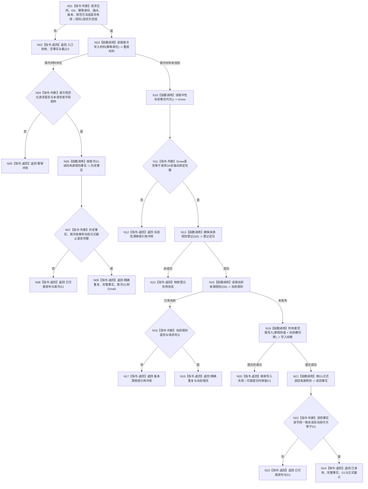

# 发布主动安全结算来源规则函数流程图 v0.1

更新时间：2026-08-30

## 依据

```text
规范/6100_子规范_安全服务值结算_20260720.md v0.6
规范/6120_子规范_自我存在服务与生存基本因果闭环_20260720.md v0.10
规范/详细设计/20260830_INSTINCT-STAGE3-ACTIVE-SAFETY-SOURCE-CATALOG_主动安全结算来源方法完整集合详细设计_v0.1.md
当前代码：海中鱼巣/领域/服务.安全根定义与当前值.ixx
```

## 身份与边界

本图是待新增公开函数的目标单函数流程图，只冻结来源规则发布；读取入口和生产初始化组合由详细设计定义。本函数不发布安全根定义、不建立方法、不解释变化账，也不改变 L/H 或 A。

## 函数合同

```text
根函数：安全根定义与当前值服务::发布主动安全结算来源规则_v1
归属模块 / 文件 / 层级：海中鱼巣.领域.服务.安全根定义与当前值 / 海中鱼巣/领域/服务.安全根定义与当前值.ixx / ARCH-L4
现有或待新增：待新增
完整签名：主动安全结算来源规则发布结果_v1 发布主动安全结算来源规则_v1(const 发布主动安全结算来源规则请求_v1& 请求) noexcept
参数：请求；const 输入借用；函数返回前有效；非法合同、G0、身份、版本、顺序或 v1 非空组拒绝
返回结果：强类型发布结果；只有已发布 / 精确重复携带完整事实和正式读回截止；已可能发布只携带提交见证
被调函数流程图：无；调用的 L1 owner 公开入口沿用其现行合同
```

## 流程图



## 节点合同

| 节点 | 类型 | 参数 / 输入绑定 | 结果 / 输出绑定 | 事实读写 | 后继条件 | 验证 |
| --- | --- | --- | --- | --- | --- | --- |
| N01—N02 | 指令 | `请求` | 入口拒绝 | 无 | 形状非法 | 坏版本、非空 v1、乱序重复 |
| N03—N09 | 调用 + 判断 | 幂等身份 | 首次材料、历史事实 | 只读 | 首次材料命中 | 精确重复、同键异义、坏首次材料 |
| N10—N14 | 调用 + 判断 | 请求 G0、锚点 | 当前代次、登记定位 | 登记缺失时写登记 | 同截止且登记完整 | 漂移、登记恢复、资源失败 |
| N15—N18 | 调用 + 判断 | G0、请求定义 | 当前规则 | 只读 | 已有当前 | 同义异键零第二版本、版本冲突 |
| N19—N20 | 函数调用 | 规范 U64 组与槽切换 | 写入结果 / G1 | 原子写来源规则值和当前槽 | 提交状态 | 写失败、已可能发布 |
| N21—N24 | 调用 + 判断 | G1、规则身份 | 正式读回事实 | 只读 | 完整且读后守卫成立 | 写后读回、读后漂移 |

## 关键边界

```text
规则版本1只允许显式空方法组。
规则未发布不等于空集。
未知方法不因“不在空集”而自动取得非主动来源结论。
本函数不改变安全根定义版本1及L/H。
```
