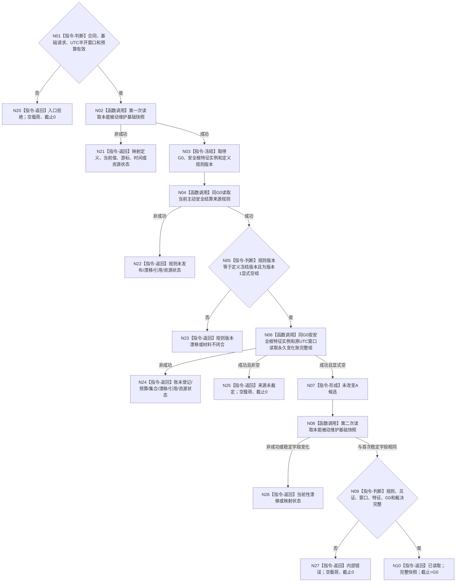

# INSTINCT-STAGE3-ACTIVE-SAFETY-WINDOW-ADJUDICATION 读取 UTC 窗口主动安全变化裁决函数流程图 v0.1

日期：2026-08-30

对应设计：`规范/详细设计/20260830_INSTINCT-STAGE3-ACTIVE-SAFETY-WINDOW-ADJUDICATION_主动安全UTC窗口裁决详细设计_v0.1.md`

## 1. 函数

```cpp
本能主动安全UTC窗口裁决读取结果_v1
本能主动安全UTC窗口裁决组合器::读取UTC窗口主动安全变化裁决_v1(
    const 本能主动安全UTC窗口裁决读取请求_v1&) const noexcept;
```

## 2. 流程



## 3. 边界

本函数不生产 UTC 窗口，不把单调完整秒转换为 UTC。版本 1 非空变化组必须 fail-closed；只有规则 1 显式空集合与永久账合法空组同时成立时，才能返回 `未改变A`。
