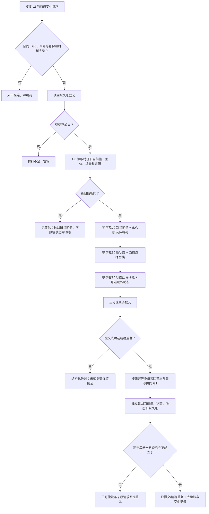
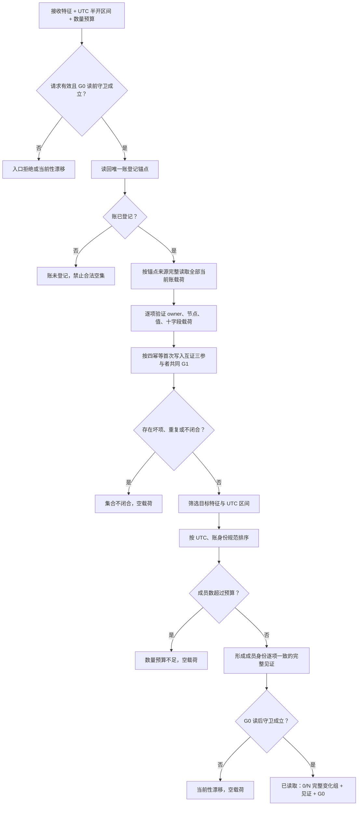
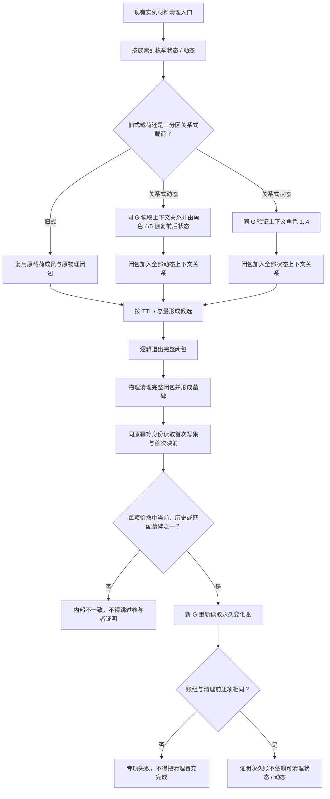
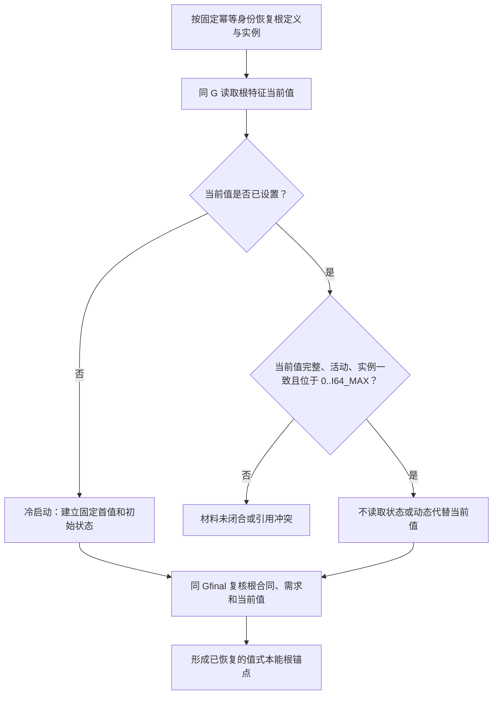

# INSTINCT-STAGE3-CURRENT-VALUE-CHANGE-LEDGER 特征当前值变化永久账函数流程图 v0.1

日期：2026-08-30

执行期修订：2026-08-30 R3。补齐合法当前值变化及状态 / 动态清理后的本能根恢复路径。

## 1. v2 发布

## 2. 完整组读回

## 3. 关系式材料清理兼容

## 4. 本能根重启恢复

## 5. 边界

本图只表达永久变化账的 v2 发布、完整读回、现有清理入口对三分区关系式状态 / 动态和 L1 首次材料墓碑互证的内部兼容，以及根身份对合法当前值变化的恢复兼容。它不新增清理 ABI 或 L1 / 本能根公开 ABI，也不从墓碑恢复完整事实。来源业务解释、主动安全裁决、低位回升、服务维护事务和 `A/V` 写入均不在本图内。
