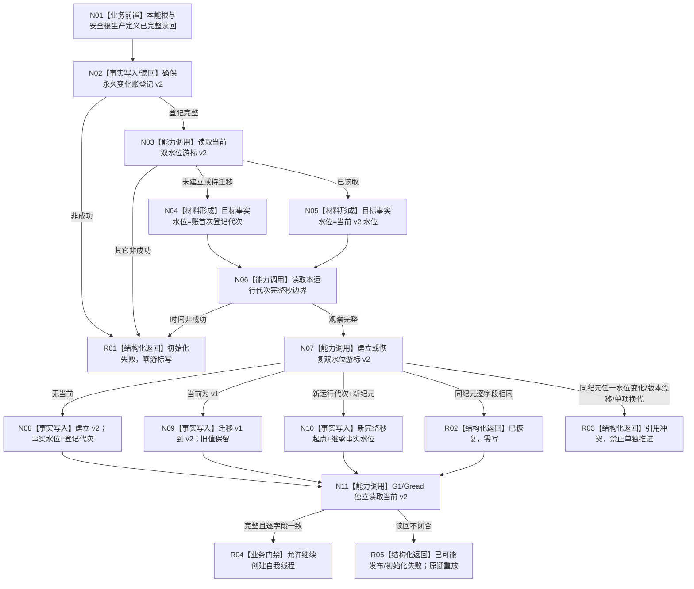

# INSTINCT-STAGE3-MAINTENANCE-CURSOR-FACT-GENERATION-WATERMARK 维护游标事实代次水位基础业务流程图 v0.1

更新时间：2026-08-30

## 边界

本图只冻结永久变化账登记到双水位游标建立、v1 迁移、新纪元继承和生产启动读回。不表示同一纪元推进，不写 A/V、状态或动态。



## 关键不变量

```text
首次事实水位 = 永久变化账首次登记事实代次
新纪元事实水位 = 旧 v2 事实水位
同纪元建立入口不得改变完整秒边界或事实水位
事实代次不解释为单调完整秒
游标建立不等于维护提交
生产 L/H 与规则版本保持不变
```

## 能力映射

| 节点 | 正式能力 | 函数 |
| --- | --- | --- |
| N02 | 永久变化账登记 | `L2状态动态原子发布服务::确保特征当前值变化永久账登记_v2` |
| N03/N11 | 当前双水位游标读取 | `本能被动维护游标服务::读取当前本能被动维护游标_v2` |
| N06 | 单调完整秒观察 | `完整秒时钟服务::读取当前完整秒边界` |
| N07—N10 | 双水位建立、迁移、恢复、新纪元 | `本能被动维护游标服务::建立或恢复本能被动维护游标_v2` |
