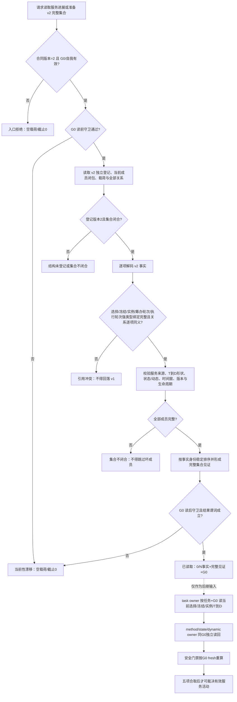

# INSTINCT-STAGE3-SERVICE-ACTIVITY-TYPED-BINDING-V2 服务活动强类型执行绑定业务流程图 v0.1

日期：2026-08-30

## 边界

- v1 三类不透明见证不转换、不比较、不投影为 v2。
- v2 只保存外部正式身份，不复制 task / method / safety 权威事实。
- 安全门禁不是服务 owner 持久事实；本图不实现后继活动裁决。
- 当前生产定义版本 1 的 `L/H` 保持不变。
