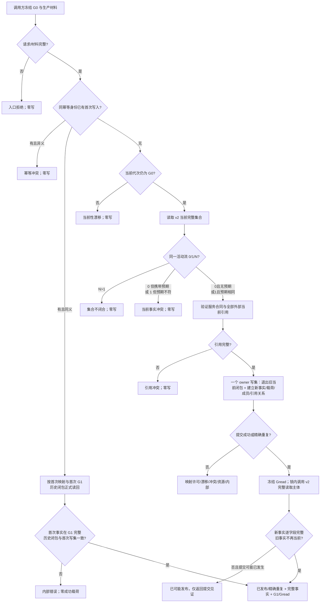

# INSTINCT-STAGE3-SERVICE-ACTIVITY-V2-PUBLISHER 服务活动 v2 生产事实发布业务流程图 v0.1

日期：2026-08-30

边界：公开 v2 读取和发布后读取共用同一个“已锁定读取主体”，发布函数不得持锁递归调用公开入口。本图只形成 v2 生产事实；它不证明真实生产调用已接线，不把空集合解释为无活动，不执行安全门禁或单秒维护，不修改 L/H。
