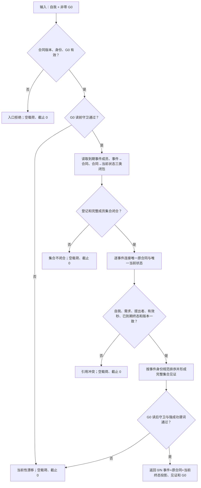

# INSTINCT-STAGE3-SERVICE-EXPIRY-CONTRACT-READBACK 读取服务到期事件合同终态完整集合函数流程图 v0.1

```mermaid
flowchart TD
    A["输入：自我 + 非零 G0"] --> B{"合同版本、身份、G0 有效？"}
    B -- "否" --> X["入口拒绝；空载荷、截止 0"]
    B -- "是" --> C{"G0 读前守卫通过？"}
    C -- "否" --> Y["当前性漂移；空载荷、截止 0"]
    C -- "是" --> D["读取到期事件成员、事件→合同、合同→当前状态三类闭包"]
    D --> E{"登记和完整成员集合闭合？"}
    E -- "否" --> Z["集合不闭合；空载荷、截止 0"]
    E -- "是" --> F["逐事件连接唯一原合同与唯一当前状态"]
    F --> G{"自我、需求、提出者、有效秒、已到期终态和版本一致？"}
    G -- "否" --> R["引用冲突；空载荷、截止 0"]
    G -- "是" --> H["按事件身份规范排序并形成完整集合见证"]
    H --> I{"G0 读后守卫与强成功谓词通过？"}
    I -- "否" --> Y
    I -- "是" --> J["返回 0/N 事件+原合同+当前终态投影、见证和 G0"]
```

边界：原合同提供正式时间纪元；本流程不比较当前秒、不裁决服务活动、不写任何事实，也不修改当前生产 L/H。
