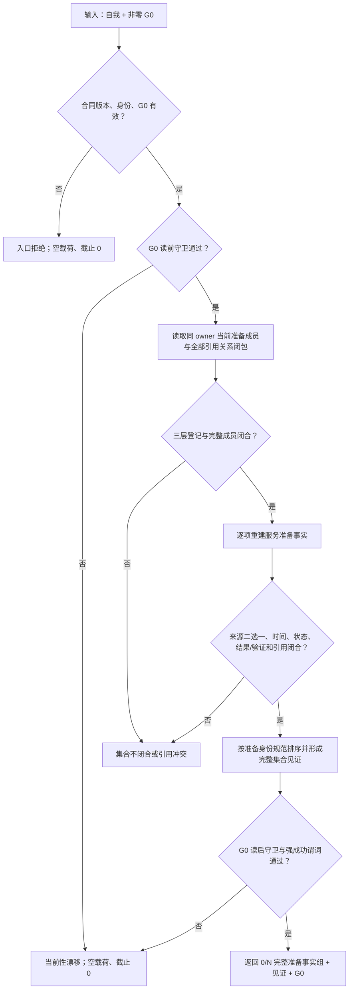

# INSTINCT-STAGE3-SERVICE-PREPARATION-FACT-COLLECTION 服务准备当前事实完整集合业务流程图 v0.1

```mermaid
flowchart TD
    A["输入：自我 + 非零 G0"] --> B{"合同版本、身份、G0 有效？"}
    B -- "否" --> X["入口拒绝；空载荷、截止 0"]
    B -- "是" --> C{"G0 读前守卫通过？"}
    C -- "否" --> Y["当前性漂移；空载荷、截止 0"]
    C -- "是" --> D["读取同 owner 当前准备成员与全部引用关系闭包"]
    D --> E{"三层登记与完整成员闭合？"}
    E -- "否" --> Z["集合不闭合或引用冲突"]
    E -- "是" --> F["逐项重建服务准备事实"]
    F --> G{"来源二选一、时间、状态、结果/验证和引用闭合？"}
    G -- "否" --> Z
    G -- "是" --> H["按准备身份规范排序并形成完整集合见证"]
    H --> I{"G0 读后守卫与强成功谓词通过？"}
    I -- "否" --> Y
    I -- "是" --> J["返回 0/N 完整准备事实组 + 见证 + G0"]
```

边界：该流程只读取和证明完整集合，不裁决合法服务活动，不发布准备，不补回服务值，也不修改当前生产 L/H 定义。
