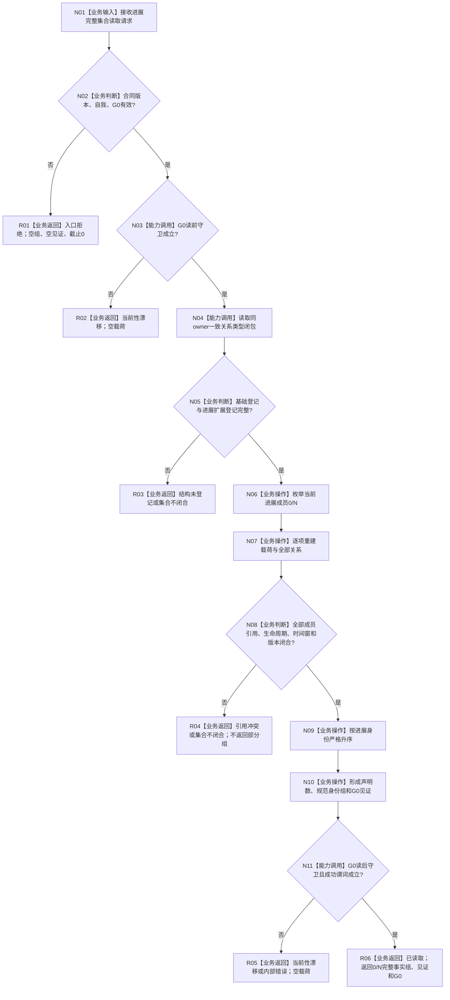

# INSTINCT-STAGE3-SERVICE-PROGRESS-FACT-COLLECTION 服务合同关联进展事实完整集合业务流程图 v0.1

更新时间：2026-08-30

## 依据

```text
0050 v2.1、6100 v0.5、6120 v0.10、6160 v0.4、6170 v0.6
计划/数据服务最终需求清单.md 的 DATA-EXT-16 当前服务进展组能力边界
规范/详细设计/20260830_INSTINCT-STAGE3-SERVICE-PROGRESS-FACT-COLLECTION_服务合同关联进展事实完整集合详细设计_v0.1.md
当前代码 main@de9fd384：服务合同事实权威 owner 与两类完整集合读取已存在，进展完整集合入口不存在
```

## 身份与边界

正式业务设计图。唯一业务目标是：在调用方给定的同一 `G0` 下，从唯一 `服务合同事实权威` owner 取得一个自我的 0/N 当前服务合同关联进展事实完整集合，并使合法空集合与读取失败机器可分。

输入：合同版本、`L2结构请求头(G0)`、唯一自我。

成功输出：按进展身份规范有序的 0/N 完整事实组、完整集合见证、共同截止 `G0`。

非成功输出：具名状态、空事实组、空见证、截止 0。

前置：基础登记和进展扩展登记均已在同一 owner 中形成或恢复；请求 `G0` 非零。

完成：读前 / 读后守卫成立，全部当前成员逐项重建和互证，成功谓词成立。

本图不裁决有效活动，不读取安全 / 任务 / 方法事实的业务内容，不调用被动维护内核。



## 节点合同

| 节点 | 类型 | 参数 / 输入绑定 | 结果 / 输出绑定 | 事实读写 | 后继条件 | 验证 |
| --- | --- | --- | --- | --- | --- | --- |
| N01/N02 | 输入 / 判断 | 请求合同版本、自我、G0 | 合法请求或 R01 | 无 | 三项有效才进入 N03 | 零 G0、坏版本、空自我 |
| N03 | 能力调用 | `G0` -> L1 当前代次读取 | 守卫成立或 R02 | 只读共享代次 | 精确等于 G0 | 旧 G0 漂移 |
| N04/N05 | 能力调用 / 判断 | 同一 owner、登记定位、G0 | 已验证关系闭包或 R03 | 只读 owner 闭包 | 两份登记完整 | 扩展未登记、错版本、错 owner |
| N06—N08 | 操作 / 判断 | 0/N 成员、关系和载荷 | 完整事实组候选或 R04 | 只读进展与合同事实 | 全部成员闭合 | 漏 / 多 / 重、错引用、坏时间窗 |
| N09/N10 | 操作 | 完整候选 | 规范身份组和完整见证 | 无新事实 | 严格升序且声明数相等 | 0/1/N、乱序输入 |
| N11 | 能力调用 / 判断 | G0、结果候选 | 守卫成立且成功谓词为真或 R05 | 只读共享代次 | 两项都成立 | 读中漂移、坏成功形状 |
| R01—R05 | 返回 | 具名非成功 | 空组、空见证、截止 0 | 无 | 结束 | 非成功零载荷 |
| R06 | 返回 | 完整结果 | `已读取`、0/N 事实、见证、G0 | 无 | 结束 | 合法空有完整见证和非零 G0 |

## 业务—能力—函数映射

| 业务节点 | 所需能力 | 当前裁决 | 目标函数组 |
| --- | --- | --- | --- |
| N03/N11 | 读取同一 L1 当前事实代次 | 复用 | `L1事实基座服务::读取中性当前事实代次`，由服务内部守卫封装 |
| N04 | owner 范围一致关系类型闭包 | 复用 | `L1事实基座服务::尝试读取所有者范围一致关系类型闭包投影` |
| N05—N10 | 进展扩展登记、事实重建、引用互证、排序和见证 | 扩展现有服务 | `服务合同事实权威服务::读取当前服务合同关联进展完整集合_v1` 及 module-private helpers |
| R01—R06 | 结构化结果与成功形状 | 新增 DTO / 谓词 | `服务进展完整集合读取结果_v1`、`成功()` 和完整性谓词 |

## 非职责

```text
进展事实存在 != 当前存在有效服务活动
安全门禁见证身份非零 != 安全门禁允许
方法执行见证身份非零 != 方法正在真实执行
线程运行 / 队列存在 / 日志心跳 != 进展事实
完整空组 != 读取失败
```
