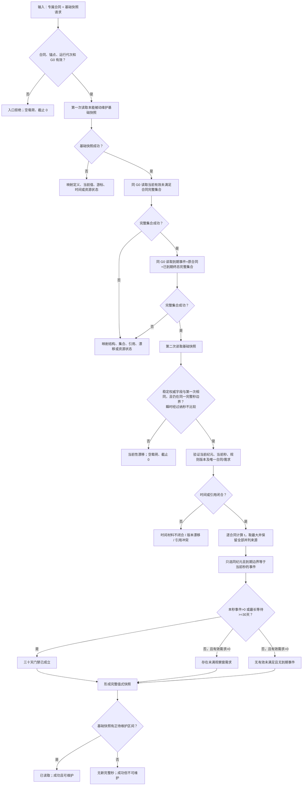

# INSTINCT-STAGE3-SINGLE-SECOND-DEMAND-TIME-ADJUDICATION 读取当前维护秒服务需求时间裁决函数流程图 v0.2

```mermaid
flowchart TD
    A["输入：专属合同 + 基础快照请求"] --> B{"合同、锚点、运行代次和 G0 有效？"}
    B -- "否" --> X["入口拒绝；空载荷、截止 0"]
    B -- "是" --> C["第一次读取本能被动维护基础快照"]
    C --> D{"基础快照成功？"}
    D -- "否" --> E["映射定义、当前值、游标、时间或资源状态"]
    D -- "是" --> F["同 G0 读取当前有效未满足合同完整集合"]
    F --> G{"完整集合成功？"}
    G -- "否" --> H["映射结构、集合、引用、漂移或资源状态"]
    G -- "是" --> I["同 G0 读取到期事件+原合同+已到期终态完整集合"]
    I --> J{"完整集合成功？"}
    J -- "否" --> H
    J -- "是" --> K["第二次读取基础快照"]
    K --> L{"稳定权威字段与第一次相同，且仍在同一完整秒边界？\n瞬时经过纳秒不比较"}
    L -- "否" --> M["当前性漂移；空载荷、截止 0"]
    L -- "是" --> N["验证当前纪元、当前秒、规则版本及唯一合同/需求"]
    N --> O{"时间或引用闭合？"}
    O -- "否" --> P["时间材料不闭合 / 版本漂移 / 引用冲突"]
    O -- "是" --> Q["逐合同计算 t，取最大并保留全部并列来源"]
    Q --> R["只选同纪元且到期边界等于当前秒的事件"]
    R --> S{"本秒事件>0 或最长等待>=30天？"}
    S -- "是" --> T["三十天门禁已成立"]
    S -- "否，且有效需求>0" --> U["存在未满观察窗需求"]
    S -- "否，且有效需求=0" --> V["无有效未满足且无到期事件"]
    T --> W["形成完整值式快照"]
    U --> W
    V --> W
    W --> Y{"基础快照有正待维护区间？"}
    Y -- "是" --> Z["已读取；成功且可维护"]
    Y -- "否" --> AA["无新完整秒；成功但不可维护"]
```

边界：当前版本只裁决基础快照观察到的当前完整秒，不处理多秒历史分段，不调用规则内核，不写 A/V/游标/状态/动态，也不改变生产 L/H。
