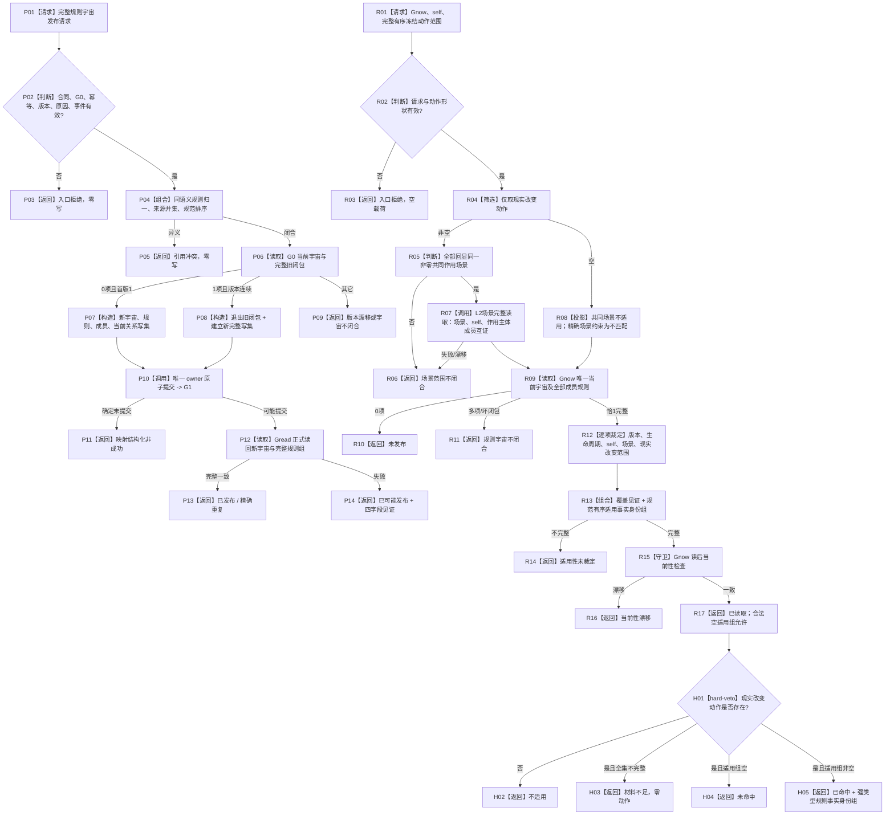

# INSTINCT-STAGE3-HARD-DENIAL-RULE-UNIVERSE 硬否决规则宇宙发布与全集读取业务流程图 v0.1

更新时间：2026-08-31

## 依据与边界

```text
规范/0050_项目通用机器逻辑与禁止性规则总纲_20260721.md v2.1
规范/5230_子规范_任务筹办与执行边界_20260720.md v1.6
规范/6150_子规范_因果安全层级与任务执行优先级权限.md v0.12
规范/详细设计/20260831_INSTINCT-STAGE3-HARD-DENIAL-RULE-UNIVERSE_任务现实执行硬否决规则宇宙详细设计_v0.1.md
```

本图描述待实现 owner 的发布与读取闭环，不表示已有真实规则发布者，不自动发布空宇宙，不包含 FRESH 或普通应用接线。

## 流程图



## 关键不变量

```text
规则全集只由唯一 owner 当前关系闭包形成。
显式空宇宙不等于没有收到规则记录。
单一共同作用场景来自冻结动作回显和场景 owner 读回，不来自 self 位置或公共祖先。
内部治理 / 纯观察场景不进入硬否决场景匹配。
非完整全集永不降级为空适用组。
本流程不读取、不计算、不修改 L/H。
```
