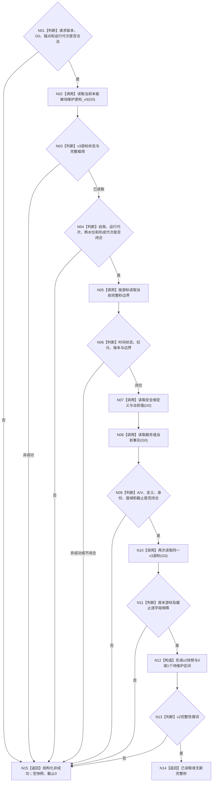

# INSTINCT-STAGE3-MAINTENANCE-BASE-SNAPSHOT-V3 读取三水位本能被动维护基础快照函数流程图 v0.1

日期：2026-08-31

依据：6120 v0.10、6170 v0.9、同名详细设计 v0.1

## 函数合同

```text
函数：本能被动维护基础快照组合器::读取本能被动维护基础快照_v2
输入：合同版本2、L2请求头(G0)、本能根锚点、期望运行代次
输出：同G0的安全根定义/A、服务值V、v3三水位游标、时间观察和待维护区间
副作用：无
```



## 边界

- v1 函数和 DTO 保持不变；v2 不把 v3 投影回 v1。
- L/H 只读取正式定义，版本 1 当前实例保持不变。
- 两个事实代次水位只被携带和互证，本函数不读取历史范围、不推进水位。
- 任何非成功都为空载荷、截止 0；不得用首次读取或缓存补齐第二次漂移。
