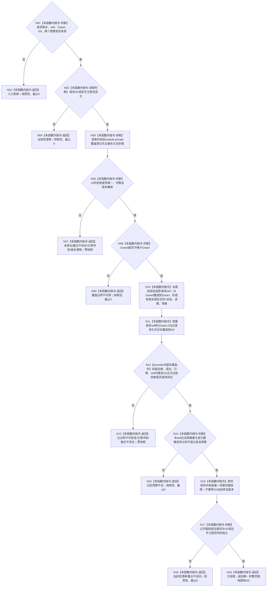

# INSTINCT-STAGE3-SERVICE-HISTORY-BOUNDARY-SNAPSHOT-V2 服务维护历史边界读取函数流程图 v0.2

更新时间：2026-08-31

## 依据

```text
规范/6160_子规范_服务需求合同预算与准备结算.md
规范/6170_子规范_服务值时间维护生存安全回归与任务门控.md
规范/详细设计/20260831_INSTINCT-STAGE3-SERVICE-HISTORY-BOUNDARY-SNAPSHOT-V2_服务维护历史兼容锚点与左边界读回详细设计_v0.2.md
海中鱼巣/领域/服务合同事实权威.数据.h
海中鱼巣/领域/服务.服务合同事实权威.ixx
```

## 身份与边界

本图是目标单函数流程图，只冻结低层维护工程读取函数。v2 覆盖登记、构造恢复及进展 / 准备 writer 挂接由详细设计和实施计划另行约束，不属于本函数执行节点。本函数不形成状态、动态、因果或根需求结论，不修改 L/H，不推进游标。

`G0` 终态互证是 provider 在返回 `已读取` 前完成的内部后置条件。公开快照不携带第二份 `G0` 当前合同、状态、进展或准备投影；公开 `成功()`只验证它能够观察到的值式载荷形状，不能对任意调用方构造的对象证明来源真实性。

## 函数合同

```text
根函数：服务合同事实权威服务::按事实代次边界读取服务维护历史完整快照_v2
归属模块：海中鱼巣.领域.服务.服务合同事实权威
归属文件：海中鱼巣/领域/服务.服务合同事实权威.ixx
层级：领域 owner 的低层维护工程只读边界
现有或待新增：待新增

完整签名：
服务维护历史边界读取结果_v2
服务合同事实权威服务::按事实代次边界读取服务维护历史完整快照_v2(
    const 服务维护历史边界读取请求_v2& 请求) const noexcept;

参数：
请求：const 服务维护历史边界读取请求_v2&，只读、调用期有效；
      携带合同版本、G0、自我、Gstart、左边界数量预算、变化数量预算；
      非法版本、零身份、零代次、Gstart>G0或任一预算为零均入口拒绝。

返回结果：
服务维护历史边界读取结果_v2；
已读取时唯一快照存在且正式读回截止等于请求G0；
全部非成功快照为空、截止0；函数不抛异常；
快照仅含请求self的左边界与变化载荷，不含第二份G0当前终态投影。

被调函数流程图：无；module-private 枚举、重放、归组、self过滤、G0当前根互证和排序不取得独立公开函数合同。
```

## 流程图



## 节点合同

| 节点 | 类型 | 参数 / 输入绑定 | 结果 / 输出绑定 | 事实读写 | 后继条件 | 验证 |
| --- | --- | --- | --- | --- | --- | --- |
| N01—N04 | 本函数内判断 / 返回 | 请求全部字段 | 入口拒绝、当前性漂移或继续 | 只读请求与当前代次 | 请求与读前守卫 | 坏版本、零值、Gstart>G0、两个预算分别为零 |
| N05—N09 | 本函数内读取 / 判断 / 返回 | self、Gstart、G0 | 唯一覆盖登记、Gseed或结构化非成功 | 只读module-private登记和五类历史根 | `Gseed<=Gstart` | 未登记、错版本、漏 / 多 / 重、坏引用、边界过早 |
| N10—N13 | 本函数内重放 / provider内部互证 / 返回 | Gseed、Gstart、G0、五类历史和正式G0当前四类 | 请求self的左边界、区间变化、provider内部G0终态互证或非成功 | 只读业务治理事实及生命周期 | 全根先完整；输出仅本self；唯一前驱后继；G0正式当前四类逐项相等 | A/B self交错、左边界有效未满足、G0当前空而左边界非空、区间形成 / 退出、坏链、终态错配 |
| N14—N15 | 本函数内判断 / 返回 | 本self左边界数、变化数、两个预算 | 继续或对应预算不足 | 零事实写 | 两个预算分别成立 | foreign self不计预算、恰好预算、分别少1、不得截断 |
| N16—N19 | 本函数内构造 / 判断 / 返回 | 范围绑定、成员身份、八个向量九类投影 | 唯一完整范围快照或零快照 | 零事实写 | 载荷成功谓词与读后守卫同时成立 | 合法空集、跨self载荷、左边界终态、漏 / 多 / 重 / 错序、读后漂移 |

## 关键边界

```text
Gstart < Gseed：覆盖边界不可用，不猜登记前历史。
形成事实代次：只用于 owner 历史重放，不是单调完整秒或同秒发布序。
左边界合同：只允许请求self在Gstart仍有效未满足的合同及唯一当前状态。
跨self：全局根先校验；foreign self不进入返回载荷、声明成员和预算。
G0终态：provider内部以正式当前有效未满足合同/状态、进展、准备互证；不进入公开DTO。
合同状态：业务治理事实，不是1160状态节点。
完整范围快照：只供 maintenance composer 调用成功谓词后消费，不透传自我、需求比较或学习。
当前固定阈值：L=2767011611056432742，H=7378697629483820645，版本1不变。
```

本函数完成只说明服务历史从显式覆盖起点可恢复并完整交付给 maintenance composer，不形成新的认知证据类型，也不代表被动维护业务闭环完成。

## v0.2 修订说明

v0.2 把 `G0` 终态互证明确为 provider-private 后置条件，把公开 `成功()`收敛为载荷形状谓词，并补齐跨 self 过滤、间接合同归属、左边界有效未满足和增量验证。函数签名、DTO 字段和状态数值不变。
