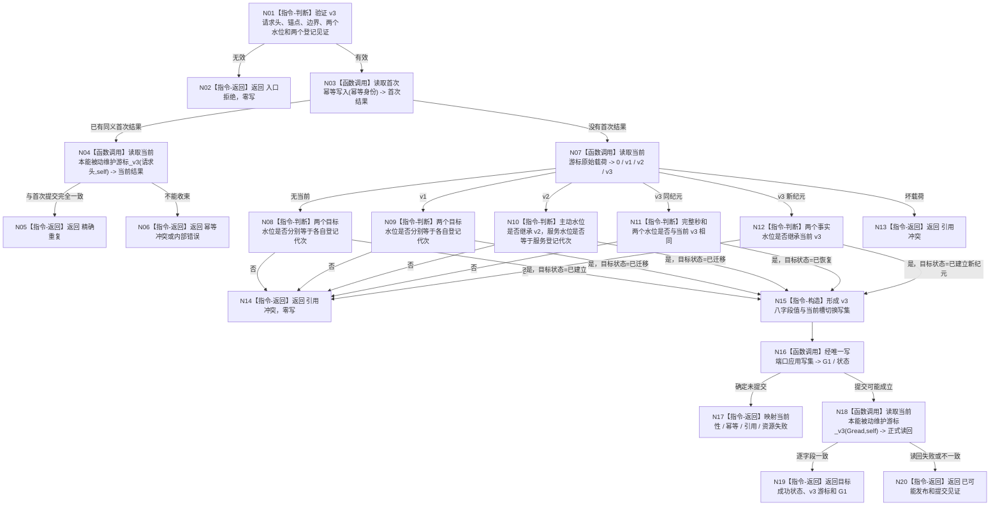

# INSTINCT-STAGE3-SERVICE-HISTORY-WATERMARK 维护游标 v3 建立恢复函数流程图 v0.1

更新时间：2026-08-31

## 依据

```text
规范/6170_子规范_服务值时间维护生存安全回归与任务门控.md v0.9
规范/详细设计/20260831_INSTINCT-STAGE3-SERVICE-HISTORY-WATERMARK_服务维护历史事实代次水位详细设计_v0.1.md
海中鱼巣/领域/服务.本能被动维护游标.ixx 当前 v1/v2 实现
```

## 身份与边界

本图是待实现单函数设计图，只冻结维护游标 v3 建立 / 迁移 / 恢复的目标过程。它不表示代码已经实现，不包含覆盖起点读回函数或生产启动函数的内部流程。

## 函数合同

```text
根函数：建立或恢复本能被动维护游标_v3
归属模块 / 文件 / 层级：海中鱼巣.领域.服务.本能被动维护游标 / 海中鱼巣/领域/服务.本能被动维护游标.ixx / 领域服务
现有或待新增：待新增
完整签名：本能被动维护游标建立结果_v3 建立或恢复本能被动维护游标_v3(const 建立或恢复本能被动维护游标请求_v3&) noexcept
参数：请求，const 引用；调用期只读；必须包含两个 owner 的登记见证和目标水位
返回结果：成功为已建立 / 已恢复 / 已迁移 / 已建立新纪元 / 精确重复；逻辑内非成功和内部错误均为结构化 v3 结果
被调函数流程图：无；复用现有 owner 私有写集、首次写入读回和当前游标读取能力
```

## 流程图



## 节点合同

| 节点 | 类型 | 参数 / 输入绑定 | 结果 / 输出绑定 | 事实读写 | 后继条件 | 验证 |
| --- | --- | --- | --- | --- | --- | --- |
| N01 | 本函数内判断 | v3 请求全部字段 | 有效 / 拒绝 | 无 | 见证分别属于两个 owner | 错 self、错 G、交换水位 |
| N03 | 函数调用 | 幂等身份 | 首次规范写集或未找到 | 只读幂等账 | 同键重放优先收束 | 精确重复、同键异义 |
| N07 | 函数调用 | 当前游标节点 | 0 / v1 / v2 / v3 | 只读当前槽和值 | 版本决定迁移分支 | 四种载荷 |
| N08-N12 | 本函数内判断 | 当前事实、目标水位、登记见证 | 目标成功状态 | 无 | 不允许回退或补造 | 首次、迁移、恢复、新纪元 |
| N15 | 本函数内构造 | 规范 v3 事实 | 八字段写集 | 尚未发布 | 一个当前槽 | 字段顺序和旧退出 |
| N16 | 函数调用 | 规范写集 | 写入结果 | 可能写入游标 owner | 再正式读回 | 失败矩阵 |
| N18 | 函数调用 | Gread、自我 | v3 当前游标 | 只读 | 必须逐字段相等 | 提交后读回失败 |
| N19-N20 | 本函数内返回 | 写入与读回结果 | 成功或已可能发布 | 无 | 函数结束 | 成功谓词 / 见证谓词 |

## 关键边界

```text
两个事实代次水位绝不合并或互推。
旧 v1/v2 只在服务历史覆盖起点正式读回后迁移。
建立 / 恢复入口不承担维护后的水位推进。
当前 L/H、A/V 和规则版本不在本函数中读取、计算或修改。
```
