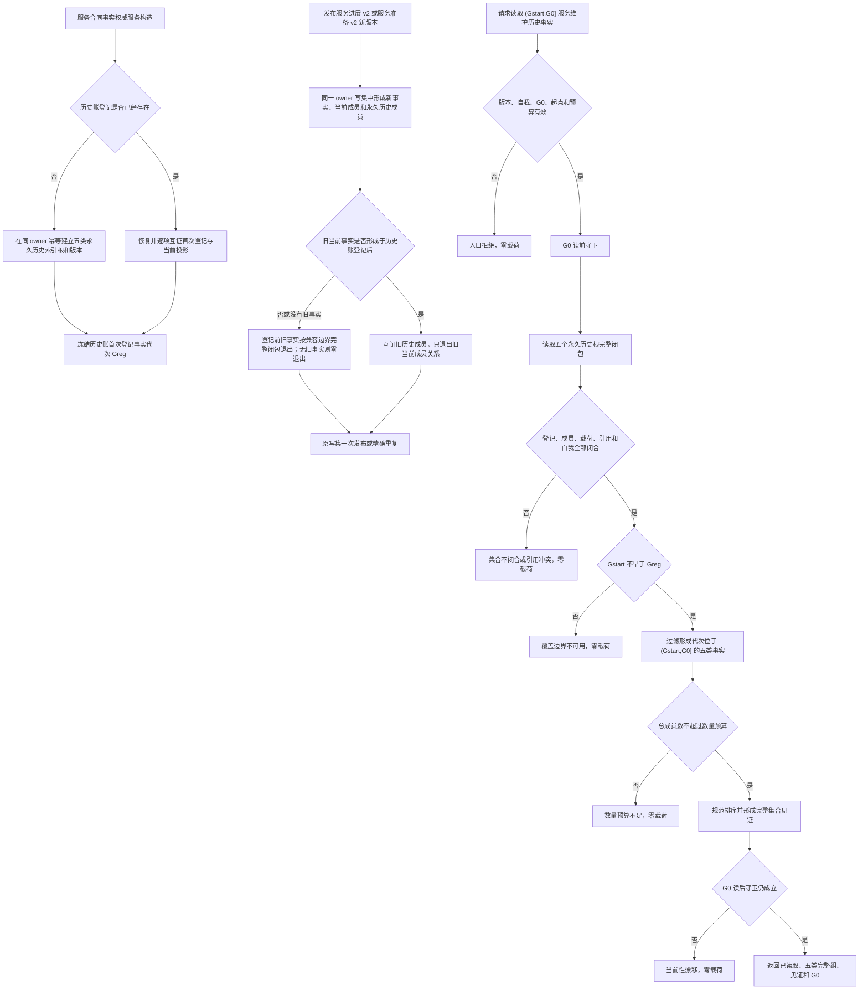

# INSTINCT-STAGE3-SERVICE-MAINTENANCE-HISTORY-LEDGER 服务维护历史事实账与完整范围读回业务流程图 v0.1

日期：2026-08-31

## 1. 业务闭环



## 2. 关键业务规则

1. 当前集合为空不证明历史范围为空；只有永久历史账完整见证可以证明合法空范围。
2. 历史账登记代次是覆盖起点，不回填、不猜测登记前已经退出的事实。
3. 当前成员关系可以退出；历史成员关系永久保留并与事实同代次形成。
4. 事实载荷仍由原合同 / 状态 / 事件 / 进展 / 准备结构唯一承载，历史账不复制第二份业务载荷。
5. 当前生产阈值保持 `L=2767011611056432742`、`H=7378697629483820645`、安全根定义版本 1；本流程不计算或改变阈值。
6. 本流程不形成单调秒事实段，不结算服务值，不推进游标。
7. 登记前事实不回填：更新时沿旧完整闭包退出，旧请求重放按首次写集收敛；登记后事实才取得永久历史保留语义。
8. 完整性由唯一生产入口同写集入账和永久账闭包共同证明；见证计数不是对未知 owner 历史事实的反向全扫描。

## 3. 目标代码映射

```text
数据合同：海中鱼巣/领域/服务合同事实权威.数据.h
历史登记、同步入账和范围读取：海中鱼巣/领域/服务.服务合同事实权威.ixx
专项：海中鱼巣/端到端测试.服务合同事实权威.ixx
```

完成只证明服务维护历史事实范围账和完整读回，不证明阶段三生产维护闭环。
