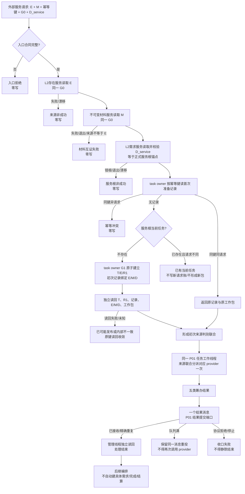

# 真实服务请求材料到 P01 初次筹办流程图 v0.1

```mermaid
flowchart TD
    A[外部服务请求: E + M + 幂等键 + G0 + D_service] --> B{入口合同完整?}
    B -- 否 --> X[入口拒绝\n零写]
    B -- 是 --> C[L2存在服务读取 E\n同一 G0]
    C -->|失败/漂移| X2[来源非成功\n零写]
    C --> D[不可变材料服务读取 M\n同一 G0]
    D -->|失败/退出/来源不等于 E| X3[材料互证失败\n零写]
    D --> E[L2需求服务读取并校验 D_service\n等于正式服务根锚点]
    E -->|错根/退出/漂移| X4[服务根非成功\n零写]
    E --> F[task owner 按幂等键读首次准备记录]
    F -->|同键同请求| G[返回原记录与原工作包]
    F -->|同键异请求| X5[幂等冲突\n零写]
    F -->|无记录| H{服务根当前任务?}
    H -- 不存在 --> I[task owner G1 原子建立 T/E/R1\n初次记录绑定 E/M/D]
    H -- 已存在且请求不同 --> J[已有当前任务\n不写新请求账/不形成新包]
    I --> K[独立读回 T、R1、记录、E/M/D、工作包]
    K -->|读回失败/未知| X6[已可能发布或内部不一致\n原键读回收敛]
    K --> L[形成初次来源判别联合]
    G --> L
    L --> M[同一 P01 任务工作线程\n来源联合分派对应 provider 一次]
    M --> N[五类筹办结果]
    N --> O[一个结果消息\nP01 结果提交端口]
    O -->|已接收/精确重复| P[管理线程独立读回\n处理结束]
    O -->|队列满| O2[保留同一消息重投\n不得再次调用 provider]
    O -->|协议拒绝/停止| O3[收口失败\n不得静默结束]
    P --> Q[后继编排\n不自动建具体需求/完成/结算]
```

图中 `E/M/D` 的正式读回是业务适配器责任；P01 消息只作线程交接，不能替代任何事实。初次来源与后继来源在联合中保持可区分，不能通过整数、路径或队列顺序互换。
