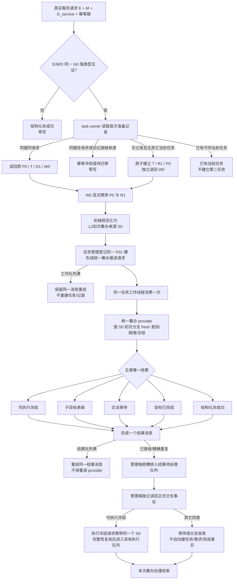

# 真实服务请求材料到 P01 初次筹办流程图 v0.2

统一不变量：初次与后继工作都只能由任务工作线程调用筹办 provider，并且每次处理恰好形成一个结果消息交任务管理线程。任务管理线程不得直接调用筹办 provider，不得从线程槽或返回值推断结束；初次`可执行冻结`也必须经过结果消息接收、结果待处理排队和正式事实独立读回，不能绕过消息直接形成执行请求。

P01 消息中的筹办推进请求使用 DATA-L2 `L2任务筹办规范化来源材料`判别联合。初次来源以首次准备记录为来源幂等身份并显式绑定 R1；后继来源保持自己的强类型分支。两个分支不得互相构造或压成裸整数。
