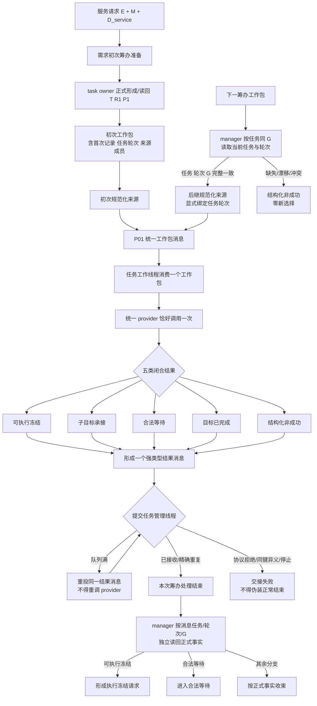

# 真实服务请求材料到 P01 初次筹办流程图 v0.3

统一不变量：`消息.任务轮次 == 来源材料.任务轮次 == task owner 同 G 正式读回任务轮次`。初次和后继只共享一个规范化来源联合、一个工作包端口、一个工作线程处理路径和一个结果端口。结果消息是跨线程定位，不是正式业务事实；任务管理线程不得直接调用筹办 provider。

后继原始工作包保持不变，任务轮次只来自 manager 已有的`按任务读取当前任务与轮次`正式读回。禁止从筹办轮次、执行轮次、线程槽、消息身份或裸整数推断。
