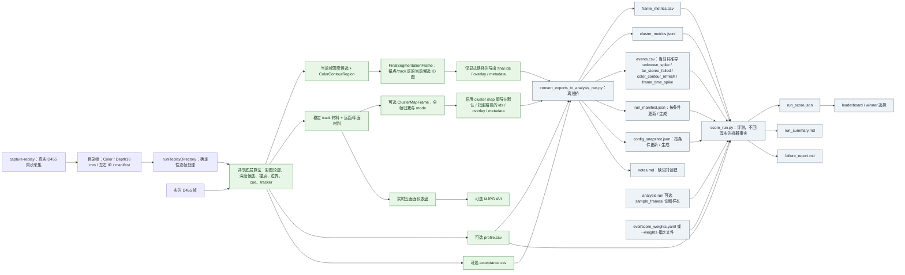

# D455 项目视频处理实现流程图 v0.1

更新时间：2026-07-13

## 元数据

```text
图类型：外部参考项目当前实现证据流程图
来源仓库：D:\D455
来源分支：codex/visual-capability-loop-plan
代码版本：b3608530f5a1c1da736517c1ef93a666c1fa5895
代码状态：D455.cpp、README.md、相关 docs/scripts 和旧流程图在抽取时无未提交差异；未跟踪 analysis_runs 不在本图证据范围
目标仓库：D:\海中鱼巣
覆盖入口：main、runReplayDirectory、runCaptureReplayDirectory、实时逐帧主循环
覆盖终点：五画面显示 / AVI 录像 / profile 与验收 CSV / cluster map 与 final segmentation 导出 / 离线分析包桥接
不得作为施工许可：是
不得宣称：海中鱼巣已实现或接入 D455、视频处理、真实外设、体素或视觉融合
```

## 依据

```text
D:\D455\AGENTS.md:1-78
D:\D455\README.md:1-33,52-188,245-347
D:\D455\docs\ATTENTION_DIFFERENCE_SCAN.md:1-86
D:\D455\流程图\20260614_D455稳定轮廓算法流程图_v0.1.md:1-222
D:\D455\D455.cpp:60-249,641-680,682-1547,1589-1713,1634-1648
D:\D455\D455.cpp:2510-2624,2698-3717,3975-4711,5453-8558
D:\D455\D455.cpp:9076-10163,10359-11052,12969-13665,13677-13782,13786-15022
D:\D455\scripts\convert_exports_to_analysis_run.py:192-247,347-695,748-904
D:\D455\scripts\run_batch.py:108-140,216-224
AGENTS.md
规范/0050_项目通用机器逻辑与禁止性规则总纲_20260721.md
规范/规范目录.md
规范/6320_子规范_外设观察特征与自我场景认知分层_20260720.md
规范/6340_子规范_外设独立控制线程与消息承接边界_20260720.md
规范/6350_子规范_双目相机外设独占观察线程_20260720.md
.codex/skills/hai-zhong-yu-chao-flowchart-code-correction/SKILL.md
```

## 范围说明

本图按 `D:\D455` 当前源码抽取“视频处理”主链，包含三类输入语境：实时 D455、目录 replay、capture-replay 数据采集。专项深度稳定性、锚点、单目深度和稳定轮廓测试只标出入口分流，不展开其独立循环；`StaticStabilityProbe` 是独立子项目，不纳入本图。

当前代码没有 AVI、MP4 或 RealSense bag 作为 RGB-D 输入的路径。AVI 只用于把处理后的仪表盘画面写出；确定性回放输入是 `frames/<编号>_color.png`、`depth16.png`、`ir_left.png`、`ir_right.png` 组成的目录。

运行期与离线分析必须区分：`D455.exe` 直接产生窗口、AVI，以及显式启用后的 profile/验收 CSV、cluster/final PNG 与 metadata；标准 `frame_metrics.csv`、`cluster_metrics.jsonl`、`events.csv`、`run_manifest.json`、`config_snapshot.json` 和 `notes.md` 由后续 Python 转换器生成或更新，不是实时事件账本；`run_score.json`、`run_summary.md` 和 `failure_report.md` 再由 `score_run.py` 生成。

## 当前默认路径与可选路径

| 项目 | 当前默认 | 可选分支 | 代码事实 |
| --- | --- | --- | --- |
| 实时输入 | Color + Depth + 左 IR；因 `qualitySegmentation` 与 `stereoContourDistance` 默认开启，同时启用右 IR | 姿态读取启用且设备支持时增加 Accel/Gyro | `D455.cpp:198-244,13871-13910` |
| 深度后处理 | `realtime30=true` 且 `realtimeSkipDepthPost=true`，默认直接使用对齐后的未滤波深度 | 快速路径只做 Spatial；完整路径执行 Depth→Disparity→Spatial→Temporal→Depth→Hole Filling | `D455.cpp:214-220,641-680,14008-14010,14157-14164` |
| 灰度边缘来源 | 优先左 IR；缺失时退回 BGR 灰度 | 可关闭红外分割 | `D455.cpp:207,14186-14204` |
| 彩图轮廓 | `colorContourFrameInterval=1`，每帧全帧提取；双目模板估距默认开启 | 缓存、motion refresh、attention、ROI、线程池和异步刷新 | `D455.cpp:161-187,229-244,14206-14505` |
| Attention | 默认关闭 | 显式开启后做低分辨率差异扫描、相位相关对齐、局部 ROI 和陈旧结果门禁 | `D455.cpp:181-187,244,7260-7334` |
| 实时算法粒度 | 深度切片 450mm、锚点步长 6px、稳定轮廓最低 10 个锚点 | 非实时默认分别为 300mm、4px、16 个锚点 | `D455.cpp:73,121-125,545-557,13961-14006` |
| PCL | 结构默认开启，但默认实时档通过 `realtimeDisablePcl=true` 实际关闭 | 实际启用还须 `--no-realtime-disable-pcl`；启用后刷新间隔至少 6 帧，只标记 PCL cluster ID | `D455.cpp:212-219,952-1010,3571-3717,13983-13987` |
| Final segmentation | `qualitySegmentation=true`，每帧在内存构造当前候选 ID 图 | 只有配置导出路径才落盘 | `D455.cpp:229,7578-7619,14577-14582` |
| Full-frame cluster map | 默认关闭 | 显式 `--cluster-map` 后基于稳定材料、远距材料和平面生成像素归簇 | `D455.cpp:227,8237-8299,14689-14701` |
| 显示 | 默认开启，五个核心画面组成三列仪表盘 | 可增加边界与室内平面独立诊断窗口 | `D455.cpp:14735-14914` |
| 录像 | 默认关闭 | 启用后录制五画面；诊断开启时录像可追加为六/七画面 | `D455.cpp:568-576,9278-9483,14931-14945` |
| Profile / 验收 CSV | 默认关闭 | 只有显式启用相应参数才逐帧写出 | `D455.cpp:587-591,1695-1713,9653-10163` |
| 周期导出 | `analysisExportEveryN=0` | 显式周期并同时启用对应导出后写逐帧 PNG/metadata | `D455.cpp:172,14715-14732` |

## 视频处理主流程图

```mermaid
flowchart TD
    A["D455.exe main：解析分割、姿态、运动、显示、录制和帧数参数；打印用法"] --> HELP{"--help / -h？"}
    A -. "非法数值解析发生在主 try 之前" .-> X0["追根因解决：stoi 异常缺少统一入口收口"]
    HELP -->|是| LHELP["逻辑内返回：返回 0"]
    HELP -->|否| REPLAYMODE{"--replay-dir？"}

    REPLAYMODE -->|是| RLIST["枚举存在配对 Depth16 的目录帧，并按帧号排序"]
    RLIST --> RANY{"枚举到配对路径？"}
    RANY -->|否| LR0["逻辑内返回：无 replay 帧，返回 1"]
    RANY -->|是| RREAD["逐帧读取 Color PNG"]
    RREAD --> RCOLOR{"Color 可解码？"}
    RCOLOR -->|否| LR2["逻辑内返回：Color 材料不可读，返回 2"]
    RCOLOR -->|是| RLOAD["读取毫米 Depth16 与左/右 IR；固定 depthScale=0.001；首帧构造近似内参"]
    RLOAD -. "目录或 Depth 读取异常位于 main try 外" .-> X1["追根因解决：replay 缺少统一异常边界"]
    RLOAD --> RMAT["Replay 帧材料：不再执行 RealSense 同步、对齐或深度后处理"]

    REPLAYMODE -->|否| TRY["进入 main try：设备、capture、专项与实时路径共享异常收口"]
    TRY -. "范围内任一 rs2::error" .-> XR2["异常收口：打印 RealSense 诊断并返回 2"]
    TRY -. "范围内任一 std::exception" .-> XR3["异常收口：打印错误并返回 3"]
    TRY --> DEV["查询 RealSense 设备"]
    DEV --> PROBE{"--probe-only？"}
    PROBE -->|是| PROBERET["逻辑内返回：有设备返回 0；无设备返回 1"]
    PROBE -->|否| DOK{"设备存在？"}
    DOK -->|否| LR1["逻辑内返回：外部设备不可用"]
    DOK -->|是| CAPMODE{"--capture-replay-dir？"}
    CAPMODE -->|是| CAPSTART["配置并启动 Color / Depth / 左 IR / 可选右 IR；创建输出目录"]
    CAPSTART --> CAPWARM["预热循环：连续取得最新 RGB-D"]
    CAPWARM --> CAPMORE{"captured < captureFrames？"}
    CAPMORE -->|是| CAPWAIT["取得最新帧；Depth 对齐 Color；读取左右 IR"]
    CAPWAIT --> CAPOK{"Color / Depth 都存在？"}
    CAPOK -->|否| CAPMORE
    CAPOK -->|是| CAPSAVE["保存 Color / 毫米 Depth16 / 可用左右 IR PNG；captured++"]
    CAPSAVE -. "imwrite 返回值未检查" .-> X3["追根因提醒：PNG 失败可能未被发现，manifest / metadata 与图片不一致"]
    CAPSAVE --> CAPMORE
    CAPMORE -->|否| CAPMAN["写 case_manifest.json"]
    CAPMAN --> CAPSTOP["pipeline.stop；返回 0"]
    CAPSTOP --> CAPEND["范围终点：只生成 replay 输入，不执行分割、跟踪或仪表盘录像"]

    CAPMODE -->|否| IMU{"IMU 重力专项？"}
    IMU -->|是| IMUTEST["进入 IMU 独立循环并返回"]
    IMU -->|否| STREAM["配置 Color、Depth、左 IR；默认再启用右 IR；可选 Accel / Gyro"]
    STREAM --> START["pipeline.start；读取真实 depthScale 与 Color 内参"]
    START --> SPECIAL{"深度稳定 / 锚点 / 稳定轮廓 / RGB 深度专项？"}
    SPECIAL -->|是| TEST["进入对应独立测试循环并返回；不走默认五画面主循环"]
    SPECIAL -->|否| SETUP["装配 tracker、轮廓缓存、profile / 验收 writer 与录像器"]
    SETUP --> LIVEWAIT["wait_for_frames 阻塞取帧；再最多 poll 8 组，保留最新完整 RGB-D"]
    LIVEWAIT -. "无超时" .-> X2["风险：停止或设备失联时等待可能无法及时收口"]
    LIVEWAIT --> RAWOK{"原始 Color / Depth 有效？"}
    RAWOK -->|否| SKIP["逻辑内返回：跳过当前外部帧"]
    SKIP --> LIVEWAIT
    RAWOK -->|是| ALIGN["读取姿态材料；Depth 对齐到 Color"]
    ALIGN --> AOK{"对齐后 Color / Depth 有效？"}
    AOK -->|否| SKIP
    AOK -->|是| DP{"深度后处理配置？"}
    DP -->|默认实时档：跳过| LMAT["生成 colorBgr、rawDepth16、depth16；统一尺寸"]
    DP -->|快速后处理| DPS["只执行 Spatial 滤波"]
    DP -->|完整后处理| DPF["Depth→Disparity→Spatial→Temporal→Depth→Hole Filling"]
    DPS --> LMAT
    DPF --> LMAT

    RMAT --> MAT["统一逐帧算法材料：彩图、原始/当前深度、IR 灰度、内参与帧号"]
    LMAT --> MAT
    MAT --> GRAY["分割灰度：优先左 IR，缺失时退回彩图灰度"]

    GRAY --> ARESULT{"异步 worker 有已完成结果？"}
    ARESULT -->|否| ATT["计算 startup / interval / motion / unknown spike / far loss 刷新原因；执行最小间隔门禁"]
    ARESULT -->|是| AVALID{"attentionDifferenceScan=true，且版本不一致或结果超龄？"}
    AVALID -->|是| ADROP["丢弃过期异步候选，保留当前缓存"]
    ADROP --> ATT
    AVALID -->|否| ASTEREO["先给异步候选复用旧 stereo 证据；普通 async 不做版本 / 年龄拒绝"]
    ASTEREO --> AMERGE["再与缓存合并；更新缓存版本、来源帧与运动签名"]
    AMERGE --> ATT
    ATT --> ATRIG{"本帧刷新？默认 interval=1，因此每帧为是"}
    ATRIG -->|否| CREUSE["复用 ColorContourRegion 缓存和已有双目粗距"]
    ATRIG -->|是| SAFE{"已有缓存 + 非 startup + 非对齐失败 + 脏区未超预算？"}
    SAFE -->|否| FORCEFULL["强制同步全帧提取：startup、attention 对齐失败或脏区超预算"]
    SAFE -->|是| MOTION{"motion 触发？"}
    MOTION -->|否| FULLREQ["允许异步的全帧刷新请求：interval / unknown spike / far loss 等"]
    MOTION -->|是| ROI["计算单个 / 多个脏 ROI 候选"]
    ROI --> ROK{"生成有效 ROI？"}
    ROK -->|否| RSKIP{"确有 ROI 空 / 过大拒绝标志 + 非 attention + 仅 motion 触发 + 启用 rejected-ROI skip？"}
    RSKIP -->|是| CREUSE
    RSKIP -->|否| FULLREQ
    ROK -->|是| ASYNC{"异步 worker 存在？"}
    FULLREQ --> ASYNC
    ASYNC -->|否| RWORK["同步提取：空 ROI 全帧、单 ROI 串行、多 ROI 且有 worker pool 才并行；Canny / Lab / 连通域 / 过滤"]
    ASYNC -->|是| AIDLE{"worker 无待处理任务？"}
    AIDLE -->|否| CREUSE
    AIDLE -->|是| ASUBMIT["提交单 / 多 / 空 ROI 任务；本帧复用缓存"]
    ASUBMIT --> CREUSE
    FORCEFULL --> STEREO["先建立或复用 stereo 证据：左右 IR 模板匹配粗距"]
    RWORK --> STEREO
    STEREO --> DROP["ROI 路径可选丢弃无 stereo 的新区域"]
    DROP --> MERGE["再与缓存确定性合并：保留 ROI 外缓存及无匹配新证据的旧 stereo 区域"]
    CREUSE --> CCOUT["ColorContourRegion：2D 轮廓 + 可选双目粗距、尺寸和置信度"]
    MERGE --> CCOUT

    CCOUT --> ANCHOR["可靠深度锚点：量程、原始/当前深度一致性、边缘排除、邻域稳定性"]
    ANCHOR --> BOUNDARY["边界分析：深度台阶 / 可选孔洞 / IR或RGB边缘 / 深度确认边；默认实时档仅保留深度台阶"]
    BOUNDARY --> DEPTHC["按深度切片生成 mask；形态学；扣除边界；轮廓/连通域；面积、ROI和贴边大块过滤"]
    BOUNDARY --> FAR["可选远距材料：3501-12000mm 区间轮廓与相对近远分层"]
    DEPTHC --> CREFINE["按重叠彩图轮廓精修当前深度候选，并重算深度统计与 3D AABB"]
    CREFINE --> PCL{"PCL 实际启用？结构默认开启，但实时 / replay 档默认压制；默认配置需 --no-realtime-disable-pcl"}
    PCL -->|否| CAND["当前帧 ObservationMaterial 候选"]
    PCL -->|是| PCEMPTY{"当前候选为空？"}
    PCEMPTY -->|是| PCLCLEAR["清空 PCL 候选缓存；输出空候选"]
    PCLCLEAR --> CAND
    PCEMPTY -->|否| PCREFRESH{"缓存为空，或到达至少 6 帧的刷新间隔？"}
    PCREFRESH -->|是| PCLTAG["立即执行候选内点云欧式聚类；只写 pclClusterId；更新候选缓存"]
    PCLTAG -.-> XPCL["风险：当前主链没有行为性消费者使用该 ID"]
    PCLTAG --> CAND
    PCREFRESH -->|否| PCLREUSE["整体复用旧候选，仅把 sourceFrameId 改为本帧"]
    PCLREUSE -.-> XPCLR["风险：复用候选几何可能陈旧"]
    PCLREUSE --> CAND

    CAND --> QSEG{"qualitySegmentation？默认开启"}
    QSEG -->|是| FSEG["构造 FinalSegmentationFrame：当前深度候选先占 ID；彩图轮廓只补未分配像素"]
    QSEG -->|否| CAL["按锚点数量准入并校准中心/深度；可选稳定平面碎片合并"]
    FSEG --> CAL
    CAL --> CUE["Cue selection：深度边、受深度支持边、强锚点；弱证据可走 fallback"]
    CUE --> TRACK["SegmentationTracker：一对一匹配、平滑、连续命中确认、短时丢失保持"]
    TRACK --> STABLE["稳定 ObservationMaterial 与 track 汇总"]
    FAR --> POST["汇总稳定材料、远距材料、可选近场平面与室内平面缓存"]
    STABLE --> POST
    POST --> CM{"--cluster-map？默认关闭"}
    CM -->|是| CMAP["构造 full-frame ClusterMap：当前写入五类 mode；DepthHoleCandidate / Unknown 无写入点，剩余像素归 FarBackground"]
    CM -->|否| FRAMEOUT["本帧 final / cluster / 稳定材料处理完成"]
    CMAP --> FRAMEOUT
    FRAMEOUT --> PERIODIC{"满足 analysisExportEveryN 周期？"}
    PERIODIC -->|是| PEXPORT["帧内周期导出：cluster 启用则写；final 还要求显式导出路径"]
    PERIODIC -->|否| OUT{"输入语境？"}
    PEXPORT -. "imwrite 返回值未检查" .-> X3
    PEXPORT --> OUT

    OUT -->|Replay| RPROFILE["可选 profile CSV；默认关闭；不显示、不录 AVI"]
    RPROFILE --> RNEXT{"还有目录帧？"}
    RNEXT -->|是| RREAD
    RNEXT -->|否| RCLOSE["关闭 profile CSV"]
    RCLOSE --> RFINAL["末帧导出：cluster 启用即写默认 / 指定路径；final 仅显式路径"]
    RFINAL -. "imwrite 返回值未检查" .-> X3
    RFINAL --> REND["Replay 返回 0"]

    OUT -->|实时| NEEDVIEW{"needsViews？显示 / recorder / 命令控制任一开启"}
    NEEDVIEW -->|否| METRIC["可选 profile CSV；可选验收 CSV；两者默认关闭"]
    NEEDVIEW -->|是| VIEW["构造五个核心画面：原图、稳定诊断、稳定轮廓内彩图、轮廓外彩图、非精度彩图归属"]
    VIEW --> DASHBOARD["锁定双目重叠裁剪与面板尺寸；五画面裁剪 / 缩放后处理"]
    DASHBOARD --> DISPLAYGATE{"显示启用？"}
    DISPLAYGATE -->|是| DISPLAY["三列拼图；imshow；读取窗口键"]
    DISPLAYGATE -->|否| HEADLESS["不调用 imshow；允许 headless 录像 / 命令控制"]
    DISPLAY --> COMMAND["窗口键；命令控制开启时再轮询控制台：r 启动、s 停止、q / Esc 退出"]
    HEADLESS --> COMMAND
    COMMAND --> REC{"recorder 当前启用？"}
    REC -->|是| AVI["MJPG AVI：五画面；诊断开启时可追加到六 / 七画面"]
    REC -->|否| METRIC
    AVI --> METRIC
    METRIC --> QUIT{"收到退出命令？"}
    QUIT -->|是| LCLOSE["关闭验收 / profile CSV"]
    QUIT -->|否| INCR["frameId++"]
    INCR --> MAX{"达到 maxFrames？"}
    MAX -->|否| LIVEWAIT
    MAX -->|是| LCLOSE
    LCLOSE --> LFINAL["末帧导出：cluster 启用即写默认 / 指定路径；final 仅显式路径"]
    LFINAL -. "imwrite 返回值未检查" .-> X3
    LFINAL --> END["关闭录像、pipeline 和窗口；返回 0"]

    classDef logicReturn fill:#fff5cc,stroke:#a57900,color:#3a2a00;
    classDef rootCause fill:#ffe1e1,stroke:#b42318,color:#5a0b08;
    classDef output fill:#e7f6e7,stroke:#2f7d32,color:#123d15;
    class LHELP,LR0,LR2,PROBERET,LR1,SKIP logicReturn;
    class X0,X1,X2,X3,XPCL,XPCLR,XR2,XR3 rootCause;
    class CAPSAVE,CAPMAN,FSEG,CMAP,PEXPORT,RFINAL,LFINAL,VIEW,DASHBOARD,AVI,END output;
```



## 运行期输出与离线分析关系图



## 阶段与代码证据映射

| 阶段 | 当前代码位置 | 当前行为 |
| --- | --- | --- |
| 参数与入口优先级 | `D:\D455\D455.cpp:13786-13958` | 参数/help → replay → 查询设备 → probe → 无设备退出 → capture-replay → IMU → 配流并启动 → 其它专项 → 实时主循环 |
| 实时流配置与启动 | `D:\D455\D455.cpp:13871-13910` | Color、Depth、左 IR；默认质量分割+双目粗距再启右 IR；可选 IMU |
| 最新帧与对齐 | `D:\D455\D455.cpp:1634-1648,14125-14171` | 阻塞等帧，排空最多 8 组积压，Depth 对齐 Color，转换 Mat 并统一尺寸 |
| Replay 枚举与读帧 | `D:\D455\D455.cpp:2510-2624,12969-13114` | 读取目录 PNG；固定毫米比例；构造近似内参；不重复同步/对齐/滤波 |
| Capture-replay | `D:\D455\D455.cpp:13677-13782` | 真实设备预热、对齐、保存四路目录帧和 manifest，不执行算法主链 |
| 深度后处理 | `D:\D455\D455.cpp:641-680,14008-14010,14157-14164` | 默认跳过；快速只 Spatial；完整链执行视差、空间、时间和填洞 |
| 彩图轮廓与缓存调度 | `D:\D455\D455.cpp:6058-7334,14206-14505` | 默认全帧；可选 motion/attention/ROI/线程池/异步缓存刷新 |
| 双目轮廓粗距 | `D:\D455\D455.cpp:7461-7575,14424-14454` | 左右 IR 模板匹配，通过视差估算粗距、尺寸与置信度 |
| 稳定深度锚点 | `D:\D455\D455.cpp:10359-10469,14507-14515` | 原始/当前深度一致性、边缘排除和邻域稳定门；默认跳过滤波时一致性门退化 |
| 边界分析 | `D:\D455\D455.cpp:4207-4446,14517-14520` | 支持深度、孔洞、IR/RGB 和深度确认边；默认实时档仅深度台阶切分 |
| 深度候选与彩图精修 | `D:\D455\D455.cpp:2698-3089,7361-7458,14521-14538` | 深度切片→形态学→边界扣除→连通材料→彩图轮廓重定形与深度/AABB 重算 |
| PCL | `D:\D455\D455.cpp:3571-3717,4097-4179,14552-14575` | 默认实时/replay 档关闭；实际开启需解除实时抑制；只标记 cluster ID，当前主链无行为性消费者，非刷新帧复用整个候选缓存 |
| Final segmentation | `D:\D455\D455.cpp:7578-7619,14577-14582` | 锚点准入和 tracker 之前构造当前候选 ID 图，不是稳定 track 输出 |
| 锚点校准、cue 与 tracker | `D:\D455\D455.cpp:3975-4095,4578-4711,10540-11052,14584-14638` | 锚点准入和校准→可选碎片合并→cue→跨帧一对一匹配、平滑与稳定确认 |
| 远距、平面与 cluster map | `D:\D455\D455.cpp:3152-3313,4778-5253,7949-8431,14539-14713` | 可选远距区间、近场/室内平面和全帧 mode 归簇 |
| 五画面显示与录像 | `D:\D455\D455.cpp:7629-7938,9076-9483,14735-14945` | 五个核心画面裁剪缩放成三列仪表盘；录像复用画面并可追加诊断 |
| 指标与导出 | `D:\D455\D455.cpp:8347-8558,9653-10163,14715-15009` | profile/验收 CSV；周期与退出时可选写 cluster/final PNG 和 metadata |
| 离线标准分析包 | `D:\D455\scripts\convert_exports_to_analysis_run.py:192-247,347-904` | 合并 metadata 与 profile，生成 frame/cluster/events/manifest/config/notes |

## 输入契约与调用语境

| 入口 | 输入来源 | 上游是否保证有效 | 允许逻辑内返回 | 追根因触发条件 | 结构变化 |
| --- | --- | --- | --- | --- | --- |
| `main` 参数解析 | 外部命令行 | 否 | help、probe、模式分流允许返回 | 非法数值在主 `try` 外抛出且无统一错误码 | 只形成运行配置 |
| `runReplayDirectory` | 外部目录材料 | 否 | 无帧、Color 不可读可拒绝 | 目录/Depth 异常越过主异常边界；配对或帧号合同失真 | 只形成非权威帧材料和分析输出 |
| `runCaptureReplayDirectory` | 真实设备帧 | 否 | 外设缺帧可继续等待 | 无超时/尝试上限导致无法停止，或保存清单与实际帧不一致 | 写本地 replay 材料，不写世界事实 |
| 实时逐帧主循环 | RealSense 外部帧 | 否 | 缺 Color/Depth 可跳过当前帧 | pipeline 已启动后内部对象状态或对齐载荷自相矛盾 | 只形成运行期候选、缓存与人读输出 |
| Attention/ROI 异步应用 | 当前帧签名、历史缓存、worker 候选 | 仅 attention 模式执行版本/年龄门禁；普通 async 当前直接应用 | attention 模式陈旧结果可丢弃；worker 忙时可复用缓存 | 被允许应用的结果合并后仍破坏 ROI 外缓存或顺序确定性 | 写非权威彩图轮廓缓存 |
| `VideoRecorder::write` | 已组装仪表盘画面 | 请求录制时应有有效画面 | 未启用或未到抽帧间隔可跳过 | 所有后端均无法打开请求文件，或写出尺寸与打开尺寸不一致 | 写 AVI 人读材料 |
| Final segmentation 导出 | 已构造的 `FinalSegmentationFrame` 与显式非空导出路径 | 显式配置路径后应完整写出 | 路径为空时不落盘 | metadata 已形成但 PNG 写出失败未被检测 | 写 PNG/JSON 分析材料 |
| Cluster map 导出 | `--cluster-map` 已启用且当前帧已构造 | 启用后应完整写出；未给路径时仍使用默认路径 | 未启用 cluster map 时不写 | metadata 已形成但 PNG 写出失败未被检测 | 写 PNG/JSON 分析材料 |

## 非成功返回二分审查

| 判断点 | 代码位置 | 当前处理 | 二分口径 | 说明 |
| --- | --- | --- | --- | --- |
| help / probe / 专项模式分流 | `D455.cpp:13805-13956` | 返回对应结果或进入专项循环 | 逻辑内返回 | 外部请求选择，不产生半结构 |
| 无 RealSense 设备 | `D455.cpp:13838-13847` | probe 返回 1 或主模式报错退出 | 逻辑内返回 | 外部设备条件不满足 |
| 实时帧缺 Color/Depth | `D455.cpp:14128-14142` | `continue` 跳过当前帧 | 逻辑内返回 | 外部候选帧无效，不发布该帧输出 |
| Replay 无帧或 Color 不可读 | `D455.cpp:12976-12985,13086-13091` | 返回 1/2 | 逻辑内返回 | 外部目录材料被入口拒绝 |
| Replay 目录/Depth 读取抛异常 | `D455.cpp:2531-2585,13817-13822` | 可能越过主 `catch` | 追根因解决 | 同一入口的失败语义未统一收口 |
| Attention 结果版本过期或超龄 | `D455.cpp:14209-14249` | 拒绝异步结果，保留现有缓存 | 逻辑内返回 | 设计内的陈旧候选门禁 |
| Attention 对齐不可靠或脏区过大 | `D455.cpp:14275-14345` | 回退全帧刷新 | 逻辑内分支 | 不把未重算区域伪装成背景 |
| 主 `try` 内 RealSense 异常 | `D455.cpp:13822-15017` | `rs2::error` 统一打印诊断并返回 2 | 逻辑内返回（外设语境） | 外部设备、流或候选帧不可用时停止本次运行；若来自内部错误参数仍需按根因另查 |
| 主 `try` 内外部输出资源异常 | `D455.cpp:9398-9483,15019-15022` | `std::exception` 统一打印并返回 3 | 逻辑内返回 | 外部文件路径或编码后端不可用，且没有发布机器结构 |
| 主 `try` 内部承载异常 | `D455.cpp:13822-15022` | 同样落入 `std::exception` 并返回 3 | 追根因解决 | 前置通过后若内部对象、读回或已承诺写出结果自相矛盾，必须追查具体抛出点，不能只凭统一 catch 当作普通失败 |
| 录像后端全部打开失败 | `D455.cpp:9398-9483,15012-15022` | 抛一般异常，主入口返回 3 | 逻辑内返回 | 外部文件/编码后端不可用，停止请求的录制流程 |
| PNG `imwrite` 返回 false | `D455.cpp:8375-8383,8475-8478,13753-13761` | 当前未检查返回值 | 追根因解决 | 可能形成 manifest/metadata 与 PNG 不一致的材料包 |
| `wait_for_frames` 长期阻塞 | `D455.cpp:1634-1648` | 无超时，无法进入正常退出判断 | 追根因解决 | 生命周期收口缺少可停止等待合同 |

## 当前实现与既有说明的偏差

| 编号 | 当前代码事实 | 既有说明或目标口径 | 偏差结论 |
| --- | --- | --- | --- |
| D455-VIDEO-01 | 当前仪表盘固定构造五个核心画面，超过四格使用三列布局 | README 开头和 2026-06-14 旧流程图仍写 2×2 / 四窗口 | 新图以五画面为准；旧图只能作早期稳定轮廓参考 |
| D455-VIDEO-02 | 默认实时档跳过深度后处理并关闭 PCL | README 开头和旧图按完整滤波链、PCL 主链描述 | 必须区分“实现存在”和“默认实际执行” |
| D455-VIDEO-03 | PCL 只给现有候选写 `pclClusterId`，不重建或分裂轮廓；唯一比较入口 `buildObservationGroups()` 当前无调用点 | “PCL 精修/阻止后续误合并”容易被理解为已进入稳定跟踪门禁 | 当前主链没有行为性消费者使用该 ID，只能证明标签产生 |
| D455-VIDEO-04 | PCL 非刷新帧用旧 `pclCandidateCache` 整体覆盖当前候选，只改 `sourceFrameId` | 理想语义应只复用昂贵标签或显式标明历史来源 | 存在候选几何陈旧风险 |
| D455-VIDEO-05 | 单独开启 attention 不会改变默认 `colorContourFrameInterval=1`，间隔触发仍每帧为真 | “低变化帧复用缓存”需要大于 1 的间隔配置 | attention 开关本身不保证缓存复用或提速 |
| D455-VIDEO-06 | ROI 并发只覆盖彩图轮廓提取；双目估距、深度锚点、深度切片、PCL、tracker 仍在主线程/全帧路径 | 不能把它描述为整条视频算法已局部化并行 | 当前是局部机制探针，不是完整并发视频流水线 |
| D455-VIDEO-07 | `FinalSegmentationFrame` 在锚点准入和历史跟踪之前构造 | 名称容易被理解为最终稳定分割 | 它是当前候选合成图，不等于稳定 track 或 full-frame cluster map |
| D455-VIDEO-08 | ClusterMap 的 `ApproxStereoContour` 来自远距深度区间，不是 ColorContourRegion 双目粗距；`DepthHoleCandidate`/`Unknown` 当前无写入点，剩余像素全写 `FarBackground` | 项目目标枚举包含七种 mode | 枚举存在不等于七种模式已全部由当前 builder 产生 |
| D455-VIDEO-09 | 实时与 replay 复制两套逐帧编排正文，只共享底层算法函数 | 理想拆分目标是统一单帧处理器 | 两条入口可能发生顺序或门禁漂移，后续迁移不能直接复制双正文 |
| D455-VIDEO-10 | MotionDiagnostics 的视觉/IMU运动只做诊断与叠加；attention 使用另一套灰度签名 | 容易误以为 IMU 已驱动 attention | 当前没有 IMU/三维缓存重投影或真正相机运动门禁 |
| D455-VIDEO-11 | `events.csv` 由离线 converter 推导，当前只生成四类事件 | 分析协议还列出 merge/split/track_lost 等推荐事件 | 不得把协议候选事件说成实时程序已经记录 |

## 关键边界

```text
1. 本图只证明 D:\D455 当前 HEAD 的视频处理路径已被静态抽取；未运行构建、相机、replay 或录像烟测。
2. D455 输出是外设观察材料、候选轮廓、稳定 track 材料、诊断画面或评测材料，不是海中鱼巣世界事实。
3. capture-replay 只采集目录材料；目录 replay 不处理 AVI，也不复现 RealSense 对齐和深度后处理。
4. FinalSegmentationFrame、ClusterMapFrame、五画面仪表盘是三种不同输出，不得互相替代。
5. 默认实际路径必须与可选实现区分：默认跳过深度后处理、关闭 PCL/attention/cluster map/录像。
6. 线程池和异步 worker 只服务彩图轮廓刷新；线程不是动作来源，缓存不是权威事实。
7. profile、metadata、events 和 score 都是人读/评测证据；converter 与 scorer 不回写实时机器事实。
8. 本图不自动生成海中鱼巣 D455 代码许可，也不证明外设、体素、视觉融合或真实样本验收已完成。
```
