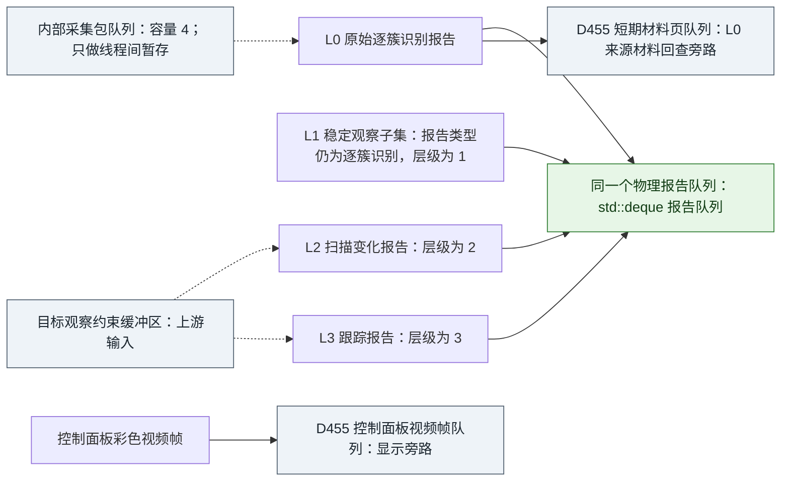

# 旧鱼巢 D455 采集至四类逻辑队列数据生成实现流程图 v0.1

更新时间：2026-07-13

## 元数据

```text
图类型：旧仓库当前实现证据流程图
来源仓库：D:\鱼巢
代码版本：main @ 839d306771e1f6be1b626294ee066a1c113d5d00
代码状态：本图覆盖的源文件在抽取时无未提交改动
目标仓库：D:\海中鱼巣
截止边界：四类逻辑队列数据完成构造并调用“提交外设观察报告”进入共享报告队列
不得作为施工许可：是
不得宣称：海中鱼巣已接入 D455、体素、真实外设或四类队列实现
```

## 依据

```text
D:\鱼巢\D455相机类.ixx:1-16,41-113
D:\鱼巢\D455相机类.cpp:55-85,223-342
D:\鱼巢\双目相机本能适配器.h:14-21,254-261
D:\鱼巢\双目相机本能适配器.cpp:994-1001,1835-1890,1925-1980,2059-2164
D:\鱼巢\外设线程_D455深度相机.ixx:43-53,803-900,1444-1962,2373-2505,2590-2688,3044-3565,3569-3787,4170-4188
D:\鱼巢\外设观察报告队列.ixx:24-53,1150-1187,1670-1763,4170-4282
D:\鱼巢\docs\current-state.md:8,16,41
D:\鱼巢\规范\详细设计\待完成\20260702_外设感知本能方法共同边界详细设计_v0.1.md:67-100
D:\鱼巢\规范\详细设计\待完成\20260703_外设观察材料稳定关联与入队详细设计_v0.1.md:108-135
D:\海中鱼巣\AGENTS.md:61-87
D:\海中鱼巣\规范\000_项目规则总纲.md:684-707,725-738
D:\海中鱼巣\规范\001_规则迁移清单.md:69-77,114-122
```

## 说明

本图按 `D:\鱼巢` 当前源码抽取，不按旧计划或候选详细设计反推代码。图从公开启动入口开始，覆盖 RealSense 设备打开、帧采集、对齐与滤波、适配器结果构造、内部采集流水线、L0/L1/L2/L3 四类逻辑数据生成及共享队列写入；到入队点立即截止。

这里的“四个队列”必须校正为“四类逻辑队列数据”：旧代码没有四个独立报告 `deque`。L0、L1、L2、L3 最终都调用 `提交外设观察报告`，写入同一个 `报告队列`。其中 L0 与 L1 还复用 `逐簇识别报告` 类型，只靠 `报告层级` 区分。它们也不是深度 / 彩色 / 左红外 / 右红外四路传感器队列，不是调用结果中的四种深度 `vector`，更不是“容量为 4”的内部采集包队列。

以下对象不属于四类逻辑输出：

```text
结构_D455观察报告采集流水线::队列：容量 4 的线程间临时采集包缓冲。
D455材料页队列：L0 报告对应的短期可回查材料页旁路。
D455控制面板视频帧队列：显示材料旁路，不是观察事实材料。
目标观察约束缓冲区：L2 / L3 的上游输入，不是 D455 生成的输出。
```

## 实现流程图

```mermaid
flowchart TD
    CALL["调用方：命令行、控制面板或其它上层入口"] --> A["启动外设线程_D455深度相机(配置)"]
    A --> B{"已有可 join 的工作线程？"}
    B -->|是| R0["逻辑内返回：拒绝重复启动；不创建新线程"]
    B -->|否| C["建立共享状态并启动工作线程"]
    C --> D["D455_线程主循环：清空跟踪稳定缓存与跨帧观察簇缓存，读取配置"]
    D --> E{"配置要求启动时打开相机？"}
    E -->|否| H["进入运行态"]
    E -->|是| F["双目相机本能适配器::打开"]
    F --> G{"RealSense 运行时、配置应用和设备打开成功？"}
    G -->|否| R1["逻辑内返回：设备或运行时不可用；记录样本并故障收口"]
    G -->|是| G1["D455_相机实现::打开：启用深度和彩色流，可选双红外；启动管线，读取内参与深度尺度，配置传感器和滤波链"]
    G1 --> H

    H --> I{"启用完整观察材料？"}
    I -->|否| R2["逻辑内分支：本轮不生成四类逻辑队列数据；可继续显示视频旁路"]
    I -->|是| J{"采用观察报告采集流水线？"}
    J -->|是| K["启动采集生产者：互斥锁、可读/可写条件变量、容量 4 的内部采集包队列；轻量模式异步重叠采集与报告构建"]
    J -->|否| L["主循环按采样时点同步采集"]
    K --> M{"启用轻量观察报告？"}
    L --> M
    M -->|是| N["采集轻量观察原始帧：wait_for_frames"]
    M -->|否| N2["采集完整观察帧或多帧材料；需要时回写迁移分割空间候选"]
    N --> O["彩色对齐；降采样；深度转视差；空间/时间滤波；转回深度；填洞"]
    O --> P{"深度帧、所需彩色帧、尺寸与复制结果有效？"}
    P -->|否| R3["逻辑内返回：拒绝无效外部帧材料；不发布四类逻辑队列数据"]
    P -->|是| Q["写入时间戳、帧号、内参、对齐状态、RGB 与毫米深度"]
    Q --> Q1["从原始帧生成调用结果：稳定深度网格候选、空间候选、像素材料和质量摘要"]
    N2 --> Q2["形成完整调用结果"]
    Q1 --> S{"轻量调用结果成功且存在有效空间候选？"}
    S -->|否| R4["逻辑内返回：调用失败；保留失败样本，不发布四类逻辑队列数据"]
    S -->|是| T["读取外设观察等待项并分组为扫描变化、目标跟踪；扫描分支按需读取上一份 L1"]
    Q2 --> SF{"完整调用结果成功？"}
    SF -->|否| R4
    SF -->|是| SC{"迁移分割空间候选为空？"}
    SC -->|否| T
    SC -->|是| E0["仍发布空簇 L0：写候选数量与补观察缺口；不伪造稳定簇"]
    E0 --> T

    T --> U["构造 L0 原始逐簇识别报告；写来源、帧、坐标系、材料句柄、候选簇与质量字段；更新跨帧簇状态"]
    U --> UQ["提交外设观察报告：L0 写入同一个物理报告队列"]
    UQ --> MP{"提交 D455 短期观察材料页成功？"}
    MP -->|否| X0["旧代码继续：仅把材料页提交结果写入诊断；按海中鱼巣规则应追根因，禁止照搬"]
    MP -->|是| V["按稳定发布门筛选：连续稳定命中、低复现离散度，并具备轮廓、深度和空间材料"]
    X0 --> V
    V --> W{"存在达到稳定门且当前应发布的簇？"}
    W -->|否| R5["逻辑内返回：本帧只保留 L0；不生成 L1/L2/L3"]
    W -->|是| Y["构造 L1 稳定观察子集；保留来源 L0 报告、来源外设帧、坐标系和稳定簇摘要"]
    Y --> YQ["提交外设观察报告：L1 写入同一个物理报告队列"]

    YQ --> S2{"存在扫描等待项且目标前置满足？"}
    S2 -->|否| R6["逻辑内返回：本轮不生成 L2"]
    S2 -->|是| S2A{"L1 口径及来源链完整？"}
    S2A -->|否| X2["追根因解决：旧代码只记录跳过；已形成 L1 却缺来源报告、外设帧、时间或坐标系"]
    S2A -->|是| L2["构造 L2 扫描变化报告：结合目标约束与上一 L1；无基准或目标未命中时仍形成结构化缺口材料"]
    L2 --> L2Q["提交外设观察报告：L2 写入同一个物理报告队列"]

    YQ --> S3{"存在跟踪等待项、目标种子且本帧尚未生成主动跟踪报告？"}
    S3 -->|否| R7["逻辑内返回：本轮不生成 L3"]
    S3 -->|是| S3A{"L1 口径及来源链完整？"}
    S3A -->|否| X3["追根因解决：旧代码只记录跳过；已形成 L1 却缺来源报告、外设帧、时间或坐标系"]
    S3A -->|是| L3["构造 L3 跟踪报告：按目标约束或种子匹配；未命中时写丢失、失败次数与重捕获候选材料"]
    L3 --> L3Q["提交外设观察报告：L3 写入同一个物理报告队列"]

    UQ -.-> END["范围终点：四类逻辑数据的条件性生成与共享报告队列写入；不进入任何消费者"]
    YQ -.-> END
    L2Q -.-> END
    L3Q -.-> END

    classDef logicReturn fill:#fff5cc,stroke:#a57900,color:#3a2a00;
    classDef rootCause fill:#ffe1e1,stroke:#b42318,color:#5a0b08;
    classDef output fill:#e7f6e7,stroke:#2f7d32,color:#123d15;
    class R0,R1,R2,R3,R4,R5,R6,R7 logicReturn;
    class X0,X2,X3 rootCause;
    class UQ,YQ,L2Q,L3Q,END output;
```



## 四类逻辑数据与物理承载映射



| 逻辑层 | 当前代码生成物 | 生成条件 | 当前物理承载 | 重要事实 |
| --- | --- | --- | --- | --- |
| L0 | 原始逐簇识别报告 | 轻量路径须有有效空间候选；非轻量完整调用结果成功即可 | 共享 `报告队列`；同时为成功来源提交 `D455材料页队列` | 非轻量迁移候选为空时仍发布空簇 L0；`报告类型=逐簇识别报告`；当前构造函数依赖结构默认值取得 `报告层级=0`，未显式赋值 |
| L1 | 稳定观察子集报告 | 连续稳定、复现离散度、轮廓、深度、空间材料及发布节拍满足 | 同一共享 `报告队列` | 仍是 `逐簇识别报告` 类型，靠 `报告层级=1` 与 L0 区分；可能无等待项时按待发布状态生成 |
| L2 | 扫描变化报告 | 有扫描等待项，目标前置满足，当前 L1 及来源链完整 | 同一共享 `报告队列` | 无上一 L1 基准或目标未命中时仍提交结构化非成功材料，不等于扫描事实成立 |
| L3 | 跟踪报告 | 有跟踪等待项和目标种子，本帧尚未生成主动跟踪报告，当前 L1 及来源链完整 | 同一共享 `报告队列` | 未命中时仍提交丢失、失败次数和重捕获候选材料，不等于目标消失事实成立 |

单帧不保证四类数据同时入队。L0 是成功完整观察帧的基础产物；L1 受稳定门限制；L2、L3 还受等待项、目标约束和 L1 来源链限制。同一帧可按多个扫描等待项生成多条 L2；主动 L3 每帧最多一条。

## 代码证据映射

| 流程节点 | 当前代码位置 | 代码事实 |
| --- | --- | --- |
| 启动与线程装配 | `D:\鱼巢\外设线程_D455深度相机.ixx:4170-4188,4284-4286` | 拒绝重复线程，建立共享状态，启动 `D455_线程主循环` |
| 主循环与打开设备 | `D:\鱼巢\外设线程_D455深度相机.ixx:3569-3601` | 清缓存、读取配置、调用适配器打开，失败则故障收口 |
| RealSense 管线打开 | `D:\鱼巢\双目相机本能适配器.cpp:1925-1980`；`D:\鱼巢\D455相机类.cpp:55-85` | 检查运行时，配置并打开 D455；启用流、启动管线、读取内参与深度尺度 |
| 帧采集与滤波 | `D:\鱼巢\D455相机类.cpp:223-342` | 阻塞等帧、彩色对齐、视差/空间/时间/填洞链、复制 RGB 和毫米深度 |
| 适配器结果构造 | `D:\鱼巢\双目相机本能适配器.cpp:1835-1890,2059-2164` | 把原始帧转为候选、像素、质量和帧元数据调用结果 |
| 非轻量空候选语义 | `D:\鱼巢\双目相机本能适配器.cpp:994-1001`；`D:\鱼巢\外设线程_D455深度相机.ixx:803-900,3176-3188,3727-3782` | 完整调用结果先保持成功；迁移候选为空只写数量与缺口，随后仍发布空簇 L0 |
| 线程间采集流水线 | `D:\鱼巢\外设线程_D455深度相机.ixx:3062-3236,3639-3648,3715-3724` | 容量 4 的临时 `deque`，条件变量协调；轻量路径异步重叠构建 |
| L0 构造 | `D:\鱼巢\外设线程_D455深度相机.ixx:1444-1609,3267-3276` | 构造逐簇识别报告，更新跨帧簇状态，提交共享报告队列和短期材料页 |
| L1 稳定门与构造 | `D:\鱼巢\外设线程_D455深度相机.ixx:1626-1686,1707-1962,3296-3341` | 只保留稳定且材料可承接的簇；非空才入队 |
| 等待项分组 | `D:\鱼巢\外设线程_D455深度相机.ixx:3240-3255,3538-3547` | 将等待项分为扫描变化和目标跟踪，并按需读上一 L1 |
| L2 构造与入队 | `D:\鱼巢\外设线程_D455深度相机.ixx:2373-2505,3345-3435` | 校验等待项、L1 与来源链，生成扫描变化或结构化缺口材料后入共享队列 |
| L3 构造与入队 | `D:\鱼巢\外设线程_D455深度相机.ixx:2391-2405,2590-2688,3439-3525` | 校验等待项、目标种子、L1 与来源链，生成命中或丢失材料后入共享队列 |
| 四类统一物理写点 | `D:\鱼巢\外设观察报告队列.ixx:1170-1187,4170-4187` | 四类报告均 `push_back` 到同一个 `报告队列`；写点分配报告 ID 和时间戳并执行清理 |
| 辅助队列 | `D:\鱼巢\外设观察报告队列.ixx:4191-4219,4265-4282` | L0 来源材料页与控制面板视频帧分别进入独立辅助队列 |

## 输入契约与调用语境

| 入口 | 输入来源 | 上游是否保证有效 | 允许逻辑内返回 | 追根因触发条件 | 结构变化 |
| --- | --- | --- | --- | --- | --- |
| `启动外设线程_D455深度相机` | 命令行、控制面板或其它上层请求 | 否；可能重复启动 | 已有工作线程时允许拒绝 | 新线程已建立但共享状态或工作线程装配不一致 | 建立运行期线程状态，不写世界事实 |
| `双目相机本能适配器::打开` | 外部设备与本地 RealSense 运行时 | 否 | 运行时缺失、设备不可用、配置应用失败 | 报告成功后相机对象或打开状态不一致 | 只改变外设适配器运行期状态 |
| `采集轻量观察原始帧` | RealSense 外部帧 | 否 | 缺帧、尺寸无效、复制失败、有效候选为空 | 已声明成功但帧载荷、帧号、对齐或像素数读回矛盾 | 只形成非权威材料 |
| `D455_发布采集成功后的报告编排` | 已成功的调用结果、等待项和上一 L1 | 调用结果应有效；等待项可为空 | 无稳定簇、无扫描/跟踪等待项或目标前置不满足 | 已生成 L1 但来源报告、外设帧、时间或坐标系不完整 | 写运行期非权威报告队列 |
| `提交外设观察报告` | L0/L1/L2/L3 报告项 | 正式发布路径应保证类型与来源契约 | 无普通失败返回；函数直接分配 ID 并入队 | 入队后 ID、类型、层级、来源或读回不一致 | 写共享报告队列，不写世界事实 |
| `提交D455短期观察材料页` | 已成功的 L0 调用结果和已分配报告 ID | 是 | 不应把 `报告ID=0` 或来源失败当普通分支继续 | L0 已入队但材料页无法承载或按报告 ID 回查失败 | 写短期材料页队列 |

## 非成功返回二分审查

| 判断点 | 旧代码位置 | 旧代码实际处理 | 二分口径 | 说明 |
| --- | --- | --- | --- | --- |
| 重复启动 | `外设线程_D455深度相机.ixx:4172-4174` | 返回 `false` | 逻辑内返回 | 调用请求被拒绝，无新线程结构 |
| RealSense 运行时或设备打开失败 | `双目相机本能适配器.cpp:1930-1979`；`外设线程_D455深度相机.ixx:3586-3597` | 返回失败材料并把线程收口为故障 | 逻辑内返回 | 外部条件不可用，不生成观察报告 |
| 帧、尺寸、彩色或深度材料无效 | `D455相机类.cpp:257-258,288,321-335` | 返回采集失败 | 逻辑内返回 | 拒绝外部候选材料，不写报告队列 |
| 轻量空间候选为空 | `双目相机本能适配器.cpp:1881-1889` | 调用结果标记失败，不发布报告 | 逻辑内返回 | 只适用于轻量稳定深度网格路径 |
| 非轻量迁移分割候选为空 | `双目相机本能适配器.cpp:994-1001`；`外设线程_D455深度相机.ixx:803-900,3727-3782` | 保持调用成功并发布空簇 L0 | 逻辑内材料输出 | 写候选数量与补观察缺口，不伪造稳定簇；后续 L1/L2/L3 由稳定门自然阻断 |
| 采集构建线程异常 | `外设线程_D455深度相机.ixx:3199-3209` | 只写运行错误日志并结束生产者 | 追根因解决 | 内部异步处理异常，不得在新项目中只靠日志吞掉 |
| L0 已入队但短期材料页提交失败 | `外设线程_D455深度相机.ixx:3271-3294` | 继续稳定子集流程 | 追根因解决 | 已进入正式运行期承载，报告与可回查来源出现不一致风险 |
| 无达到稳定门的簇 | `外设线程_D455深度相机.ixx:3296-3337` | 保留 L0，不生成 L1 | 逻辑内返回 | 设计允许的条件性输出，未伪造 L1 |
| 扫描/跟踪等待项或目标前置不满足 | `外设线程_D455深度相机.ixx:3354-3367,3447-3473` | 跳过本轮相应报告 | 逻辑内返回 | 请求材料不完整或本轮无需生成 |
| L1 已形成但来源链不完整 | `外设线程_D455深度相机.ixx:3387-3408,3493-3514` | 只写“跳过”日志 | 追根因解决 | 来源原始报告、外设帧、时间和坐标系是 L1 正式承接前提 |
| 扫描无历史基准或目标未命中 | `外设线程_D455深度相机.ixx:2440-2461` | 仍生成并提交 L2 非成功材料 | 逻辑内材料输出 | 这是结构化缺口材料，不是扫描事实，也不是普通成功报告 |
| 跟踪目标未命中或种子丢失 | `外设线程_D455深度相机.ixx:2619-2679` | 仍生成并提交 L3 丢失材料 | 逻辑内材料输出 | 丢失、失败次数、重捕获候选只是外设材料，不裁决世界事实 |

## 当前实现偏差与迁移提醒

| 编号 | 当前旧代码事实 | 与目标口径的偏差 | 本图结论 |
| --- | --- | --- | --- |
| D455-FLOW-01 | L0/L1/L2/L3 共用一个 `报告队列` | 旧候选详细设计曾写“按数据类型分开队列” | 不能把四类逻辑数据画成四个已实现的物理容器 |
| D455-FLOW-02 | L0 构造函数未显式写 `报告层级=0`，依赖结构默认值 | 候选详细设计要求 L0 新写入口显式为 0 | 新实现不能依赖默认值暗示层级 |
| D455-FLOW-03 | `提交外设观察报告` 直接分配 ID、写时间并 `push_back`，无类型/层级/来源入口拒绝 | 海中鱼巣要求正式写入口先排除无效输入 | 后续设计必须另定服务边界与写入口契约，不能原样复制 |
| D455-FLOW-04 | L1 来源链不完整时扫描/跟踪分支只记录日志并跳过 | 海中鱼巢要求已进入结构承载后的内部不一致追根因 | 新实现必须把该分支列为逻辑错误，不得静默继续 |
| D455-FLOW-05 | L0 已入队后材料页失败不会阻止后续 L1 处理 | 报告与来源可回查页可能出现半闭合 | 新实现必须定义同一发布会话、撤销或最后发布边界 |
| D455-FLOW-06 | 报告结构字段注释只写 `L0/L1/L2`，跟踪构造却实际写 `报告层级=3` | 注释与当前 L3 实现不一致 | 新实现必须用正式枚举或完整值域定义四层，不依赖过期注释 |
| D455-FLOW-07 | 轻量采集使用无超时的 `wait_for_frames()` | 外部停止请求不能直接打断设备等待 | 新实现必须设计可停止等待、超时和线程回收合同 |
| D455-FLOW-08 | 采集生产者异常只写运行错误日志并置 `采集结束=true` | 主线程可能把生产者异常收口成普通停止 | 新实现必须把内部异常结构化传播到生命周期故障，不得让日志承担状态 |

## 关键边界

```text
1. 本图只证明旧鱼巢当前源码中 D455 采集到四类逻辑报告数据入共享队列的实现路径已经被静态抽取。
2. 本图不证明旧鱼巢真实 D455 样本当前可运行，也未执行构建、设备采集或队列烟测。
3. 本图不证明海中鱼巣已经实现或接入 D455、外设等待、四类队列、体素或视觉融合。
4. 截止点之后的队列消费、观察/识别/扫描/跟踪方法、任务承接、世界事实入账、体素、SQL、控制面板显示、需求结算和方法学习全部不在范围内。
5. 外设帧、调用结果、材料页和 L0/L1/L2/L3 报告都是非权威材料；不能直接成为存在、状态、动态、特征、需求、任务或方法事实。
6. 工作线程和采集线程只负责供料，不是动作来源。日志、控制台和显示只做人读诊断。
7. 四类数据是条件性输出，不是每帧必定同时生成：L0 依赖成功采集，L1 依赖稳定门，L2/L3 还依赖等待项、目标与 L1 来源链。
8. 旧函数事实和旧调用链只是迁移证据，不是海中鱼巢的迁移单位或代码施工许可。
```
