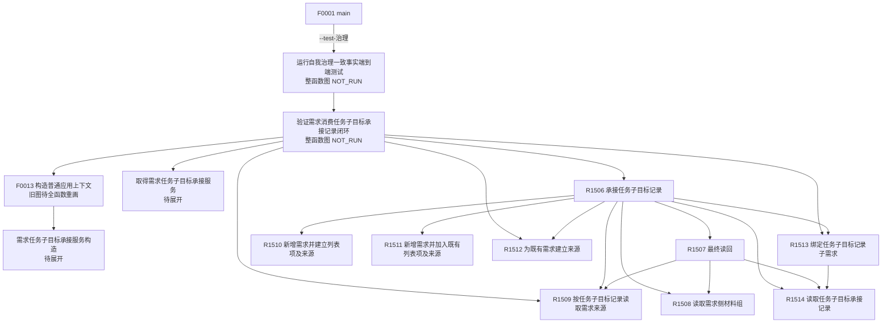

# 需求任务子目标承接当前调用子图

图类型：当前代码调用子图
冻结提交：`d534058e154177d4576f50a92ec448dc3f38a507`
实现提交：`5aada0f2eb5c015617b0c55e22aaccf2bfdb328c`
范围：普通应用装配、需求任务子目标承接服务、需求 owner 三类原子写、需求来源读回、任务记录绑定 / 读取及治理专项实际调用。
边界：这是从当前源码逐项复核得到的增量子图，不替代仍绑定 `720f4afd78e63d95d244867aa13d72970a419654` 的全量聚合表，不宣称全仓当前可达覆盖完成。

## 当前实际调用

生产普通模式只证明 `F0013` 装配唯一业务服务实例；本次新增服务的业务入口在当前代码中由 `--test-治理` 的合法普通应用消费者调用。图中没有生产线程调用 `R1506` 的边。

| 调用方 | 被调方 | 当前调用点 | 条件 / 结果传递 |
| --- | --- | --- | --- |
| `main` | `运行自我治理一致事实端到端测试` | `海中鱼巣/入口.cpp:19-21` | 参数为 `--test-治理`，直接返回测试退出码 |
| `运行自我治理一致事实端到端测试` | `验证需求消费任务子目标承接记录闭环` | `海中鱼巣/端到端测试.自我治理一致事实.ixx:2954-2957` | 返回 false 时测试根返回 1 |
| `验证需求消费任务子目标承接记录闭环` | `F0013 构造普通应用上下文`、mutable / const getter、R1506、R1509、R1512、R1513 | 同上 `:737-752, 829-982` | 真实普通应用实例；逐 V 项消费并检查结构化结果 |
| `F0013 构造普通应用上下文` | `需求任务子目标承接服务`构造 | `海中鱼巣/装配.普通应用.ixx:835-841` | 需求服务与任务记录服务构造成功后建立唯一实例；异常映射装配状态 55 |
| R1506 | R1514 / R1509 | `海中鱼巣/领域/服务.需求任务子目标承接.ixx:323-346` | 记录与来源按同一截止读取；漂移时整组重读 |
| R1506 | R1508 / R1513 / R1507 | 同上 `:356-374, 458-470` | 恢复既有需求侧材料，任务 owner 绑定后同 G 双读回 |
| R1506 | R1510 / R1511 / R1512 | 同上 `:421-456` | 按“同父同目标子 / 精确列表项 / 均不存在”三种互斥模式选择一个需求 owner 原子入口 |
| R1507 | R1514 / R1509 / R1508 | 同上 `:228-279` | 同 G 双向端点互证；最多一次最新截止重读 |
| R1513 | R1514 | `海中鱼巣/领域/服务.L2任务子目标承接记录结构.ixx:139-150` | 先读记录；旧截止可按原幂等请求收敛，否则验证成员链后写绑定 |

## 稳定身份与源码

| 身份 | 完整函数 | 源码范围 | 源码 blob | 单函数图 |
| --- | --- | --- | --- | --- |
| R1506 | `需求任务子目标承接结果 海中鱼巣::需求任务子目标承接服务::承接任务子目标记录(const 需求任务子目标承接请求& 请求) noexcept` | `海中鱼巣/领域/服务.需求任务子目标承接.ixx:317-476` | `d03f149888dca1ad51c2c841a28930f29aeb083d` | `流程图/代码流程图/L3/CF-L3-0028_承接任务子目标记录_现状流程图.md` |
| R1507 | `需求任务子目标承接结果 海中鱼巣::需求任务子目标承接内部::最终读回(L2需求结构服务& 需求服务, L2任务子目标承接记录结构服务& 记录服务, L2任务子目标承接记录身份 记录身份, 需求任务子目标承接来源 来源分类, 需求任务子目标承接状态 成功状态, std::uint64_t 截止, bool 允许重读 = true)` | 同上 `:228-280` | 同上 | `流程图/代码流程图/L4/CF-L4-0172_最终读回_现状流程图.md` |
| R1508 | `需求侧材料读取结果 海中鱼巣::需求任务子目标承接内部::读取需求侧材料组(L2需求结构服务& 服务, const L2任务子目标承接记录事实& 记录, const L2需求任务子目标来源关系事实& 来源, std::uint64_t 截止)` | 同上 `:150-199` | 同上 | `流程图/代码流程图/L4/CF-L4-0173_读取需求侧材料组_现状流程图.md` |
| R1509 | `L2按任务子目标记录读取需求来源结果 海中鱼巣::L2需求结构服务::按任务子目标记录读取需求来源(L2按任务子目标记录读取需求来源请求 请求) const noexcept` | `海中鱼巣/领域/服务.L2需求结构.ixx:3742-3763` | `732e1ef76190a5538a0ac2f6c27d3fb95fe90d03` | `流程图/代码流程图/L4/CF-L4-0174_按任务子目标记录读取需求来源_现状流程图.md` |
| R1510 | `L2新增需求并建立列表项及任务子目标来源结果 海中鱼巣::L2需求结构服务::新增需求并建立列表项及任务子目标来源(L2新增需求并建立列表项及任务子目标来源请求 请求) noexcept` | 同上 `:4006-4124` | 同上 | `流程图/代码流程图/L4/CF-L4-0175_新增需求并建立列表项及任务子目标来源_现状流程图.md` |
| R1511 | `L2新增需求并加入既有列表项及任务子目标来源结果 海中鱼巣::L2需求结构服务::新增需求并加入既有列表项及任务子目标来源(L2新增需求并加入既有列表项及任务子目标来源请求 请求) noexcept` | 同上 `:4126-4224` | 同上 | `流程图/代码流程图/L4/CF-L4-0176_新增需求并加入既有列表项及任务子目标来源_现状流程图.md` |
| R1512 | `L2为既有需求建立任务子目标来源结果 海中鱼巣::L2需求结构服务::为既有需求建立任务子目标来源(L2为既有需求建立任务子目标来源请求 请求) noexcept` | 同上 `:4226-4312` | 同上 | `流程图/代码流程图/L4/CF-L4-0177_为既有需求建立任务子目标来源_现状流程图.md` |
| R1513 | `L2任务子目标承接记录写入结果 海中鱼巣::L2任务子目标承接记录结构服务::绑定任务子目标承接记录子需求(L2绑定任务子目标承接记录子需求请求 请求) noexcept` | `海中鱼巣/领域/服务.L2任务子目标承接记录结构.ixx:134-156` | `6e13c91095c9bbfa4361358bc8bf26b0d9bb9a9e` | `流程图/代码流程图/L4/CF-L4-0178_绑定任务子目标承接记录子需求_现状流程图.md` |
| R1514 | `L2任务子目标承接记录读取结果 海中鱼巣::L2任务子目标承接记录结构服务::读取任务子目标承接记录(L2任务子目标承接记录读取请求 请求) const noexcept` | 同上 `:228-231` | 同上 | `流程图/代码流程图/L4/CF-L4-0179_读取任务子目标承接记录_现状流程图.md` |

## 输入契约与非成功二分

| 入口 | 调用语境 | 上游保证 | 逻辑内返回 | 追根因对象 | 当前结构变化 |
| --- | --- | --- | --- | --- | --- |
| R1506 | 治理专项经普通应用 getter；未来合法业务消费者待接线 | 请求是外部 / 测试材料，函数自行验证 | 入口拒绝、许可拒绝、代次漂移、幂等 / 引用 / 父域 / 顺序 / 目标冲突、资源失败、记录不可承接、需求已发布待任务绑定 | 前置成立后的复义、双向端点不一致、写后或读回形状不一致统一为内部不一致 | 最多一次需求 owner 原子写，再一次任务 owner 独立绑定；跨 owner 不原子 |
| R1509 / R1514 | R1506、R1507 和专项直接读回 | 请求头与身份由调用方形成，入口仍自验 | 无效请求、许可 / 代次 / 未找到等结构化读取结果 | 成功头与载荷形状不一致 | 只读 |
| R1510—R1512 | 只由 R1506 或专项直接调用 | owner 入口自行复核请求、代次和引用 | 入口拒绝、许可 / 代次 / 幂等 / 引用 / 资源非成功 | 写入成功但编码映射或完整读回不一致 | 各自只在需求 owner 内形成一个原子写集 |
| R1513 | R1506 和专项直接调用 | 记录 owner 再读取并验证记录、父需求、目标、成员链 | 入口拒绝、许可 / 代次 / 幂等 / 引用 / 资源非成功 | 已验证前置后内部结构不一致 | 任务 owner 内绑定子需求并迁移记录状态 |
| R1507 / R1508 | R1506 内部同 G 双向读回 | 已有记录 / 来源候选，仍逐项互证 | 一次最新 G 重读、代次漂移 | 记录、来源、父、子、成员、列表项端点或状态不一致 | 只读 |

## NOT_RUN 与待展开

- 图谱维护本身未运行构建、程序或业务专项；这里只读取已发布源码和已发布验证。提交 `dc9aa543` 的独立验收结论是 `INTEGRATION-ACCEPTANCE-FAIL / 未正式接线`：现有自检范围通过，但唯一业务调用者仍是自检模块，Release 仍携带测试模块和 `--test-治理` 入口。既有 V07、V13、V16、V17、V21 仍是 `NOT_RUN`，没有被图谱维护或该验收升级为 PASS。
- `构造普通应用上下文` 当前定义已从旧图的 44—53 行扩展为 454 行起的大型装配函数；本次只核对新服务构造边，不重画其余 100 余项候选调用。
- `验证需求消费任务子目标承接记录闭环` 已静态核对 V01—V21 调用，但整函数 731—988 的所有辅助调用尚未逐函数制图。
- R1510—R1512 调用的需求内部 helper、R1513 调用的记录 owner 验证 / 写入 helper仍在待展开队列；存在边不证明 helper 合同正确。
- 当前子图没有任务完成后逐需求单独核算，也没有先裁决结果与各需求是“可共用”还是“争用”的调用边。目标口径已经明确：可共用结果允许多个合格需求共同引用，但仍须逐需求独立判定与结算，且价值、预算、归因不得重复领取；争用结果才需要冻结待分配结果、合格需求候选和正式成员分配优先级证据，按优先级逐一分配，并在每次扣减剩余后再处理下一需求。
- 当前代码及正式合同尚未提供“成员分配优先级”；不得把任务执行优先级、队列顺序、需求权重、预算、创建时间或稳定编码冒充该优先级。父需求重判、任务重筹办以及上述共用 / 争用后继均不能从现有承接记录链推断为已实现。
- 当前聚合基线相对 `d534058e` 仍有 109 个新增待绘制候选；因此不得宣称 main 全量图谱、业务闭环、生产接线或独立集成验收完成。
