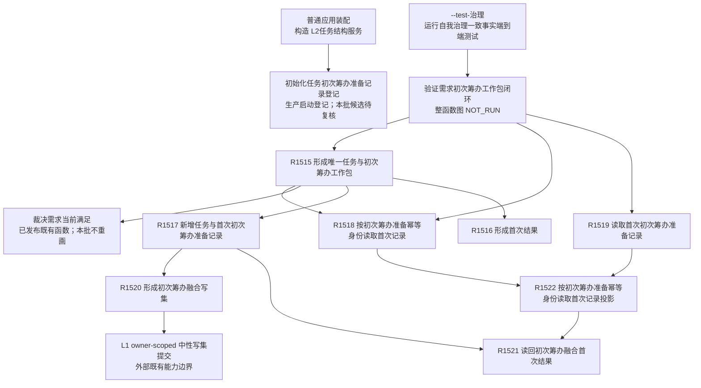

# 需求初次筹办工作包当前调用子图

图类型：当前代码调用子图
冻结提交：`7d3e7c9e32623aaa9aa4b4c90b53ef634eb6f094`
实现提交：`17edb9d974be6d961d404247c88a064b8f73df58`
范围：首次准备强类型记录、需求当前满足前置裁决、任务与首次记录融合原子建立、按准备幂等身份首次读回及按记录身份当前 / 历史读回。
边界：这是对已发布源码逐函数复核形成的局部当前子图，不替代仍绑定 `720f4afd78e63d95d244867aa13d72970a419654` 的全量聚合表；候选批次仍有其它未展开源码，状态保持 `PARTIAL-CURRENT-SUBGRAPH / 候选待复核`。

## 当前实际调用

普通应用生产装配只直接证明记录登记随 `L2任务结构服务` 构造发生。`需求初次筹办准备提供者`、R1515、R1517—R1519 的唯一仓库内实际业务调用者是治理专项；治理专项是合法普通应用实例的测试消费者，但不是普通生产线程接线。`7d3e7c9e` 的独立集成验收结论同样为未正式接线，不改变源码事实。

| 调用方 | 被调方 | 当前调用点 | 条件 / 结果传递 |
| --- | --- | --- | --- |
| 普通应用装配 | `L2任务结构服务`构造 -> 记录登记 | `海中鱼巣/领域/服务.L2任务结构.ixx:4740-4754` | 构造 task owner 时登记记录锚点、4 种关系类型和 3 种属性类型；这不是形成业务记录 |
| 治理专项根 | `验证需求初次筹办工作包闭环` | `海中鱼巣/端到端测试.自我治理一致事实.ixx:3656-3658` | 仅 `--test-治理` 路径；本图未运行程序 |
| 专项闭环 | R1515 / R1518 / R1519 | 同上 `:2966-3167` | 构造合法普通应用上下文后直接消费公开接口，覆盖首次、重复、冲突、历史和并发场景的已发布测试代码 |
| R1515 | R1518 | `海中鱼巣/领域/内部治理/服务.需求初次筹办准备.ixx:166-188,219-236` | 实时裁决前先按准备幂等身份读取；发布未知时只按原键收敛 |
| R1515 | 需求当前满足裁决 / R1517 / R1516 | 同上 `:190-213` | 无首次记录且 G 未漂移才实时裁决；未满足后一次融合写；成功或重复从首次记录组包 |
| R1517 | R1520 / L1 提交 / R1521 | `海中鱼巣/领域/服务.L2任务结构.ixx:4762-4838` | 同一 task owner 锁下检查 0/1 当前任务，形成一个 owner-scoped 写集并按 G1 历史读回 |
| R1518 | R1522 | 同上 `:4841-4867` | 读取当前截止后按准备键读取首次写入材料，不依赖任务当前性 |
| R1519 | R1522 | 同上 `:4870-4942` | 当前 / 历史验证记录节点与完整请求值，再由准备键重建首次 G0/G1 结果 |
| R1522 | R1521 | 同上 `:4688-4731` | 从 L1 首次写入见证恢复融合映射并精确读回；普通任务旧写入键返回空记录而非伪造融合记录 |

## 稳定身份与源码

| 身份 | 完整函数 | 源码范围 | 源码 blob | 单函数图 |
| --- | --- | --- | --- | --- |
| R1515 | `需求初次筹办准备结果 海中鱼巣::需求初次筹办准备提供者::形成唯一任务与初次筹办工作包(需求初次筹办准备请求 请求) noexcept` | `海中鱼巣/领域/内部治理/服务.需求初次筹办准备.ixx:153-246` | `49d5c31745cdd82eccaf577626706ed22a393409` | `流程图/代码流程图/L3/CF-L3-0029_形成唯一任务与初次筹办工作包_现状流程图.md` |
| R1516 | `需求初次筹办准备结果 海中鱼巣::需求初次筹办准备内部::形成首次结果(需求初次筹办准备状态 状态, const L2任务初次筹办准备记录事实& 记录, const L2任务事实& 任务, const L2任务身份来源事实& 身份来源)` | 同上 `:109-137` | 同上 | `流程图/代码流程图/L4/CF-L4-0180_形成首次结果_现状流程图.md` |
| R1517 | `L2新增任务与首次初次筹办准备记录结果 海中鱼巣::L2任务结构服务::新增任务与首次初次筹办准备记录(L2新增任务与首次初次筹办准备记录请求 请求) noexcept` | `海中鱼巣/领域/服务.L2任务结构.ixx:4762-4838` | `d93c97b38a034e868d7d3c0796275d23bf48b652` | `流程图/代码流程图/L4/CF-L4-0181_新增任务与首次初次筹办准备记录_现状流程图.md` |
| R1518 | `L2按初次筹办准备幂等身份读取首次记录结果 海中鱼巣::L2任务结构服务::按初次筹办准备幂等身份读取首次记录(L2按初次筹办准备幂等身份读取首次记录请求 请求) const noexcept` | 同上 `:4841-4867` | 同上 | `流程图/代码流程图/L4/CF-L4-0182_按初次筹办准备幂等身份读取首次记录_现状流程图.md` |
| R1519 | `L2任务初次筹办准备记录读取结果 海中鱼巣::L2任务结构服务::读取首次初次筹办准备记录(L2任务初次筹办准备记录读取请求 请求) const noexcept` | 同上 `:4870-4942` | 同上 | `流程图/代码流程图/L4/CF-L4-0183_读取首次初次筹办准备记录_现状流程图.md` |
| R1520 | `L1所有者范围写集请求 海中鱼巣::L2任务结构内部::形成初次筹办融合写集(const L2新增任务与首次初次筹办准备记录请求& 请求, const 任务身份来源定位& 来源, const 任务结构类型定位& 类型, const 任务初次筹办准备记录定位& 记录定位)` | 同上 `:4486-4543` | 同上 | `流程图/代码流程图/L5/CF-L5-0309_形成初次筹办融合写集_现状流程图.md` |
| R1521 | `L2新增任务与首次初次筹办准备记录结果 海中鱼巣::L2任务结构内部::读回初次筹办融合首次结果(const L1事实基座服务& 第一层服务, const 任务身份来源定位& 来源, const 任务结构类型定位& 类型, const 任务初次筹办准备记录定位& 记录定位, const 初次筹办融合写入编码映射& 映射, L2结构状态 返回状态, std::uint64_t G1)` | 同上 `:4557-4686` | 同上 | `流程图/代码流程图/L5/CF-L5-0310_读回初次筹办融合首次结果_现状流程图.md` |
| R1522 | `L2按初次筹办准备幂等身份读取首次记录结果 海中鱼巣::L2任务结构内部::按初次筹办准备幂等身份读取首次记录投影(const L1事实基座服务& 第一层服务, const L1所有者范围写端口& 写入端口, const 任务身份来源定位& 来源, const 任务结构类型定位& 类型, const 任务初次筹办准备记录定位& 记录定位, const L2按初次筹办准备幂等身份读取首次记录请求& 请求, std::uint64_t 截止)` | 同上 `:4688-4731` | 同上 | `流程图/代码流程图/L5/CF-L5-0311_按初次筹办准备幂等身份读取首次记录投影_现状流程图.md` |

## 输入契约与非成功二分

### 输入契约与调用语境表

| 入口 | 调用方 | 输入字段 | 输入来源 | 上游是否保证有效 | 允许逻辑内返回 | 追根因触发条件 | 结构变化 | 验证方式 |
| --- | --- | --- | --- | --- | --- | --- | --- | --- |
| R1515 | 当前仅治理专项直接调用；未来普通业务消费者未接线 | 合同版本、准备幂等身份、请求身份、运行代次、G0、需求、任务建立幂等身份 | 测试 / 外部请求材料 | 否；入口自行验证完整请求与双幂等键 | 是；入口拒绝、目标已满足、证据不足、漂移、许可 / 资源失败、已有当前任务、幂等冲突 | 已有首次记录但任务 / 来源缺失、首次材料无法重构、发布结果形状不守恒 | 只经 R1517 形成一次 task owner 融合写 | 当前源码与调用点静态读取；运行 NOT_RUN |
| R1517 | R1515；治理专项间接消费 | G0、完整请求、完整首次未满足裁决 | 已验证业务材料 | 是；入口仍复核 | 是；入口 / 许可 / 漂移 / 引用 / 幂等 / 资源非成功 | 成功提交却无完整发布见证、映射或 G1 历史读回 | 一次写入 3 节点、7 关系、3 值与 3 属性槽，全部同 G1 | 当前源码与 L1 调用点静态读取；运行 NOT_RUN |
| R1518 / R1519 | R1515 前置 / 收敛读回及治理专项直接读回 | 请求头、准备键，或记录身份 / 当前历史类别 / 历史截止 | 测试或正式首次记录引用 | 部分；入口仍验证请求头、准备键或记录身份 | 是；未找到、入口拒绝、漂移、许可 / 资源失败 | 首次写入材料、记录值、映射或载荷形状不一致 | 无，只读 | 当前源码静态读取；运行 NOT_RUN |
| R1520 | R1517 | 已完整的融合请求和 owner 类型定位 | 正式上游已验证材料 | 是 | 否；编码失败不允许降格为业务拒绝 | 强类型材料无法编码 | 只形成尚未提交的局部写集 | 当前源码静态读取 |
| R1521 / R1522 | R1517—R1519 | 已提交 / 精确重复见证、融合编码、G1 或准备键 / 截止 | task owner 权威发布见证 | 是 | 仅准备键没有首次融合记录时允许空记录 | 已发布见证的节点、关系、值、生命周期或 G0/G1 形状错误 | 无，只读 | 当前源码静态读取；运行 NOT_RUN |

### 非成功返回二分审查表

| 节点 | 代码位置 | 返回条件 | 输入语境 | 是否上游保证有效 | 结构是否变化 | 设计是否允许 | 二分口径 | 追根因对象或逻辑返回理由 | 计划动作 |
| --- | --- | --- | --- | --- | --- | --- | --- | --- | --- |
| R1515-N01/N06/N08 | `服务.需求初次筹办准备.ixx:160-202` | 请求无效、G 漂移、已满足或裁决具名非成功 | 测试 / 外部材料 | 否 | 否 | 是 | 逻辑内返回 | 入口和实时裁决协议允许具名拒绝 / 等待 | 无；保持现状图 |
| R1515-N03/N04 | 同上 `:166-185` | 首次记录存在但载荷缺失，或完整请求同键异义 | 已发布首次记录 | 是 | 否 | 部分 | 载荷缺失为追根因解决；异义为逻辑内返回 | task owner 首次记录形状，或幂等冲突 | 形状错登记偏差；冲突无动作 |
| R1515-N11/C13 | 同上 `:204-238` | 融合写具名非成功或发布未知收敛失败 | 正式业务材料 | 是 | 可能已发布 | 是 | 已知非成功为逻辑内返回；发布见证不守恒为追根因解决 | task owner 写入见证与原键收敛链 | 形状错登记偏差 |
| R1517-N02/N04 | `服务.L2任务结构.ixx:4772-4800` | 请求 / G 非成功、列表项已有当前任务或引用失败 | 正式业务材料 | 部分 | 否 | 是 | 逻辑内返回 | 唯一当前任务和入口协议 | 无 |
| R1517-N07 | 同上 `:4801-4830` | 写入非成功、发布见证 / 映射 / G1 读回不完整 | 正式融合写 | 是 | 非成功应为否；发布成功为是 | 具名非成功允许；假发布不允许 | 具名非成功为逻辑内返回；假发布为追根因解决 | L1 写入结果、13 项映射和 G1 历史读回 | 形状错登记偏差 |
| R1518-N02 / R1519-N02 | 同上 `:4851-4859,4881-4884` | 读取请求无效或当前性漂移 | 测试 / 外部读请求 | 否 | 否 | 是 | 逻辑内返回 | 读取入口协议 | 无 |
| R1519-N04/N06/N08 | 同上 `:4885-4925` | 记录不可见、属性读取失败、完整请求复义 / 缺失、准备键投影不一致 | 正式记录引用 | 部分 | 否 | 未找到允许；形状错不允许 | 未找到为逻辑内返回；形状错为追根因解决 | 记录生命周期、唯一完整请求和首次写入见证 | 形状错登记偏差 |
| R1520-N02 | 同上 `:4486-4494` | 正式强类型材料无法编码 | 正式上游已验证材料 | 是 | 否 | 否 | 追根因解决 | 编解码合同或上游完整性守卫 | 登记偏差 |
| R1521-N03/N05/N07/N09/N11 | 同上 `:4570-4679` | 已发布节点、关系、值、G0/G1 或强类型事实不守恒 | 已提交 / 重复见证 | 是 | 已发布 | 否 | 追根因解决 | task owner 权威历史事实 | 登记偏差 |
| R1522-N02/N04/N06 | 同上 `:4702-4723` | 准备键未找到、普通任务旧写，或融合见证不守恒 | 准备键读取 | 部分 | 否 | 空记录允许；不守恒不允许 | 空记录为逻辑内返回；不守恒为追根因解决 | L1 首次写入见证与融合映射 | 形状错登记偏差 |

## 当前实现边界与偏差

- 已发布实现：首次准备强类型记录 DTO、登记类型、融合任务与记录的 task owner 原子写、首次 G1 历史读回、准备键前置读回、记录身份当前 / 历史读回，以及外层首次结果 / 精确重复组包。
- 已发布不等于生产业务接线：R1515 的唯一调用方位于治理专项；普通应用上下文没有保存或暴露 `需求初次筹办准备提供者`，也没有普通线程调用 R1515 的边。
- 未实现：父需求结果回流、已有任务重筹办、成员逐项结算、结果共用 / 争用裁决和成员分配优先级。目标源码中没有这些后继调用边；既有其它位置的“目标未达成待重筹办”结构不能冒充本链已经接线。
- `27b25990` 已发布规范只冻结后继共用 / 争用和逐成员结算口径；当前代码没有成员分配优先级合同，需求优先级、任务基础优先级、列表顺序或遍历顺序均不能替代。
- 本批不运行构建、程序或治理专项；已发布施工 / 验证记录只作交叉证据，不能由图谱维护升级为新的运行事实。
- event 候选以旧 `720f4afd` 全量聚合为输入，报告大量未登记源码；本批只关闭上表 8 个核心函数，初始化登记、编码 / 解码 helper、专项整函数及其余调用闭包保持 `候选待复核`，不改全量 frozen 统计。

### 偏差清单

| 编号 | 现状代码事实 | 正式规范 / 有效流程图 / 详细设计 / 计划口径 | 偏差类型 | 唯一纠偏归属 / 纠偏方向 | 是否需要代码计划 |
| --- | --- | --- | --- | --- | --- |
| IP-G001 | R1515 唯一实际调用方是治理专项，普通应用无 provider 所有权 / 线程调用边 | 详细设计与已完成计划只声明本切片形成首次工作包；`7d3e7c9e` 独立验收明确未正式接线 | 当前实现未接线 | 交互智能体按顶层方案形成直接后继生产消费设计 | 是；本批不形成 |
| IP-G002 | 当前只到首次工作包形成；没有父回流、已有任务重筹办或成员结算调用边 | 3200 / 5220 / 5160 及计划禁止范围要求分账；计划完成边界明确不证明这些后继 | 已知未实现边界 | 各后继正式设计 / 计划 owner | 是；按独立后继目标形成 |
| IP-G003 | 当前没有结果共用 / 争用裁决与成员分配优先级合同 | `27b25990` 已冻结共用 / 争用和逐成员结算口径；成员分配优先级仍待机器合同 | 规范已前置、实现缺失 | 交互 / 计划治理先形成唯一成员分配优先级合同再施工 | 是；本批不形成 |
| IP-G004 | 全量聚合仍绑定 `720f4afd`，event 候选报告大量未登记源码；本批只闭合 R1515—R1522 | 0600 要求增量分账且禁止不同基线混写 | 图谱覆盖缺口 | 流程图与知识图谱维护智能体继续逐候选展开 | 否；图谱维护任务 |
