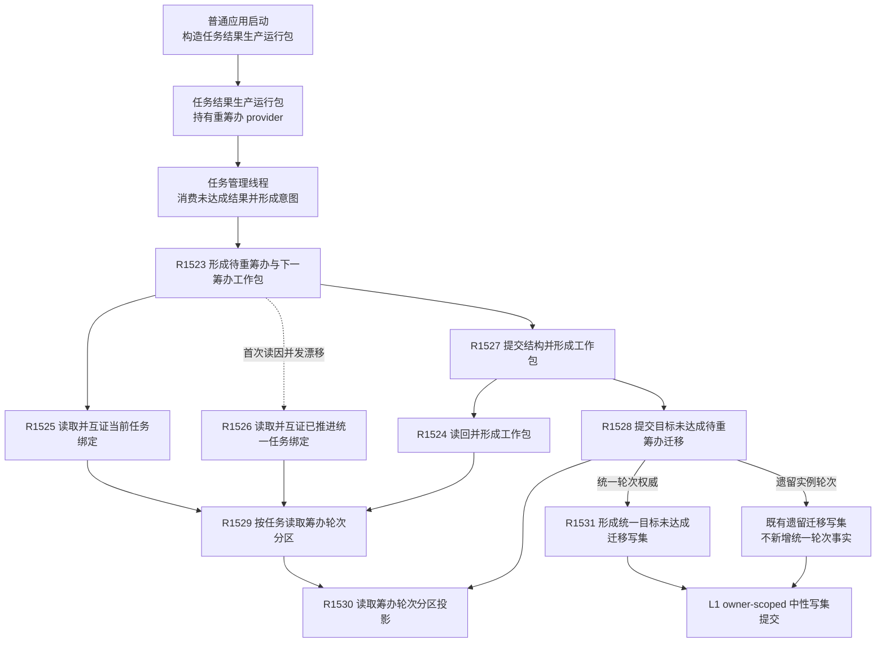

# 任务统一筹办轮次权威当前调用子图

图类型：当前代码调用子图
冻结提交：`dd8a7810693b7892b3265333f762b7c1c3bcd4d8`
实现提交：`e385585aef3c2d0d676b282ee16a62e9983749b8`
范围：新任务轮次 1 权威登记、统一 / 遗留分区读取、实际结果未达成时统一轮次 N→N+1 推进、幂等重放与已消费识别。
边界：这是局部当前子图，不替代仍绑定 `720f4afd78e63d95d244867aa13d72970a419654` 的全量聚合；初始化、编解码和后继记录历史投影等 helper 仍为 `候选待复核`。

## 当前实际调用

| 调用方 | 被调方 | 当前调用点 | 条件 / 结果传递 |
| --- | --- | --- | --- |
| 普通应用启动 | 任务结果生产运行包 | `海中鱼巣/启动.应用程序.ixx:129` | 普通程序生产路径构造运行包；运行包拥有重筹办 provider |
| 任务管理线程 | R1523 | `海中鱼巣/线程/任务管理线程.ixx:1088` | 收到目标未达成意图后调用 provider；不是治理专项专用边 |
| R1523 | R1525 / R1526 / R1527 | `海中鱼巣/领域/内部治理/服务.任务目标未达成重筹办触发.ixx:477-492` | 先读原 G；失败时只按“已被同一触发推进”路径恢复，再提交或重放 |
| R1525 / R1526 / R1524 | R1529 | 同上 `:251,323,170` | 统一读取任务所属轮次分区；统一分区必须互证当前权威准备 |
| R1529 | R1530 | `海中鱼巣/领域/服务.L2任务结构.ixx:5560-5583` | task owner 锁内冻结当前观察代次并投影分区 |
| R1527 | R1528 | `海中鱼巣/领域/内部治理/服务.任务目标未达成重筹办触发.ixx:431-470` | legacy 不携带统一推进材料；统一分区携带权威、前驱和准备幂等材料 |
| R1528 | R1530 / R1531 / legacy 写集 | `海中鱼巣/领域/服务.L2任务结构.ixx:7264-7587` | 互证请求分区等于当前分区；统一写新后继记录并换代当前关系，legacy 延续旧实例轮次写 |
| R1531 | L1 写入 | 同上 `:2763-2841` | 在既有治理迁移写集中加入后继记录、触发引用、N/N+1 值和当前关系换代 |

## 稳定身份与源码

| 身份 | 完整函数 | 源码范围 | 源码 blob | 单函数图 |
| --- | --- | --- | --- | --- |
| R1523 | `任务重筹办触发结果 海中鱼巣::任务目标未达成重筹办触发提供者::形成待重筹办与下一筹办工作包(const 任务重筹办意图& 意图) noexcept` | `海中鱼巣/领域/内部治理/服务.任务目标未达成重筹办触发.ixx:477-492` | `597af149798c2925b38406f95432c074dba28034` | `流程图/代码流程图/L3/CF-L3-0030_形成待重筹办与下一筹办工作包_现状流程图.md` |
| R1524 | `任务重筹办触发结果 海中鱼巣::任务重筹办触发内部::读回并形成工作包(...) noexcept` | 同上 `:153-229` | 同上 | `流程图/代码流程图/L4/CF-L4-0184_读回并形成工作包_现状流程图.md` |
| R1525 | `任务重筹办触发状态 海中鱼巣::任务重筹办触发内部::读取并互证当前任务绑定(...) noexcept` | 同上 `:240-307` | 同上 | `流程图/代码流程图/L4/CF-L4-0185_读取并互证当前任务绑定_现状流程图.md` |
| R1526 | `任务重筹办触发状态 海中鱼巣::任务重筹办触发内部::读取并互证已推进统一任务绑定(...) noexcept` | 同上 `:309-411` | 同上 | `流程图/代码流程图/L4/CF-L4-0186_读取并互证已推进统一任务绑定_现状流程图.md` |
| R1527 | `任务重筹办触发结果 海中鱼巣::任务重筹办触发内部::提交结构并形成工作包(...) noexcept` | 同上 `:413-472` | 同上 | `流程图/代码流程图/L4/CF-L4-0187_提交结构并形成工作包_现状流程图.md` |
| R1528 | `L2提交目标未达成待重筹办迁移结果 海中鱼巣::L2任务结构服务::提交目标未达成待重筹办迁移(L2提交目标未达成待重筹办迁移请求 请求) noexcept` | `海中鱼巣/领域/服务.L2任务结构.ixx:7264-7587` | `6e28721b63e27f96abc2abb6e9335c40484b9afc` | `流程图/代码流程图/L4/CF-L4-0188_提交目标未达成待重筹办迁移_现状流程图.md` |
| R1529 | `L2按任务读取筹办轮次分区结果 海中鱼巣::L2任务结构服务::按任务读取筹办轮次分区(L2按任务读取筹办轮次分区请求 请求) const noexcept` | 同上 `:5560-5583` | 同上 | `流程图/代码流程图/L4/CF-L4-0189_按任务读取筹办轮次分区_现状流程图.md` |
| R1530 | `L2按任务读取筹办轮次分区结果 海中鱼巣::L2任务结构内部::读取筹办轮次分区投影(...)` | 同上 `:5189-5342` | 同上 | `流程图/代码流程图/L5/CF-L5-0312_读取筹办轮次分区投影_现状流程图.md` |
| R1531 | `L1所有者范围写集请求 海中鱼巣::L2任务结构内部::形成统一目标未达成迁移写集(...)` | 同上 `:2763-2841` | 同上 | `流程图/代码流程图/L5/CF-L5-0313_形成统一目标未达成迁移写集_现状流程图.md` |

## 输入契约与非成功二分

| 入口 | 调用方 | 输入字段 | 输入来源 | 上游是否保证有效 | 允许逻辑内返回 | 追根因触发条件 | 结构变化 | 验证方式 |
| --- | --- | --- | --- | --- | --- | --- | --- | --- | --- |
| R1523 | 生产任务管理线程；治理专项也直调 | 意图、旧路径 / 实例 / 结果引用、两阶段幂等键 | 任务管理线程治理消息 | 否；入口和下游自行验证 | 入口拒绝、当前性漂移、引用冲突、合法等待、已消费 | 同一触发已推进却无法恢复后继记录，或统一权威链不守恒 | 经 R1527 间接提交 | 当前源码与生产调用点静态复核；本批运行 NOT_RUN |
| R1528 | R1527 | 前态、分区、旧引用和可选统一推进材料 | 已互证绑定及首态提交结果 | 部分；入口仍复核当前关系和分区 | 漂移、引用 / 幂等冲突、资源失败 | 成功写后无法历史读回，当前关系多值，已消费关系存在但后继记录缺失 | legacy 仅治理迁移；统一额外建立后继并退出旧当前关系 | 当前源码静态复核；运行 NOT_RUN |
| R1529 / R1530 | provider、R1528及其它 task owner 读方 | 任务身份、读取类别、当前或历史截止 | 正式读请求 | 否；公开入口与投影均验证 | legacy 合法分区；未找到 | 权威 / 后继 / 当前三账形状不一致，后继链断裂或跳轮次 | 无，只读 | 当前源码静态复核 |
| R1531 | R1528 统一分区 | 完整统一推进材料、当前准备和当前关系编码 | R1528 已互证当前事实 | 是 | 无业务拒绝 | 上游完整材料仍无法形成守恒写集 | 新增后继节点、关系和值并换代任务当前准备关系 | 当前源码静态复核 |

### 非成功返回二分审查表

| 节点 | 代码位置 | 返回条件 | 输入语境 | 是否上游保证有效 | 结构是否变化 | 设计是否允许 | 二分口径 | 追根因对象或逻辑返回理由 | 计划动作 |
| --- | --- | --- | --- | --- | --- | --- | --- | --- | --- | --- |
| R1523-N01/N04 | `服务.任务目标未达成重筹办触发.ixx:479-489` | 意图无效，或原 G / 恢复路径均未形成绑定 | 生产线程或治理专项意图 | 否 | 否 | 是 | 逻辑内返回 | 外部入口与并发收敛协议允许具名状态 | 无 |
| R1524-N03/N05/N08 | 同上 `:172-224` | 提交后治理、路径、实例、实际结果、分区或后继读回不守恒 | 已提交 / 重放迁移 | 是 | 已在下游完成 | 否 | 追根因解决 | 已发布 task owner 事实必须双账一致 | 登记偏差 |
| R1526-N05/N08 | 同上 `:363-402` | 同键后继无法找到或无法还原推进前准备 | 原 G 已漂移的并发恢复 | 部分 | 否 | 漂移允许，链错不允许 | 当前性漂移可逻辑返回；已找到但链形状错须追根因 | 并发重放恢复链 | 链错登记偏差 |
| R1528-N03/N05 | `服务.L2任务结构.ixx:7277-7529` | 请求与当前分区不一致、推进前驱不匹配或同一结果已消费 | 已互证迁移请求 | 部分 | 否 | 是 | 冲突 / 已消费为逻辑内返回 | 防止同一触发推进两次 | 无 |
| R1528-N07/N09 | 同上 `:7530-7577` | 写成功后治理或后继记录无法历史读回 | L1 写入成功 | 是 | 是 | 否 | 追根因解决 | L1 发布见证与 task owner 投影 | 登记偏差 |
| R1530-N02/N04/N06/N08 | 同上 `:5216-5337` | 三类关系、首次记录或后继链不守恒 | 正式统一分区读取 | 部分 | 否 | 否 | 追根因解决 | 统一轮次权威唯一性和连续性 | 登记偏差 |

## 当前实现边界与偏差

- 已实现：新任务在首次融合事务内建立版本 1 权威和轮次 1 当前关系；统一任务在实际结果未达成时按当前 N 建立 N+1 后继记录并换代当前关系。
- 已实现：任务管理线程经任务结果生产运行包持有的 provider 进入该链；这条边是生产接线，不是仅靠治理专项推断。
- legacy 分区仍按实例轮次形成下一工作包，不产生统一轮次写；代码没有显式 legacy 迁移或退役流程。
- 未实现：任务子目标回流 consumer、成员逐项结算、结果共用 / 争用裁决、成员分配优先级。
- 需求初次筹办 provider 仍只有治理专项直接调用；本批生产接线结论仅适用于“任务实际结果未达成重筹办”provider。
- 构建、自检和治理专项的既有记录不由本图升级成业务运行事实；本批没有运行程序。

### 偏差清单

| 编号 | 现状代码事实 | 偏差类型 | 唯一纠偏归属 / 方向 | 是否形成代码许可 |
| --- | --- | --- | --- | --- |
| RA-G001 | legacy 继续依赖实例轮次，未显式迁移到统一权威，也无退役门禁 | 已知迁移缺口 | 后继设计 / 计划 owner 形成显式迁移与退役切片 | 否 |
| RA-G002 | 子目标回流触发类型存在 DTO 枚举，但没有 consumer 调用边 | 预留合同未实现 | 子目标回流后继设计与执行 | 否 |
| RA-G003 | 成员结算、结果共用 / 争用和成员分配优先级不在本链 | 后继业务闭环缺口 | 各正式设计 / 计划 owner | 否 |
| RA-G004 | 初次筹办 provider 仍未接普通生产线程 | 既有未接线边界 | 直接后继生产消费设计 | 否 |
| RA-G005 | 本批仅闭合 R1523—R1531；登记、编解码和若干投影 helper 尚未逐函数展开 | 图谱覆盖缺口 | 图谱维护继续按 event 候选展开 | 否 |
