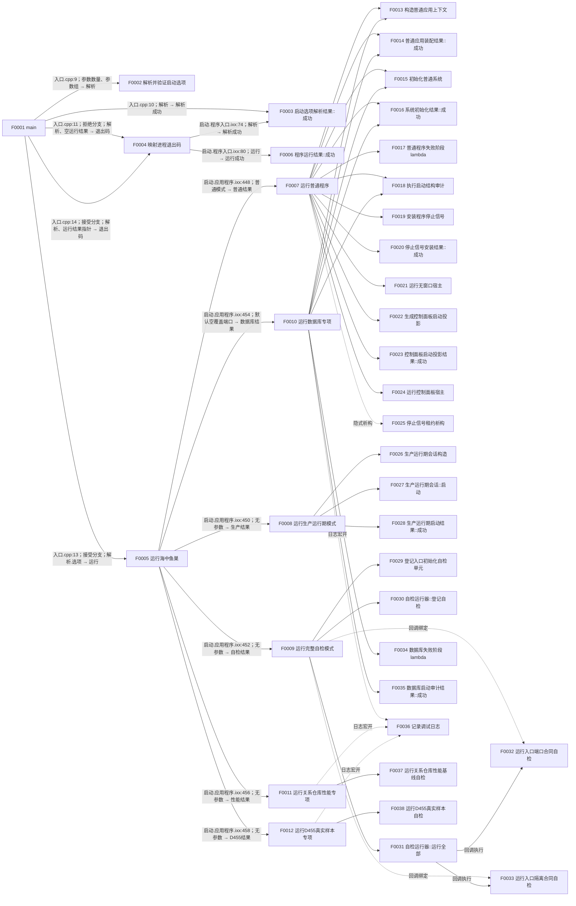

# 当前代码函数调用知识图谱

冻结提交：`a48a70b2d678dea64dd8228adb4f26f0badd9506`

## 调用边

| 边 ID | 调用方 | 被调方 | 调用位置 | 参数绑定 | 返回绑定 | 调用条件 | 调用类型 | 被调图路径 | 状态 |
| --- | --- | --- | --- | --- | --- | --- | --- | --- | --- |
| E0001 | F0001 | F0002 | `海中鱼巣/入口.cpp:9` | `参数数量, 参数组` | `解析` | 无条件 | 直接自由函数调用 | `L1/CF-L1-0001_解析并验证启动选项_现状流程图.md` | 被调图已完成 |
| E0002 | F0001 | F0003 | `海中鱼巣/入口.cpp:10` | `this=&解析` | `解析成功:bool` | F0002 返回后 | 直接 const 成员函数调用 | `L1/CF-L1-0002_启动选项解析结果_成功_现状流程图.md` | 被调图已完成 |
| E0003 | F0001 | F0004 | `海中鱼巣/入口.cpp:11` | `解析, nullptr` | `进程退出码:int` | `解析成功 == false` | 直接自由函数调用 | `L1/CF-L1-0003_映射进程退出码_现状流程图.md` | 被调图已完成 |
| E0004 | F0001 | F0005 | `海中鱼巣/入口.cpp:13` | `解析.选项` | `运行` | `解析成功 == true` | 直接自由函数调用 | `L1/CF-L1-0004_运行海中鱼巣_现状流程图.md` | 被调图已完成 |
| E0005 | F0001 | F0004 | `海中鱼巣/入口.cpp:14` | `解析, &运行` | `进程退出码:int` | F0005 返回后 | 直接自由函数调用 | `L1/CF-L1-0003_映射进程退出码_现状流程图.md` | 被调图已完成 |
| E0006 | F0004 | F0003 | `海中鱼巣/启动.程序入口.ixx:74` | `this=&解析` | `解析成功:bool` | 无条件 | 直接 const 成员函数调用 | `L1/CF-L1-0002_启动选项解析结果_成功_现状流程图.md` | 被调图已完成 |
| E0007 | F0004 | F0006 | `海中鱼巣/启动.程序入口.ixx:80` | `this=运行` | `运行成功:bool` | 解析已接受且运行非空 | 直接 const 成员函数调用 | `L2/CF-L2-0001_程序运行结果_成功_现状流程图.md` | 被调图已完成 |
| E0008 | F0005 | F0007 | `海中鱼巣/启动.应用程序.ixx:448` | `选项.模式` | `普通结果` | 普通控制面板或无窗口常驻 | 直接自由函数调用 | `L2/CF-L2-0002_运行普通程序_现状流程图.md` | 被调图已完成 |
| E0009 | F0005 | F0008 | `海中鱼巣/启动.应用程序.ixx:450` | 无 | `生产结果` | 生产运行期 | 直接自由函数调用 | `L2/CF-L2-0003_运行生产运行期模式_现状流程图.md` | 被调图已完成 |
| E0010 | F0005 | F0009 | `海中鱼巣/启动.应用程序.ixx:452` | 无 | `自检结果` | 完整自检 | 直接自由函数调用 | `L2/CF-L2-0004_运行完整自检模式_现状流程图.md` | 被调图已完成 |
| E0011 | F0005 | F0010 | `海中鱼巣/启动.应用程序.ixx:454` | `覆盖端口=nullptr` | `数据库结果` | 数据库专项 | 直接自由函数调用 | `L2/CF-L2-0005_运行数据库专项_现状流程图.md` | 被调图已完成 |
| E0012 | F0005 | F0011 | `海中鱼巣/启动.应用程序.ixx:456` | 无 | `性能结果` | 关系仓库性能专项 | 直接自由函数调用 | `L2/CF-L2-0006_运行关系仓库性能专项_现状流程图.md` | 被调图已完成 |
| E0013 | F0005 | F0012 | `海中鱼巣/启动.应用程序.ixx:458` | 无 | `D455结果` | D455真实样本专项 | 直接自由函数调用 | `L2/CF-L2-0007_运行D455真实样本专项_现状流程图.md` | 被调图已完成 |

### L2 新发现调用边

| 边 ID | 调用方 → 被调方 | 调用位置 | 参数绑定 → 返回绑定 | 条件 / 类型 | 状态 |
| --- | --- | --- | --- | --- | --- |
| E0014 | F0007 → F0013 | `启动.应用程序.ixx:51` | `配置` → `装配` | 普通模式有效；直接调用 | 待处理 |
| E0015 | F0007 → F0014 | `:52` | `this=&装配` → bool | 装配后；const 成员 | 待处理 |
| E0016 | F0007 → F0015 | `:64` | `系统端口, 请求` → `初始化` | 装配成功；直接调用 | 待处理 |
| E0017 | F0007 → F0016 | `:66` | `this=&初始化` → bool | 初始化后；const 成员 | 待处理 |
| E0018 | F0007 → F0017 | `:67-76` | 捕获初始化 → 失败阶段 | 初始化失败；立即 lambda | 待处理 |
| E0019 | F0007 → F0018 | `:95` | 审计端口、最佳努力 → 审计 | 初始化成功 | 待处理 |
| E0020 | F0007 → F0019 | `:96` | 默认安装函数 → 信号 | 审计返回后 | 待处理 |
| E0021 | F0007 → F0020 | `:97` | `this=&信号` → bool | 安装后 | 待处理 |
| E0022 | F0007 → F0021 | `:101` | 上下文、租约 → 运行结果 | headless | 待处理 |
| E0023 | F0007 → F0022 | `:103` | 上下文、初始化 → 投影 | UI 路径 | 待处理 |
| E0024 | F0007 → F0023 | `:104` | `this=&投影` → bool | 投影后 | 待处理 |
| E0025 | F0007 → F0024 | `:108-109` | 上下文、初始化、投影、审计、租约 → 运行结果 | 投影成功 | 待处理 |
| E0026-E0028 | F0007 → F0025 | `:102/:107/:110` | 租约对象 → 无 | 三条返回路径；隐式析构 | 待处理 |
| E0029 | F0008 → F0026 | `:37` | 无 → 会话 | 构造 | 待处理 |
| E0030 | F0008 → F0027 | `:38` | 会话、当前版本请求 → 结果 | 直接成员调用 | 待处理 |
| E0031 | F0008 → F0028 | `:39` | `this=&结果` → bool | const 成员 | 待处理 |
| E0032 | F0009 → F0029 | `:381` | 运行器、空配置 → bool | 无条件 | 待处理 |
| E0033-E0034 | F0009 → F0030 | `:382-385` | 两组顺序/编号/名称/回调 → bool | 左到右短路 | 待处理 |
| E0035 | F0009 → F0031 | `:390` | `this=&运行器` → 批次 | 登记全成功 | 待处理 |
| E0036-E0037 | F0009 → F0032/F0033 | `:383/:385` | 转发 lambda → 回调槽 | 回调绑定 | 待处理 |
| E0038-E0039 | F0031 → F0032/F0033 | `自检.运行器.ixx:80` | `登记.回调()` → 单元 | 顺序150/160；回调执行 | 待处理 |
| E0040-E0041 | F0010 → F0013/F0014 | `启动.应用程序.ixx:114-115` | 配置/装配 → 装配/bool | 无条件 | 待处理 |
| E0042-E0043 | F0010 → F0015/F0016 | `:128-130` | 系统端口/初始化 → 初始化/bool | 装配成功 | 待处理 |
| E0044 | F0010 → F0034 | `:131-140` | 捕获初始化 → 失败阶段 | 初始化失败；立即 lambda | 待处理 |
| E0045 | F0010 → F0018 | `:159-161` | 选中端口、必须往返一致 → 审计 | 初始化成功 | 待处理 |
| E0046/E0047/E0049 | F0010 → F0035 | `:163/:166/:167` | `this=&审计` → bool | 摘要/日志宏开/最终裁决 | 待处理 |
| E0048 | F0010 → F0036 | `:164-166` | 数据库日志切片和内容 → 丢弃 | 日志宏开 | 待处理 |
| E0050 | F0011 → F0037 | `:402` | 无 → 结果 | 性能能力宏开 | 待处理 |
| E0051 | F0011 → F0036 | `:406-408` | 性能日志切片和内容 → 丢弃 | 两个宏均开 | 待处理 |
| E0052 | F0012 → F0038 | `:422` | 无 → 结果 | D455 能力宏开 | 待处理 |
| E0053 | F0012 → F0036 | `:426-428` | D455 日志切片和内容 → 丢弃 | 两个宏均开 | 待处理 |

## 外部边界

| 边界 ID | 身份 | 调用方 | 调用位置 | 调用次数 | 状态 |
| --- | --- | --- | --- | --- | --- |
| X0001 | `std::basic_string_view<char>::basic_string_view(const char*)` | F0002 | `启动.程序入口.ixx:29` | 1 | 外部边界，不入队 |
| X0002 | `std::operator==(std::basic_string_view<char>, std::basic_string_view<char>) noexcept` | F0002 | `启动.程序入口.ixx:31,33,35,37,39,41,48` | 7 | 外部边界，不入队 |
| X0003 | `std::unique_ptr<T>::operator*() const` | F0007 | `启动.应用程序.ixx:55,101,103,109` | 6 | 外部边界，不入队 |
| X0004 | `std::unique_ptr<T>::operator*() const` | F0010 | `启动.应用程序.ixx:119` | 1 | 外部边界，不入队 |
| X0005 | `std::optional<程序专项摘要>::optional(std::nullopt_t)` | F0008 | `启动.应用程序.ixx:40-43` | 2 | 外部边界，不入队 |
| X0006 | `std::function<自检单元结果()>::function<lambda>(lambda)` | F0009 | `启动.应用程序.ixx:383,385` | 2 | 外部边界，不入队 |

项目源码关系边：53（含回调绑定、回调执行和隐式项目析构）。外部边界调用点计数随 L3 图继续细化。递归回边：0。未解析调用：0。
