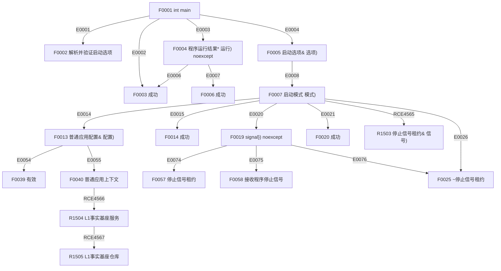

# 当前调用知识图谱

冻结提交：`720f4afd78e63d95d244867aa13d72970a419654`；函数 19；项目边 20；外部边界 24；未解析 0。

```mermaid
flowchart TD
    F0001["F0001 int main"]
    F0002["F0002 解析并验证启动选项"]
    F0003["F0003 成功"]
    F0004["F0004 程序运行结果* 运行) noexcept"]
    F0005["F0005 启动选项& 选项)"]
    F0006["F0006 成功"]
    F0007["F0007 启动模式 模式)"]
    F0013["F0013 普通应用配置& 配置)"]
    F0014["F0014 成功"]
    F0019["F0019 signal}) noexcept"]
    F0020["F0020 成功"]
    F0025["F0025 ~停止信号租约"]
    F0039["F0039 有效"]
    F0040["F0040 普通应用上下文"]
    F0057["F0057 停止信号租约"]
    F0058["F0058 接收程序停止信号"]
    R1503["R1503 停止信号租约& 信号)"]
    R1504["R1504 L1事实基座服务"]
    R1505["R1505 L1事实基座仓库"]
    F0001 -->|E0001| F0002
    F0001 -->|E0002| F0003
    F0001 -->|E0003| F0004
    F0001 -->|E0004| F0005
    F0004 -->|E0006| F0003
    F0004 -->|E0007| F0006
    F0005 -->|E0008| F0007
    F0007 -->|E0014| F0013
    F0007 -->|E0015| F0014
    F0007 -->|E0020| F0019
    F0007 -->|E0021| F0020
    F0007 -->|RCE4565| R1503
    F0007 -->|E0026| F0025
    F0013 -->|E0054| F0039
    F0013 -->|E0055| F0040
    F0040 -->|RCE4566| R1504
    R1504 -->|RCE4567| R1505
    F0019 -->|E0074| F0057
    F0019 -->|E0075| F0058
    F0019 -->|E0076| F0025
```

该图只投影当前代码事实，不证明业务能力或规范符合。
