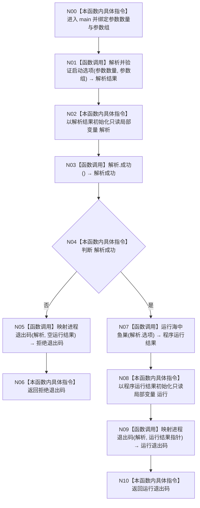

# CF-L0-0001 `main` 现状流程图

图类型：现状流程图
代码版本：`a48a70b2d678dea64dd8228adb4f26f0badd9506`
覆盖文件：`海中鱼巣/入口.cpp:8-15`
唯一根函数：F0001
完整签名：`int main(int 参数数量, char* 参数组[])`
参数：`参数数量:int`；`参数组:char*[]`，由进程启动环境提供
返回结果：进程退出码 `int`
调用图：`流程图/代码流程图/00_调用知识图谱.md`
逐行映射表：`流程图/代码流程图/L0/CF-L0-0001_main_逐行代码映射表.md`
输入契约 / 调用语境表：本文“输入契约”
非成功返回二分审查表：本文“非成功返回审查”
偏差清单：`流程图/代码流程图/00_规范偏差审计.md`
依据提交 / 结构化消息：Git 提交 `a48a70b2d678dea64dd8228adb4f26f0badd9506`
验证输出：L0 文件级机械校验待本批完成后执行
不得作为施工许可：是
不得宣称：不得据此宣称全部可达函数已经闭合或代码已经通过新的构建/运行验证

## Mermaid

## 节点合同

| 节点 | 类型 | 当前代码行为 | 输入绑定 | 结果绑定 |
| --- | --- | --- | --- | --- |
| N00 | 本函数内具体指令 | 建立进程入口调用帧并接收两个参数 | 进程启动环境 | `参数数量`、`参数组` |
| N01 | 函数调用 | 调用 F0002 | `参数数量`、`参数组` | 临时解析结果 |
| N02 | 本函数内具体指令 | 用临时解析结果初始化 `const auto 解析` | N01 返回结果 | `解析` |
| N03 | 函数调用 | 调用 F0003 | `this=&解析` | `解析成功` |
| N04 | 本函数内具体指令 | 对 `!解析成功` 形成控制分支 | N03 返回结果 | 拒绝分支或接受分支 |
| N05 | 函数调用 | 第一次调用 F0004 | `解析`、`nullptr` | 拒绝退出码 |
| N06 | 本函数内具体指令 | 立即返回拒绝退出码 | N05 返回结果 | `main` 返回值 |
| N07 | 函数调用 | 调用 F0005 | `解析.选项` | 临时程序运行结果 |
| N08 | 本函数内具体指令 | 用临时结果初始化 `const auto 运行` | N07 返回结果 | `运行` |
| N09 | 函数调用 | 第二次调用 F0004 | `解析`、`&运行` | 运行退出码 |
| N10 | 本函数内具体指令 | 立即返回运行退出码 | N09 返回结果 | `main` 返回值 |

## 被调函数登记

| 函数 ID | 完整限定签名 | 调用节点 | 层级 | 状态 |
| --- | --- | --- | --- | --- |
| F0002 | `海中鱼巣::启动选项解析结果 海中鱼巣::解析并验证启动选项(int 参数数量, char* const 参数组[]) noexcept` | N01 | L1 | 待处理 |
| F0003 | `bool 海中鱼巣::启动选项解析结果::成功() const noexcept` | N03 | L1 | 待处理 |
| F0004 | `int 海中鱼巣::映射进程退出码(const 海中鱼巣::启动选项解析结果& 解析, const 海中鱼巣::程序运行结果* 运行) noexcept` | N05、N09 | L1 | 待处理 |
| F0005 | `海中鱼巣::程序运行结果 海中鱼巣::运行海中鱼巣(const 海中鱼巣::启动选项& 选项)` | N07 | L1 | 待处理 |

## 输入契约

| 入口 | 调用方 | 输入字段 | 输入来源 | 上游是否保证有效 | 允许逻辑内返回 | 结构变化 | 验证方式 |
| --- | --- | --- | --- | --- | --- | --- | --- |
| F0001 | 操作系统进程入口 | `参数数量`、`参数组` | 外部材料 | 否 | 是；由 F0002 结构化拒绝 | 无 | 当前代码读取；F0002 后续展开 |

## 非成功返回审查

| 节点 | 代码位置 | 返回条件 | 输入语境 | 是否上游保证有效 | 结构是否变化 | 设计是否允许 | 二分口径 | 理由 |
| --- | --- | --- | --- | --- | --- | --- | --- | --- |
| N06 | `入口.cpp:10-11` | F0002 的解析结果不成功 | 外部启动参数 | 否 | 否 | 是；`8120` 第 3、4 节 | 逻辑内返回 | 未准入参数映射为退出码 2，不进入程序运行 |

## 当前规范审计

F0001 与 `8120` 第 2、4 节一致：入口只接收参数、调用具名解析函数、在接受分支调用唯一顶层程序函数，并通过具名函数映射退出码。函数体没有仓库、事务、领域对象、自检正文、宿主循环、SQL、投影或人读输出。
