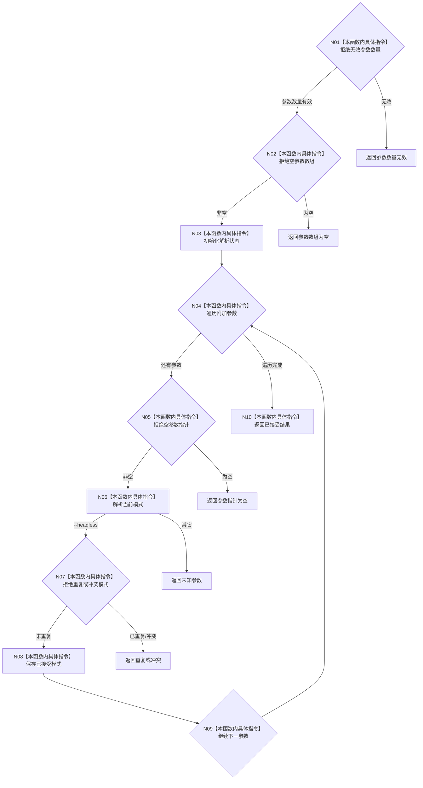

# CF-L1-0001_解析并验证启动选项 `解析并验证启动选项` 现状流程图

图类型：现状流程图
代码版本：`720f4afd78e63d95d244867aa13d72970a419654`
覆盖文件：`海中鱼巣/启动.程序入口.ixx:12-49`
唯一根函数：F0002
完整签名：`海中鱼巣::启动选项解析结果 海中鱼巣::解析并验证启动选项(int 参数数量, char* const 参数组[]) noexcept`
参数：参数数量：int；参数组：char* const[]，只读借用
返回结果：启动选项解析结果
调用图：`流程图/代码流程图/00_调用知识图谱.md`
逐行映射表：`流程图/代码流程图/L1/CF-L1-0001_解析并验证启动选项_逐行代码映射表.md`
输入契约 / 调用语境表：本图“输入与非成功边界”
非成功返回二分审查表：本图“输入与非成功边界”
偏差清单：`流程图/代码流程图/00_规范偏差审计.md`
依据提交 / 结构化消息：`720f4afd78e63d95d244867aa13d72970a419654`；GRAPH-MAINTENANCE-RESUME
验证输出：逐源码静态复核；未运行构建、程序或业务自检
不得作为施工许可：是
不得宣称：不得据此宣称业务能力、规范符合、构建或运行完成

## 输入与非成功边界

- 输入只来自当前 `main` 可达调用方和所列参数；未列调用语境不据此扩展。
- 表中标为逻辑内返回的分支发生于权威结构写入前；标为追根因解决的分支不得被升级为正常成功。
- 本图只描述当前实现，不裁决目标设计。

## 直接调用

项目被调：无。外部边界读取聚合外部边界表。
