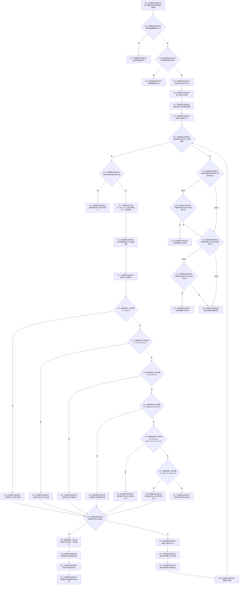

# CF-L1-0001 `解析并验证启动选项` 现状流程图

图类型：现状流程图
代码版本：`a48a70b2d678dea64dd8228adb4f26f0badd9506`
覆盖文件：`海中鱼巣/启动.程序入口.ixx:12-69`
唯一根函数：F0002
完整签名：`海中鱼巣::启动选项解析结果 海中鱼巣::解析并验证启动选项(int 参数数量, char* const 参数组[]) noexcept`
参数：`参数数量:int`；`参数组:char* const[]`
返回结果：`启动选项解析结果`
调用图：`流程图/代码流程图/00_调用知识图谱.md`
逐行映射表：`流程图/代码流程图/L1/CF-L1-0001_解析并验证启动选项_逐行代码映射表.md`
输入契约 / 调用语境表：本文“输入契约”
非成功返回二分审查表：本文“非成功返回审查”
偏差清单：`流程图/代码流程图/00_规范偏差审计.md`
依据提交 / 结构化消息：Git 提交 `a48a70b2d678dea64dd8228adb4f26f0badd9506`
验证输出：配对图、节点数和映射覆盖待本函数落盘后机械校验
不得作为施工许可：是
不得宣称：不得据此宣称全部启动模式的被调运行函数已经展开

## Mermaid

## 节点合同

| 节点范围 | 类型 | 当前代码行为 |
| --- | --- | --- |
| N00-N11 | 本函数内具体指令 | 绑定入口参数，先拒绝无效数量、空数组和空参数指针，再初始化循环状态。 |
| N12 | 函数调用 | 调用外部边界 X0001，以当前非空 C 字符串构造 `std::string_view`。 |
| N13-N14 | 本函数内具体指令 | 保存参数视图并值初始化当前模式。 |
| N15/N17/N19/N21/N23/N25 | 函数调用 | 调用外部边界 X0002，按固定顺序比较六个允许 flag；短路到首个匹配分支。 |
| N16/N18/N20/N22/N24/N26 | 本函数内具体指令 | 将匹配 flag 映射为唯一强类型启动模式。 |
| N27-N28 | 本函数内具体指令 | 无匹配时返回未知参数；有匹配时判断是否已登记过模式。 |
| N29 | 函数调用 | 调用外部边界 X0002，比较当前参数与首次参数。 |
| N30-N36 | 本函数内具体指令 | 已登记时区分重复与组合冲突并返回；首次登记时保存参数和模式并推进循环。 |
| N37-N43 | 本函数内具体指令 | 依据两个预编译宏执行构建能力拒绝，最后返回已接受结果。 |

## 外部边界调用

| 边界 ID | 完整调用身份 | 调用位置 | 参数绑定 | 返回绑定 | 是否入队 |
| --- | --- | --- | --- | --- | --- |
| X0001 | `std::basic_string_view<char>::basic_string_view(const char*)` | `启动.程序入口.ixx:29` | `参数组[参数索引]` | 参数视图 | 否 |
| X0002 | `std::operator==(std::basic_string_view<char>, std::basic_string_view<char>) noexcept` | `启动.程序入口.ixx:31,33,35,37,39,41,48` | 当前参数和固定 flag 或已见参数 | 比较结果 | 否 |

## 输入契约

| 入口 | 调用方 | 输入字段 | 输入来源 | 上游是否保证有效 | 允许逻辑内返回 | 结构变化 | 验证方式 |
| --- | --- | --- | --- | --- | --- | --- | --- |
| F0002 | F0001 | 参数数量、参数数组和各参数指针 | 外部材料 | 否 | 是；所有拒绝均在运行前形成结构化结果 | 无 | 当前函数逐行读取；`8120` 第 3 节 |

## 非成功返回审查

| 节点 | 代码位置 | 返回条件 | 是否上游保证有效 | 结构是否变化 | 设计是否允许 | 二分口径 | 逻辑返回理由 |
| --- | --- | --- | --- | --- | --- | --- | --- |
| N02 | `启动.程序入口.ixx:15-16` | 参数数量小于 1 | 否 | 否 | 是 | 逻辑内返回 | 外部入口材料无效 |
| N04 | `启动.程序入口.ixx:18-19` | 参数数组为空 | 否 | 否 | 是 | 逻辑内返回 | 外部入口材料无效 |
| N11 | `启动.程序入口.ixx:26-27` | 当前参数指针为空 | 否 | 否 | 是 | 逻辑内返回 | 外部入口材料无效 |
| N27 | `启动.程序入口.ixx:43-44` | 参数不匹配六个允许 flag | 否 | 否 | 是 | 逻辑内返回 | 未知启动参数 |
| N32 | `启动.程序入口.ixx:47-51` | 已见一个模式 | 否 | 否 | 是 | 逻辑内返回 | 重复 flag 或互斥模式冲突 |
| N39 | `启动.程序入口.ixx:58-60` | 未编译性能能力却请求性能专项 | 否 | 否 | 是 | 逻辑内返回 | 构建能力拒绝 |
| N42 | `启动.程序入口.ixx:63-65` | 未编译 D455 能力却请求 D455 专项 | 否 | 否 | 是 | 逻辑内返回 | 构建能力拒绝 |

## 当前规范审计

F0002 与 `8120` 第 3、4 节一致：无参数采用默认控制面板；六个显式 flag 映射六个非默认模式；无效数量、空数组、空指针、未知参数、重复参数、组合冲突和构建能力缺失均在结构变化前返回具名解析状态与拒绝索引。函数没有控制台、日志或弹窗输出。
