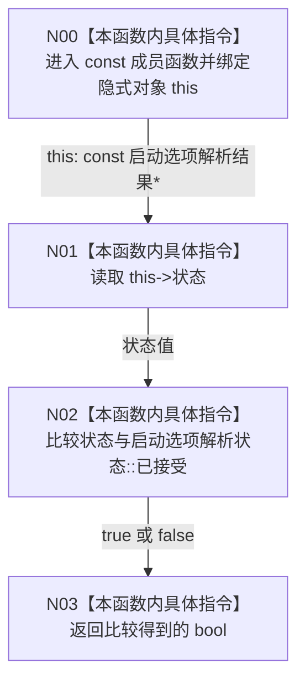

# CF-L1-0002 `启动选项解析结果::成功` 现状流程图

图类型：现状流程图
代码版本：`a48a70b2d678dea64dd8228adb4f26f0badd9506`
覆盖文件：`海中鱼巣/启动选项.数据.h:39-41`
唯一根函数：F0003
完整签名：`bool 海中鱼巣::启动选项解析结果::成功() const noexcept`
参数：显式参数无；隐式 `this:const 启动选项解析结果*`
返回结果：仅当 `状态 == 启动选项解析状态::已接受` 时为 `true`
调用图：`流程图/代码流程图/00_调用知识图谱.md`
逐行映射表：`流程图/代码流程图/L1/CF-L1-0002_启动选项解析结果_成功_逐行代码映射表.md`
输入契约 / 调用语境表：当前可达调用方为 F0001、F0004；只读借用解析结果
非成功返回二分审查表：`false` 是只读查询结果，不是结构写入失败
偏差清单：`流程图/代码流程图/00_规范偏差审计.md`
依据提交 / 结构化消息：Git 提交 `a48a70b2d678dea64dd8228adb4f26f0badd9506`
验证输出：配对图和映射覆盖待本函数落盘后机械校验
不得作为施工许可：是
不得宣称：不得把布尔查询结果独立解释为机器事实

## 函数与节点确认

| 节点 | 类型 | 当前行为 | 结构变化 |
| --- | --- | --- | --- |
| N00 | 本函数内具体指令 | 绑定合法成员调用提供的只读隐式对象 | 无 |
| N01 | 本函数内具体指令 | 读取结构化解析状态 | 无 |
| N02 | 本函数内具体指令 | 执行强类型枚举内建相等比较 | 无 |
| N03 | 本函数内具体指令 | 返回比较结果 | 无 |

项目源码出边：0。外部边界：0。未解析调用：0。

## 当前规范审计

与 `8120` 第 3、4 节一致：函数只根据结构化解析状态判断是否准入，不读取日志或文本，不修改对象或机器事实。返回 `false` 是允许的只读查询结果。
