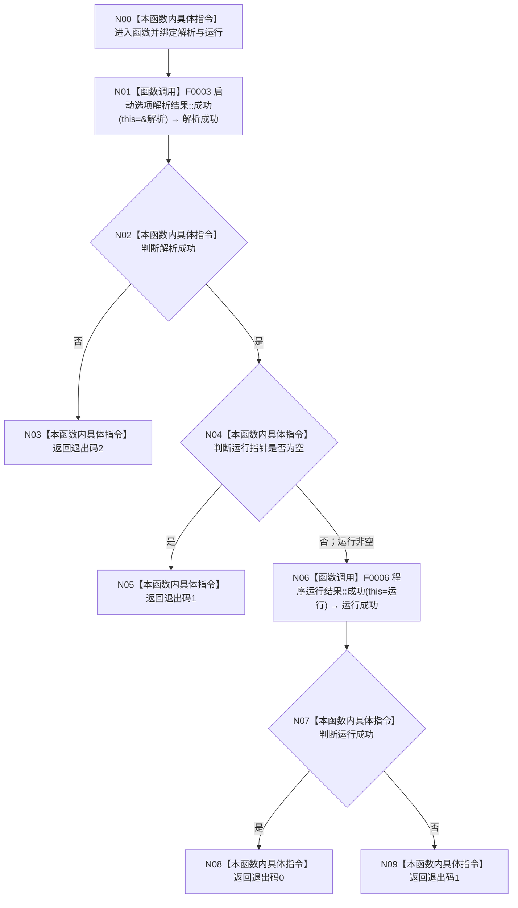

# CF-L1-0003 `映射进程退出码` 现状流程图

图类型：现状流程图
代码版本：`a48a70b2d678dea64dd8228adb4f26f0badd9506`
覆盖文件：`海中鱼巣/启动.程序入口.ixx:71-81`
唯一根函数：F0004
完整签名：`int 海中鱼巣::映射进程退出码(const 海中鱼巣::启动选项解析结果& 解析, const 海中鱼巣::程序运行结果* 运行) noexcept`
参数：`解析` 为只读引用；`运行` 为可空只读借用指针
返回结果：解析拒绝返回 `2`；解析已接受但运行结果缺失或失败返回 `1`；运行成功返回 `0`
调用图：`流程图/代码流程图/00_调用知识图谱.md`
逐行映射表：`流程图/代码流程图/L1/CF-L1-0003_映射进程退出码_逐行代码映射表.md`
输入契约 / 调用语境表：F0001 在解析拒绝分支传入 `nullptr`，在程序运行完成后传入运行结果地址
非成功返回二分审查表：退出码 `1/2` 是协议允许的逻辑内返回，不写机器事实
偏差清单：`流程图/代码流程图/00_规范偏差审计.md`
依据提交 / 结构化消息：Git 提交 `a48a70b2d678dea64dd8228adb4f26f0badd9506`
验证输出：配对图、节点和映射覆盖由本目录机械校验
不得作为施工许可：是
不得宣称：退出码映射不证明内部业务能力已完成

## 函数与节点确认

| 节点 | 类型 | 当前行为 | 参数 / 返回绑定 | 结构变化 |
| --- | --- | --- | --- | --- |
| N00 | 本函数内具体指令 | 绑定两个只读输入 | `解析`、`运行` | 无 |
| N01 | 函数调用 | 调用 F0003 查询解析是否已接受 | `this=&解析`；返回绑定 `解析成功` | 无 |
| N02 | 本函数内具体指令 | 对 `解析成功` 分支 | `false` 走 N03，`true` 走 N04 | 无 |
| N03 | 本函数内具体指令 | 返回参数拒绝退出码 | `2` | 无 |
| N04 | 本函数内具体指令 | 检查运行结果指针 | 空走 N05，非空走 N06 | 无 |
| N05 | 本函数内具体指令 | 返回一般失败退出码 | `1` | 无 |
| N06 | 函数调用 | 调用 F0006 查询结构化程序运行状态 | `this=运行`；返回绑定 `运行成功` | 无 |
| N07 | 本函数内具体指令 | 对 `运行成功` 分支 | `true` 走 N08，`false` 走 N09 | 无 |
| N08 | 本函数内具体指令 | 返回成功退出码 | `0` | 无 |
| N09 | 本函数内具体指令 | 返回一般失败退出码 | `1` | 无 |

项目源码出边：2。外部边界：0。未解析调用：0。

## 当前规范审计

与 `8120` 第 4 节一致：参数拒绝、运行失败和运行成功分别机械映射为 `2/1/0`，日志或显示不参与裁决。
