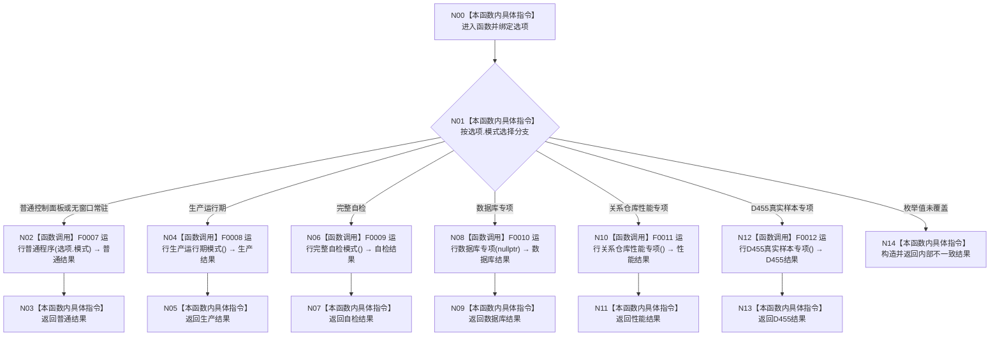

# CF-L1-0004 `运行海中鱼巣` 现状流程图

图类型：现状流程图
代码版本：`4b80f1617dd70ec7a19e1a34efa9da768dce8927`
源码 blob：`d2581161faef19cb494366ee32886ae2b12ee190`
覆盖文件：`海中鱼巣/启动.应用程序.ixx:471-489`
唯一根函数：F0005
完整签名：`海中鱼巣::程序运行结果 海中鱼巣::运行海中鱼巣(const 海中鱼巣::启动选项& 选项)`
参数：`选项` 为只读引用，当前仅读取 `选项.模式`
返回结果：返回对应模式顶层函数的结构化结果；枚举值未覆盖时返回内部不一致结果
调用图：`流程图/代码流程图/00_调用知识图谱.md`
逐行映射表：`流程图/代码流程图/L1/CF-L1-0004_运行海中鱼巣_逐行代码映射表.md`
输入契约 / 调用语境表：F0001 仅在启动选项已接受后调用；模式应来自 F0002 已验证结果
非成功返回二分审查表：模式函数返回值直接传播；穷举外枚举值返回内部不一致结构化结果
偏差清单：`流程图/代码流程图/00_规范偏差审计.md`
依据提交 / 结构化消息：冻结源码提交 `4b80f1617dd70ec7a19e1a34efa9da768dce8927`
验证输出：配对图、节点、调用端点和映射覆盖由本目录机械校验
不得作为施工许可：是
不得宣称：模式已路由不等于各模式内部能力均已完成

## 函数与节点确认

| 节点 | 类型 | 当前行为 | 参数 / 返回绑定 | 结构变化 |
| --- | --- | --- | --- | --- |
| N00 | 本函数内具体指令 | 绑定只读启动选项 | `选项` | 无 |
| N01 | 本函数内具体指令 | 读取强类型模式并选择唯一分支 | `选项.模式` | 无 |
| N02 | 函数调用 | 普通 UI 与 headless 共用 F0007 | `模式=选项.模式` → `普通结果` | 由被调函数裁决 |
| N03 | 本函数内具体指令 | 返回普通程序结果 | `普通结果` | 无新增 |
| N04 | 函数调用 | 调用 F0008 | 无参数 → `生产结果` | 由被调函数裁决 |
| N05 | 本函数内具体指令 | 返回生产运行期结果 | `生产结果` | 无新增 |
| N06 | 函数调用 | 调用 F0009 | 无参数 → `自检结果` | 由被调函数裁决 |
| N07 | 本函数内具体指令 | 返回完整自检结果 | `自检结果` | 无新增 |
| N08 | 函数调用 | 调用 F0010 并使用默认空覆盖端口 | `覆盖端口=nullptr` → `数据库结果` | 由被调函数裁决 |
| N09 | 本函数内具体指令 | 返回数据库专项结果 | `数据库结果` | 无新增 |
| N10 | 函数调用 | 调用 F0011 | 无参数 → `性能结果` | 由被调函数裁决 |
| N11 | 本函数内具体指令 | 返回性能专项结果 | `性能结果` | 无新增 |
| N12 | 函数调用 | 调用 F0012 | 无参数 → `D455结果` | 由被调函数裁决 |
| N13 | 本函数内具体指令 | 返回 D455 专项结果 | `D455结果` | 无新增 |
| N14 | 本函数内具体指令 | 为非法枚举值构造内部不一致结果并返回 | 模式沿用输入；状态内部不一致；失败阶段无；专项空 | 无 |

项目源码出边：7 个调用点、6 个唯一被调函数。外部边界：0。未解析调用：0。

## 当前规范审计

与 `8120` 第 5 节一致：普通控制面板和无窗口常驻共享普通程序顶层入口，其余显式模式各进入自己的顶层函数；路由函数不展开内部对象装配。
