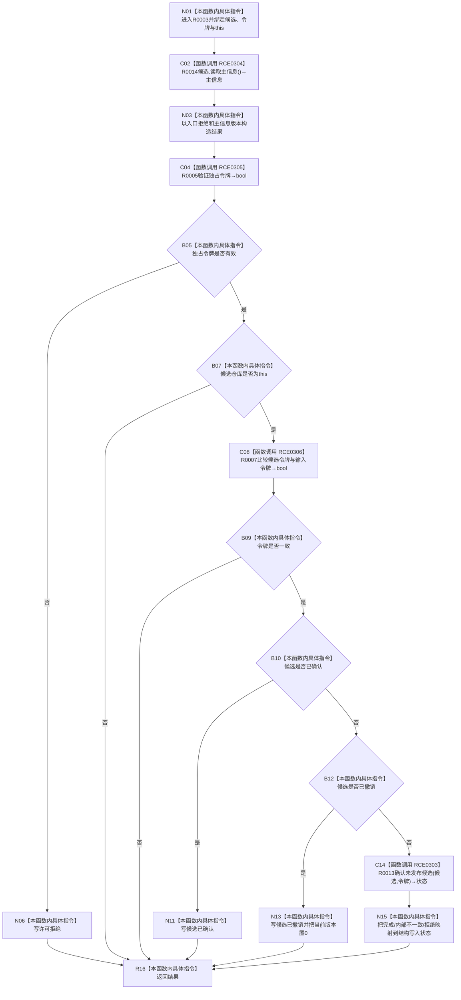

# CF-L10-0001 主信息仓库结构化确认未发布候选现状流程图

图类型：现状流程图
代码版本：`3920a74638264f9f539d50f32f3c9fe5fb1982ab`
源码 blob：`11f8fa53ff961a8cbaac34cf75b69a22533ca907`
覆盖文件：`海中鱼巣/核心/主信息仓库.cpp:111-139`
唯一根函数：R0003
完整签名：`结构写入结果 海中鱼巣::主信息仓库::结构化确认未发布候选(主信息未发布候选& 候选, const 结构事务令牌& 令牌)`
参数：候选为可修改非拥有借用；令牌为 const 非拥有借用；隐式 `this` 为非拥有借用
返回结果：返回带入口身份、版本和结构化状态的确认结果
已登记调用方：R0060
直接项目函数：RCE0304→R0014；RCE0305→R0005；RCE0306→R0007；RCE0303→R0013
外部边界：无；未解析项目调用：0
调用图：`流程图/主程序可达调用关系/01_main可达项目调用边表.md`
逐行映射表：`流程图/代码流程图/L10/CF-L10-0001_主信息仓库结构化确认未发布候选_逐行代码映射表.md`
偏差清单：无；RCE0303 已去除定义行伪调用点
依据提交 / 结构化消息：当前源码、RCE0303—RCE0306
结构读取与写入：读取候选身份与阶段；R0013 可把候选阶段写为已确认
逻辑内返回：许可拒绝、入口不匹配、候选已确认或已撤销均结构化返回
内部错误：R0013 内部不一致映射为 `内部不一致`
验证输出：111—139 行完整映射；4 个项目出边、0 个外部边界
不得作为施工许可：是
不得宣称：返回非提交状态等于没有任何既存候选结构

## 流程图

## 当前边界

- RCE0303 唯一真实调用点为第 132 行；第 111 行只是函数定义。
