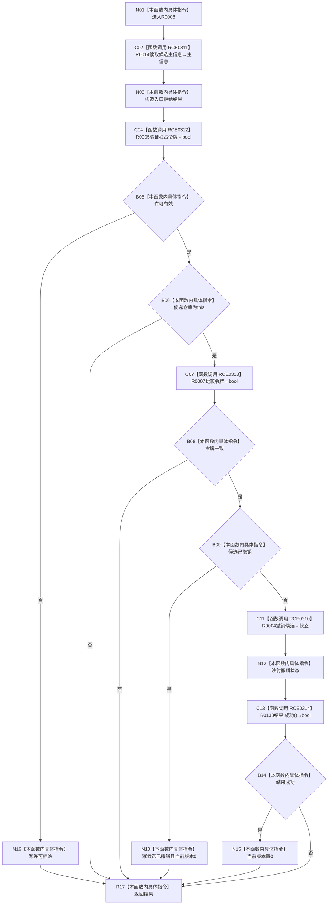

# CF-L10-0002 主信息仓库结构化撤销未发布候选现状流程图

图类型：现状流程图
代码版本：`3920a74638264f9f539d50f32f3c9fe5fb1982ab`
源码 blob：`11f8fa53ff961a8cbaac34cf75b69a22533ca907`
覆盖文件：`海中鱼巣/核心/主信息仓库.cpp:169-196`
唯一根函数：R0006
完整签名：`结构写入结果 海中鱼巣::主信息仓库::结构化撤销未发布候选(主信息未发布候选& 候选, const 结构事务令牌& 令牌)`
参数：候选为可修改借用；令牌为 const 借用；隐式 `this` 为借用
返回结果：带主信息身份、版本和撤销状态的结构写入结果
已登记调用方：R0062
直接项目函数：RCE0311→R0014；RCE0312→R0005；RCE0313→R0007；RCE0310→R0004；RCE0314→R0138
外部边界：无；未解析项目调用：0
调用图：`流程图/主程序可达调用关系/01_main可达项目调用边表.md`
逐行映射表：`流程图/代码流程图/L10/CF-L10-0002_主信息仓库结构化撤销未发布候选_逐行代码映射表.md`
偏差清单：无；RCE0310 已去除定义行伪调用点
依据提交 / 结构化消息：当前源码、RCE0310—RCE0314
结构读取与写入：R0004 可擦除主信息记录并写候选阶段；本函数映射结果
逻辑内返回：许可、入口和幂等已撤销均结构化返回；内部不一致为追根因
验证输出：169—196 行完整映射
不得作为施工许可：是
不得宣称：成功之外的结果均未改变过历史结构

## 流程图

## 当前边界

- RCE0310 唯一真实调用点为第 186 行。
