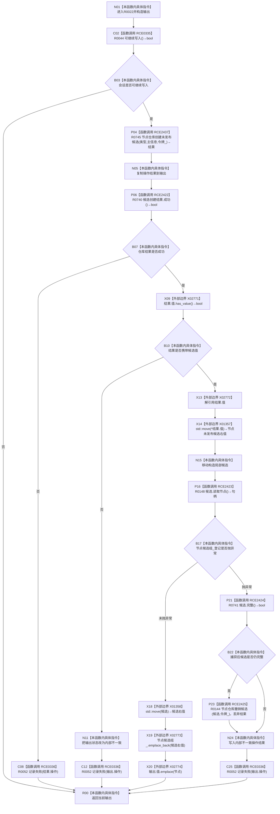

# CF-L10-0004 结构写入会话创建节点候选现状流程图

图类型：现状流程图
代码版本：`0502bcbc13202f97d0d4b4ddefd8476d6deb6c1a`
源码事实提交：`3920a74638264f9f539d50f32f3c9fe5fb1982ab`
源码 blob：`df70de9c299c74f7f0766a3e94facaf504f57968`
覆盖文件：`海中鱼巣/核心/会话.结构写入.ixx:262-288`
唯一根函数：R0022
完整签名：`海中鱼巣::带值结构写入结果<海中鱼巣::节点句柄> 海中鱼巣::结构写入会话::创建节点候选(海中鱼巣::节点类型 类型, 海中鱼巣::主信息句柄 主信息)`
参数：类型和主信息均按值传入；隐式 `this` 为非拥有借用
返回结果：返回操作结果与可选节点句柄；会话不可写、仓库失败、缺少候选值或写集登记异常时返回无值或内部不一致结果
已登记调用方：R0358/R0405/R0451/R0634/R0656/R0678/R0696，经 RCE1146/RCE1271/RCE1394/RCE1825/RCE1938/RCE1986/RCE2052
直接项目函数：RCE0335→R0044、RCE0336→R0052、RCE2422→R0740、RCE2423→R0148、RCE2424→R0741、RCE2425→R0144、RCE2437→R0745
外部边界：X01357、X01358、X02771—X02774
未解析项目调用：0
逐行映射表：`流程图/代码流程图/L10/CF-L10-0004_结构写入会话创建节点候选_逐行代码映射表.md`
结构读取与写入：仓库创建未发布节点候选；成功时把候选移入会话写集；写集登记抛异常时仅在移动后候选仍完整的条件下尝试撤销
逻辑内返回：会话不可继续写入时返回默认入口拒绝结果
内部错误：成功结果缺值或写集登记抛异常时记录内部不一致；撤销返回值被丢弃
异常：候选写集 `emplace_back` 异常被捕获；其它调用异常未在本函数捕获
验证输出：262—288 行完整映射；7 条项目入边、7 条项目出边、6 个外部边界
不得作为施工许可：是
不得宣称：返回节点句柄证明候选已发布、事务已提交或异常分支撤销一定成功

## 流程图

## 当前边界

- RCE0335：`this=this`，返回 bool 被取反用于第一个早退。
- RCE0336 三个调用点分别传入 `结果.操作`（268）、`输出.操作`（273、283），返回均为 void。
- RCE2422：`this=&结果`，返回 bool 被取反用于失败早退。
- RCE2423：`this=&候选`，返回绑定局部 `节点`。
- RCE2424：`this=&候选`，返回 bool 控制捕获分支是否调用补偿。
- RCE2425：`this=&节点_`、`候选=候选`、`令牌=令牌_`，返回值显式丢弃。
- RCE2437：`this=&节点_`、`类型=类型`、`主信息=主信息`、`令牌=令牌_`，返回绑定局部 `结果`；仅在 RCE0335 返回 true 后可达。
- X01357 与 X01358 的精确实例签名均为 `海中鱼巣::节点未发布候选&& std::move<海中鱼巣::节点未发布候选&>(海中鱼巣::节点未发布候选&) noexcept`。
- X02771—X02774 依次是 optional `has_value`、optional 左值解引用、节点候选组 `emplace_back` 和输出 optional `emplace`。
