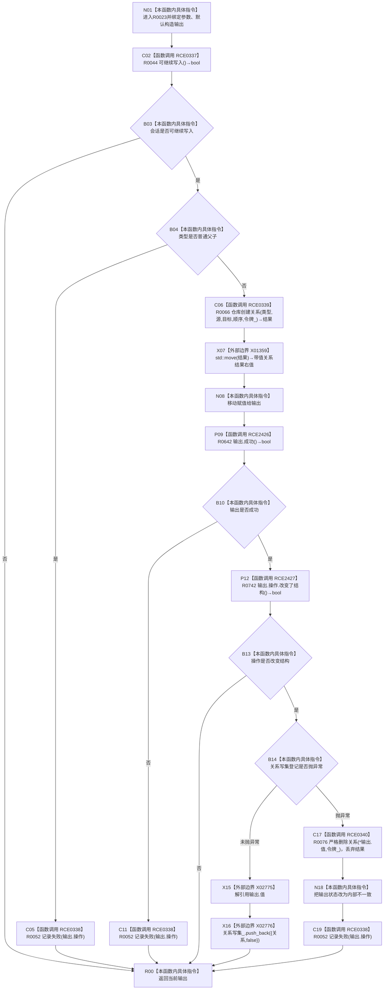

# CF-L10-0005 结构写入会话创建关系现状流程图

图类型：现状流程图
代码版本：`0502bcbc13202f97d0d4b4ddefd8476d6deb6c1a`
源码事实提交：`3920a74638264f9f539d50f32f3c9fe5fb1982ab`
源码 blob：`df70de9c299c74f7f0766a3e94facaf504f57968`
覆盖文件：`海中鱼巣/核心/会话.结构写入.ixx:290-316`
唯一根函数：R0023
完整签名：`海中鱼巣::带值结构写入结果<海中鱼巣::关系句柄> 海中鱼巣::结构写入会话::创建关系(海中鱼巣::关系类型 类型, 海中鱼巣::节点句柄 源节点, 海中鱼巣::节点句柄 目标节点, std::int64_t 顺序号 = 0)`
参数：类型、源节点、目标节点和顺序号均按值传入；隐式 `this` 为非拥有借用
返回结果：返回关系操作与可选关系句柄；普通父子类型在本入口拒绝，仓库失败或写集登记异常时返回非成功结果
已登记调用方：R0341/R0361/R0362/R0452/R0634/R0655/R0656/R0708，经 RCE1085/RCE1161/RCE1167/RCE1397/RCE1830/RCE1923/RCE1941/RCE2094
直接项目函数：RCE0337→R0044、RCE0338→R0052、RCE0339→R0066、RCE0340→R0076、RCE2426→R0642、RCE2427→R0742
外部边界：X01359、X02775、X02776
未解析项目调用：0
逐行映射表：`流程图/代码流程图/L10/CF-L10-0005_结构写入会话创建关系_逐行代码映射表.md`
结构读取与写入：关系仓库可能创建关系；结构改变时把关系加入会话写集；写集登记抛异常时调用严格删除补偿
逻辑内返回：会话不可继续写入或关系类型为普通父子时返回当前输出；普通父子必须走专用挂载入口
内部错误：关系写集登记异常时严格删除关系、把状态改为内部不一致并记录失败；删除结果被丢弃
异常：关系写集 `push_back` 异常被捕获；其它调用异常未在本函数捕获
验证输出：290—316 行完整映射；8 条项目入边、6 条项目出边、3 个外部边界
不得作为施工许可：是
不得宣称：仓库成功但未改变结构等于新建关系，或补偿删除一定成功

## 流程图

## 当前边界

- RCE0337：`this=this`，返回 bool 被取反用于会话不可写早退。
- RCE0338 三个调用点均为 `this=this`，实参依次是 `输出.操作`（298、304、313），返回 void。
- RCE0339：`this=&关系_`，依次传入类型、源节点、目标节点、顺序号和 `令牌_`，返回绑定局部 `结果`。
- RCE0340：`this=&关系_`、`关系=*输出.值`、`令牌=令牌_`，返回值显式丢弃；只在写集登记抛异常后可达。
- RCE2426：`this=&输出`，返回 bool 被取反用于仓库非成功早退。
- RCE2427：`this=&输出.操作`，返回 bool 被取反用于无结构变化早退。
- X01359 精确实例签名：`海中鱼巣::带值结构写入结果<海中鱼巣::关系句柄>&& std::move<海中鱼巣::带值结构写入结果<海中鱼巣::关系句柄>&>(海中鱼巣::带值结构写入结果<海中鱼巣::关系句柄>&) noexcept`。
- X02775 在 309、311 行各解引用一次关系 optional；X02776 在 309 行把 `{*输出.值,false}` 作为右值写入关系写集。
