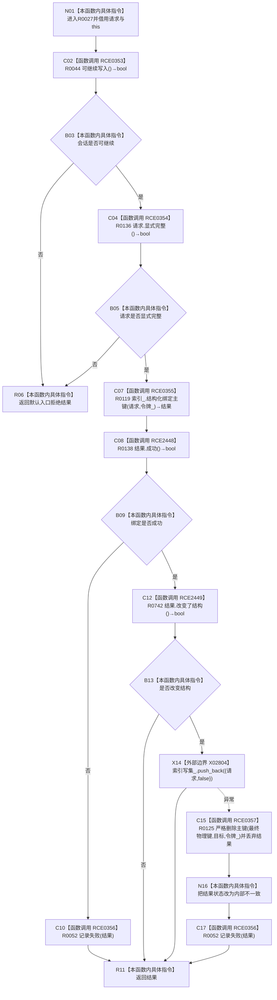

# CF-L10-0006 结构写入会话绑定主键现状流程图

图类型：现状流程图
代码版本：`3920a74638264f9f539d50f32f3c9fe5fb1982ab`
源码 blob：`df70de9c299c74f7f0766a3e94facaf504f57968`
覆盖文件：`海中鱼巣/核心/会话.结构写入.ixx:451-467`
唯一根函数：R0027
完整签名：`海中鱼巣::结构写入结果 海中鱼巣::结构写入会话::绑定主键(const 海中鱼巣::索引绑定请求& 请求)`
参数：请求为调用期间有效的 const 引用；隐式 `this` 为非拥有借用
返回结果：入口拒绝返回默认结果；仓库绑定失败会记录失败并返回；未改变结构直接返回；改变结构后登记索引写集，登记异常时严格删除主键并把结果改为内部不一致
已登记调用方：R0358、R0405、R0451、R0634、R0656、R0678、R0696，分别经 RCE1147、RCE1272、RCE1395、RCE1828、RCE1940、RCE1988、RCE2054
直接项目函数：RCE0353→R0044、RCE0354→R0136、RCE0355→R0119、RCE2448→R0138、RCE0356→R0052、RCE2449→R0742、RCE0357→R0125
外部边界：X02804 `vector<索引写入记录>::push_back`
未解析项目调用：0
调用图：`流程图/主程序可达调用关系/01_main可达项目调用边表.md`
逐行映射表：`流程图/代码流程图/L10/CF-L10-0006_结构写入会话绑定主键_逐行代码映射表.md`
偏差清单：回滚调用返回结果被显式丢弃；若回滚失败，函数仍返回内部不一致但不区分残留结构
依据提交 / 结构化消息：当前源码、全部入边、RCE0353—RCE0357、RCE2448—RCE2449、X02804 交叉复核
结构读取与写入：R0119 可能绑定主键；X02804 登记会话写集；登记异常时 R0125 尝试删除刚绑定主键
逻辑内返回：会话不可继续、请求不完整、仓库协议拒绝或幂等未改变结构
内部错误：绑定成功改变结构后写集登记异常；回滚结果未验证
生命周期与资源释放：结果按值返回；请求只借用；无局部 RAII 资源
异常：X02804 异常被捕获；catch 内 R0125 或 R0052 异常继续传播
并发 / 幂等：由会话令牌和索引仓库裁决；未改变结构按幂等结果返回
验证输出：451—467 行完整映射；7 条项目入边、7 条项目出边、1 个外部边界、0 个未解析调用
不得作为施工许可：是
不得宣称：内部不一致返回证明回滚成功、索引写集与仓库总是一致或绑定已经提交

## 流程图

## 当前边界

- 入口门禁发生在索引写入前。
- 只有成功且确实改变结构才登记写集；幂等成功直接返回。
- X02804 失败后先调用 R0125，再改写结果状态；R0125 的返回值被丢弃。
