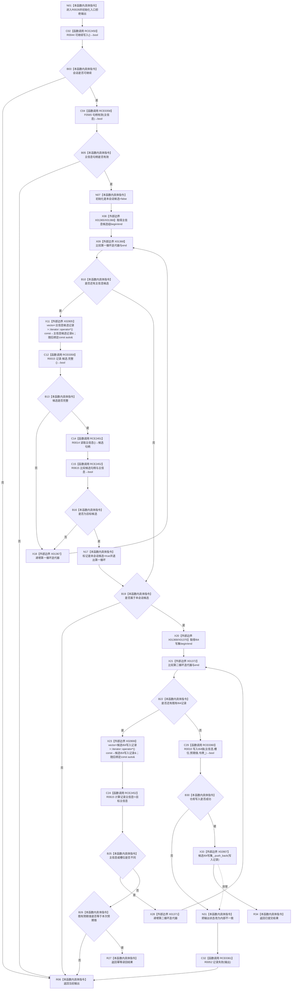

# CF-L10-0007 结构写入会话写入候选I64值现状流程图

图类型：现状流程图
代码版本：`3920a74638264f9f539d50f32f3c9fe5fb1982ab`
源码 blob：`df70de9c299c74f7f0766a3e94facaf504f57968`
覆盖文件：`海中鱼巣/核心/会话.结构写入.ixx:469-504`
唯一根函数：R0028
完整签名：`海中鱼巣::结构写入结果 海中鱼巣::结构写入会话::写入候选I64值(海中鱼巣::主信息句柄 主信息, std::uint64_t 槽位, std::int64_t 预期值)`
参数：主信息句柄、槽位和预期值按值传入；隐式 `this` 为非拥有借用
返回结果：入口或候选归属不满足时返回入口拒绝；同槽同值返回幂等读回；同槽异值返回入口拒绝；仓库写入或写集登记异常返回内部不一致；成功登记返回已提交
已登记调用方：R0362 经 RCE1169；R0405 经 RCE1270；R0678 经 RCE1985
直接项目函数：RCE2450→R0044、RCE0358→F0565、RCE0359→R0015、RCE2451→R0014、RCE2452→R0615、RCE0360→R0010、RCE0361→R0052
外部边界：X01365—X01368 第一范围循环；X01369—X01372 第二范围循环；X02805/X02806 两次迭代器解引用；X02807 `候选I64写集_.push_back`
未解析项目调用：0
调用图：`流程图/主程序可达调用关系/01_main可达项目调用边表.md`
逐行映射表：`流程图/代码流程图/L10/CF-L10-0007_结构写入会话写入候选I64值_逐行代码映射表.md`
偏差清单：仓库写入成功后写集登记异常不会撤销 I64 值，产生内部不一致并返回
依据提交 / 结构化消息：当前源码、全部入边、RCE0358—RCE0361、RCE2450—RCE2452、X01365—X01372、X02805—X02807 交叉复核
结构读取与写入：R0010 直接写主信息值槽；X02807 登记会话候选 I64 写集；失败状态经 R0052 进入会话失败账
逻辑内返回：会话/句柄/候选归属不满足、同槽异值拒绝、同槽同值幂等读回
内部错误：仓库写入失败或仓库已写而写集登记异常
生命周期与资源释放：循环只借用会话向量元素；结果按值返回
异常：X02807 异常被捕获；此前 R0010 写入不回滚；其它异常直接传播
并发 / 幂等：在会话令牌下写入；写集中的同槽同值形成幂等结果
验证输出：469—504 行完整映射；3 条项目入边、7 条项目出边、11 个外部边界、0 个未解析调用
不得作为施工许可：是
不得宣称：内部不一致会自动撤销值、已提交等同会话最终提交或返回结果证明记录已读回

## 流程图

## 当前边界

- 第一循环只接受完整且句柄相等的本会话候选；比较由 R0615 完成。
- 第二循环遇到同主信息同槽异值立即拒绝，同值立即幂等返回。
- X02807 失败发生在 R0010 已写值之后；当前代码只记录内部不一致，不撤销仓库值。
