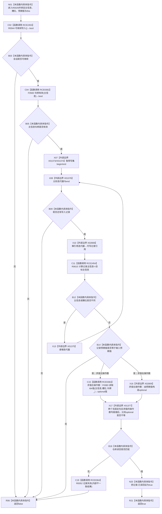

# CF-L10-0008 结构写入会话候选I64值匹配现状流程图

图类型：现状流程图
代码版本：`3920a74638264f9f539d50f32f3c9fe5fb1982ab`
源码 blob：`df70de9c299c74f7f0766a3e94facaf504f57968`
覆盖文件：`海中鱼巣/核心/会话.结构写入.ixx:506-522`
唯一根函数：R0029
完整签名：`bool 海中鱼巣::结构写入会话::候选I64值匹配(海中鱼巣::主信息句柄 主信息, std::uint64_t 槽位, std::int64_t 预期值)`
参数：主信息句柄、槽位和预期值按值传入；隐式 `this` 为非拥有借用
返回结果：入口无效、写集无匹配、同槽异值或仓库读回不一致时返回 false；写集与仓库读回均匹配时标记已读回并返回 true
已登记调用方：R0362 经 RCE1175；R0405 经 RCE1275；R0678 经 RCE1990
直接项目函数：RCE2453→R0044、RCE0362→F0565、RCE2454→R0615、校正后 RCE0363→F0383、RCE0364→R0052
外部边界：X01373—X01376 范围循环；X02808 迭代器解引用；X02809 构造 `optional<I64>`；X01377 比较两个 optional 不等
未解析项目调用：0
调用图：`流程图/主程序可达调用关系/01_main可达项目调用边表.md`
逐行映射表：`流程图/代码流程图/L10/CF-L10-0008_结构写入会话候选I64值匹配_逐行代码映射表.md`
偏差清单：RCE0363 已从错误的一参数 F0619 校正到实际三参数带令牌重载 F0383
结构读取与写入：只读主信息值槽；成功时把匹配写集记录的 `已读回` 改为 true；不改主信息值
逻辑内返回：入口无效、写集未命中或同槽异值返回 false
内部错误：写集同值记录存在但仓库读回不一致，记录失败后返回 false
生命周期与资源释放：循环借用写集元素；两个 optional 比较完成后销毁，按当前粒度不单列平凡析构
异常：仓库读取、optional 构造/比较或失败记录异常直接传播
并发 / 幂等：在会话令牌下读回；重复成功调用保持 `已读回=true`
验证输出：506—522 行完整映射；3 条项目入边、5 条项目出边、7 个外部边界、0 个未解析调用
不得作为施工许可：是
不得宣称：false 唯一表示值不匹配、成功即会话已提交或读回锁定后续值

## 流程图

## 当前边界

- RCE0363 的实际目标是带会话令牌的 F0383，不是无令牌一参数重载。
- 写集同槽异值直接返回 false，不访问仓库。
- 只有写集与仓库值均匹配才设置 `已读回=true`。
