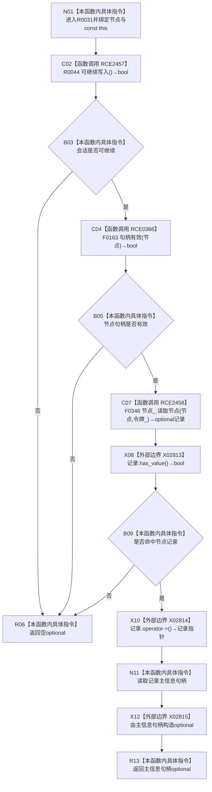

# CF-L10-0010 结构写入会话读取节点主信息现状流程图

图类型：现状流程图
代码版本：`3920a74638264f9f539d50f32f3c9fe5fb1982ab`
源码 blob：`df70de9c299c74f7f0766a3e94facaf504f57968`
覆盖文件：`海中鱼巣/核心/会话.结构写入.ixx:530-534`
唯一根函数：R0031
完整签名：`std::optional<海中鱼巣::主信息句柄> 海中鱼巣::结构写入会话::读取节点主信息(海中鱼巣::节点句柄 节点) const`
参数：节点句柄按值传入；隐式 const `this` 为非拥有借用
返回结果：入口门禁失败或节点读取为空时返回空 optional；命中时返回记录中的主信息句柄副本
已登记调用方：R0335、R0359、R0414、R0457、R0696，分别经 RCE1063、RCE1154、RCE1292、RCE1419、RCE2050
直接项目函数：RCE2457→R0044、RCE0366→F0163、RCE2458→F0346
外部边界：X02813 `optional<节点记录>::has_value()`、X02814 `operator->()`、X02815 构造 `optional<主信息句柄>`
未解析项目调用：0
调用图：`流程图/主程序可达调用关系/01_main可达项目调用边表.md`
逐行映射表：`流程图/代码流程图/L10/CF-L10-0010_结构写入会话读取节点主信息_逐行代码映射表.md`
偏差清单：无
结构读取与写入：只读节点记录主信息字段；零机器事实写入
逻辑内返回：会话不可继续、节点句柄无效或节点读取为空
内部错误：强前置已保证节点存在且可读却返回空时追查会话、令牌或节点仓库
生命周期与资源释放：返回主信息句柄副本不拥有节点或主信息记录；局部 optional 平凡析构不单列
异常：被调读取或 optional 构造异常直接传播
并发 / 幂等：使用会话令牌读取；同一冻结状态下幂等
验证输出：530—534 行完整映射；5 条项目入边、3 条项目出边、3 个外部边界、0 个未解析调用
不得作为施工许可：是
不得宣称：返回句柄证明主信息当前有效、节点仍存在或调用方获得记录所有权

## 流程图

## 当前边界

- 第 531 行按 `||` 短路；会话不可继续时不调用 F0163。
- F0346 使用现有会话令牌读取节点。
- 返回 optional 复制旧三元主信息句柄，不验证该主信息句柄自身。
