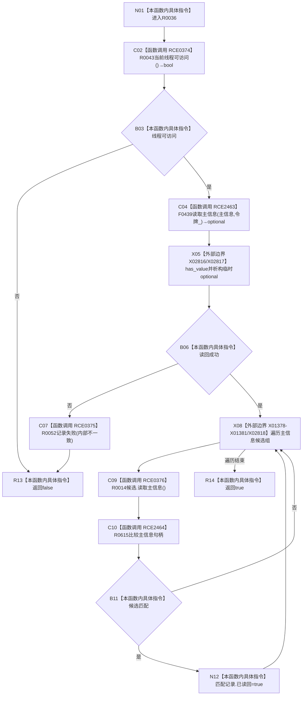

# CF-L10-0011 结构写入会话主信息可读现状流程图

图类型：现状流程图
代码版本：`3920a74638264f9f539d50f32f3c9fe5fb1982ab`
源码 blob：`df70de9c299c74f7f0766a3e94facaf504f57968`
覆盖文件：`海中鱼巣/核心/会话.结构写入.ixx:566-575`
唯一根函数：R0036
完整签名：`bool 海中鱼巣::结构写入会话::主信息可读(主信息句柄 主信息)`
参数：主信息按值；`this` 为可修改借用
返回结果：当前线程可访问且仓库读回成功时为真，并标记匹配候选已读回
直接项目函数：RCE0374→R0043；RCE2463→F0439；RCE0375→R0052；RCE0376→R0014；RCE2464→R0615
外部边界：X02816—X02818、X01378—X01381
调用图：`流程图/主程序可达调用关系/01_main可达项目调用边表.md`
逐行映射表：`流程图/代码流程图/L10/CF-L10-0011_结构写入会话主信息可读_逐行代码映射表.md`
偏差清单：无；结构变化：失败可登记首次失败，成功可标记候选已读回
验证输出：566—575 行完整映射；不得作为施工许可：是；不得宣称：可读等于已提交

## 流程图

