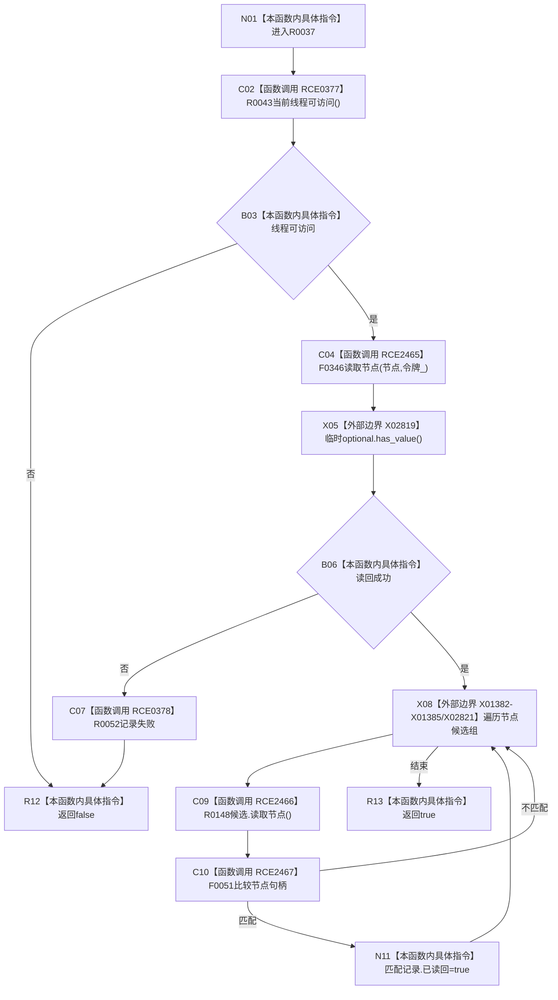

# CF-L10-0012 结构写入会话节点可读现状流程图

图类型：现状流程图
代码版本：`3920a74638264f9f539d50f32f3c9fe5fb1982ab`
源码 blob：`df70de9c299c74f7f0766a3e94facaf504f57968`
覆盖文件：`海中鱼巣/核心/会话.结构写入.ixx:577-586`
唯一根函数：R0037
完整签名：`bool 海中鱼巣::结构写入会话::节点可读(节点句柄 节点)`
参数：节点按值；`this` 为可修改借用
返回结果：线程可访问且节点读回成功时为真，并标记匹配候选
直接项目函数：RCE0377→R0043；RCE2465→F0346；RCE0378→R0052；RCE2466→R0148；RCE2467→F0051
外部边界：X02819、X02821、X01382—X01385
调用图：`流程图/主程序可达调用关系/01_main可达项目调用边表.md`
逐行映射表：`流程图/代码流程图/L10/CF-L10-0012_结构写入会话节点可读_逐行代码映射表.md`
偏差清单：无；验证输出：577—586 行完整映射
不得作为施工许可：是；不得宣称：节点已发布

## 流程图

