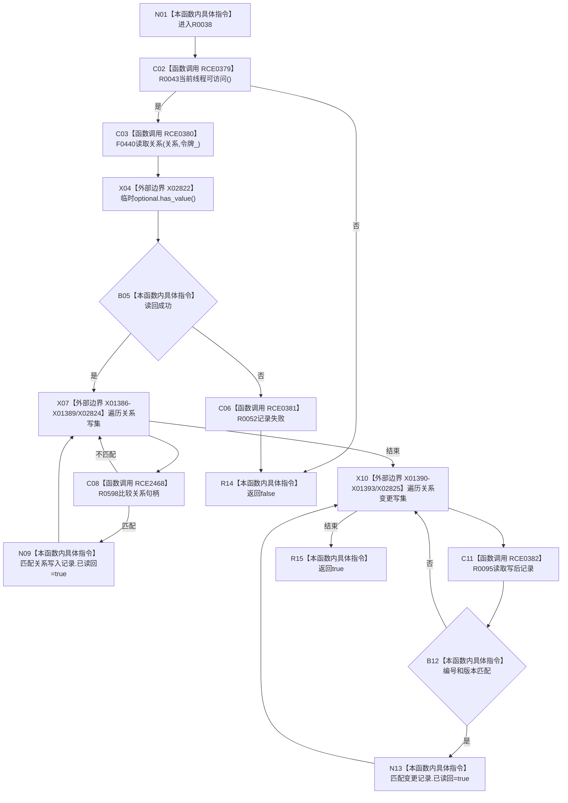

# CF-L10-0013 结构写入会话关系可读现状流程图

图类型：现状流程图
代码版本：`3920a74638264f9f539d50f32f3c9fe5fb1982ab`
源码 blob：`df70de9c299c74f7f0766a3e94facaf504f57968`
覆盖文件：`海中鱼巣/核心/会话.结构写入.ixx:588-604`
唯一根函数：R0038
完整签名：`bool 海中鱼巣::结构写入会话::关系可读(关系句柄 关系)`
参数：关系按值；`this` 为可修改借用
返回结果：读回成功并标记两类匹配关系记录后返回真
直接项目函数：RCE0379→R0043；RCE0380→F0440；RCE0381→R0052；RCE2468→R0598；RCE0382→R0095
外部边界：X02822、X02824、X02825、X01386—X01393
调用图：`流程图/主程序可达调用关系/01_main可达项目调用边表.md`
逐行映射表：`流程图/代码流程图/L10/CF-L10-0013_结构写入会话关系可读_逐行代码映射表.md`
偏差清单：无；验证输出：588—604 行完整映射
不得作为施工许可：是；不得宣称：读回成功等于事务已提交

## 流程图

