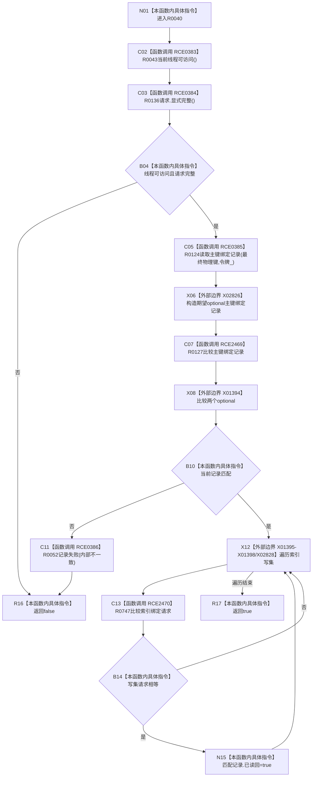

# CF-L10-0014 结构写入会话主键绑定匹配现状流程图

图类型：现状流程图
代码版本：`3920a74638264f9f539d50f32f3c9fe5fb1982ab`
源码 blob：`df70de9c299c74f7f0766a3e94facaf504f57968`
覆盖文件：`海中鱼巣/核心/会话.结构写入.ixx:632-645`
唯一根函数：R0040
完整签名：`bool 海中鱼巣::结构写入会话::主键绑定匹配(const 海中鱼巣::索引绑定请求& 请求)`
参数：请求为只读借用；`this` 为可修改借用
返回结果：请求合法、仓库读回与期望记录相等时返回真，并标记写集中相等请求已读回
直接项目函数：RCE0383→R0043；RCE0384→R0136；RCE0385→R0124；RCE2469→R0127；RCE0386→R0052；RCE2470→R0747
外部边界：X01394—X01398、X02826、X02828
调用图：`流程图/主程序可达调用关系/01_main可达项目调用边表.md`
逐行映射表：`流程图/代码流程图/L10/CF-L10-0014_结构写入会话主键绑定匹配_逐行代码映射表.md`
偏差清单：无；结构变化：失败可登记首次失败，成功可标记索引写集记录已读回
验证输出：632—645 行完整映射；不得作为施工许可：是；不得宣称：匹配成功等于事务已提交

## 流程图

