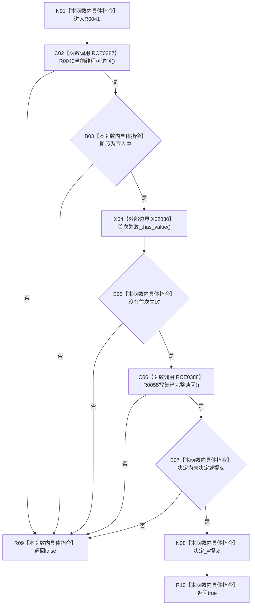

# CF-L10-0015 结构写入会话请求提交现状流程图

图类型：现状流程图
代码版本：`3920a74638264f9f539d50f32f3c9fe5fb1982ab`
源码 blob：`df70de9c299c74f7f0766a3e94facaf504f57968`
覆盖文件：`海中鱼巣/核心/会话.结构写入.ixx:647-652`
唯一根函数：R0041
完整签名：`bool 海中鱼巣::结构写入会话::请求提交()`
参数：无显式参数；`this` 为可修改借用
返回结果：全部提交前置条件成立时记录提交决定并返回真，否则返回假
直接项目函数：RCE0387→R0043；RCE0388→R0055
外部边界：X02830
调用图：`流程图/主程序可达调用关系/01_main可达项目调用边表.md`
逐行映射表：`流程图/代码流程图/L10/CF-L10-0015_结构写入会话请求提交_逐行代码映射表.md`
偏差清单：无；结构变化：成功时 `决定_` 置为提交
验证输出：647—652 行完整映射；不得作为施工许可：是；不得宣称：请求提交等于事务已提交或已发布

## 流程图

