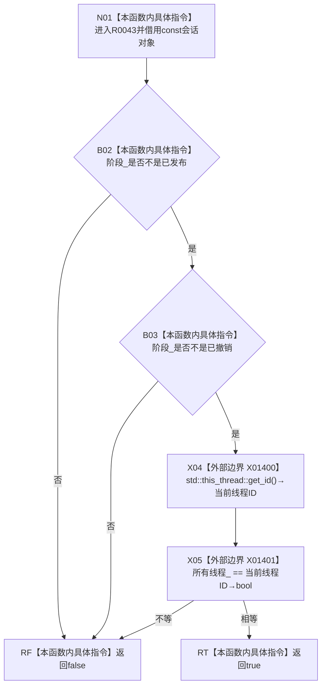

# CF-L10-0016 结构写入会话当前线程可访问现状流程图

图类型：现状流程图
代码版本：`64a2d63eca4a76b7282f3f8807aa6fea5b0f66a1`
源码事实提交：`3920a74638264f9f539d50f32f3c9fe5fb1982ab`
源码 blob：`df70de9c299c74f7f0766a3e94facaf504f57968`
覆盖文件：`海中鱼巣/核心/会话.结构写入.ixx:727-730`
唯一根函数：R0043
完整签名：`bool 海中鱼巣::结构写入会话::当前线程可访问() const`
参数：无显式参数；隐式 `this` 为 const 非拥有借用
返回结果：会话阶段既非已发布也非已撤销，且当前线程 ID 等于所有线程 ID 时返回 true，否则返回 false
已登记调用方：R0036/R0037/R0038/R0040/R0041/R0044/R0045/R0046/R0060/R0062/R0638，经 RCE0374/RCE0377/RCE0379/RCE0383/RCE0387/RCE0389/RCE0390/RCE0391/RCE0404/RCE0412/RCE1839
直接项目函数：无
外部边界：X01400 `std::this_thread::get_id()`；X01401 线程 ID 相等比较
未解析项目调用：0
逐行映射表：`流程图/代码流程图/L10/CF-L10-0016_结构写入会话当前线程可访问_逐行代码映射表.md`
结构读取与写入：只读会话阶段和所有线程 ID，零结构变化
并发：线程 ID 只在阶段前置均通过后读取并比较；本函数不加锁
验证输出：727—730 行完整映射；11 条项目入边、0 条项目出边、2 个外部边界
不得作为施工许可：是
不得宣称：返回 true 证明会话仍可写入、已经请求提交或没有首次失败

## 流程图

## 当前边界

- X01400 精确签名为 `std::thread::id std::this_thread::get_id() noexcept`，仅在两个阶段比较均通过后调用。
- X01401 精确签名为 `bool std::operator==(std::thread::id, std::thread::id) noexcept`，左值为 `所有线程_`，右值为 X01400 的结果；其 bool 直接决定根函数返回值。
