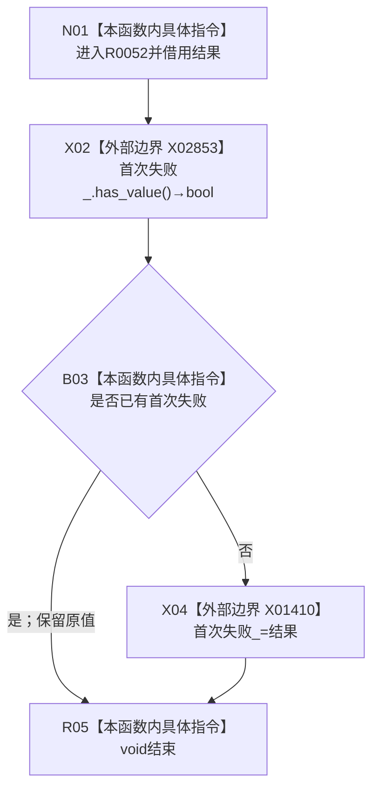

# CF-L10-0017 结构写入会话记录失败现状流程图

图类型：现状流程图
代码版本：`176b674a6c1499ccdd7306f30f910fec6dc5079c`
源码 blob：`df70de9c299c74f7f0766a3e94facaf504f57968`
覆盖文件：`海中鱼巣/核心/会话.结构写入.ixx:784-786`
唯一根函数：R0052
完整签名：`void 海中鱼巣::结构写入会话::记录失败(const 海中鱼巣::结构写入结果& 结果)`
参数：结果为只读借用；`this` 为可修改借用
返回结果：`void`；只在尚无首次失败时保存输入结果
已登记调用方：R0021 经 RCE0333；R0022 经 RCE0336；R0023 经 RCE0338；R0024 经 RCE0343；R0027 经 RCE0356；R0028 经 RCE0361；R0029 经 RCE0364；R0036 经 RCE0375；R0037 经 RCE0378；R0038 经 RCE0381；R0040 经 RCE0386；R0054 经 RCE0403；R0060 经 RCE0409；R0063 经 RCE0421；R0638 经 RCE1843
直接项目函数：无
外部边界：X02853 `首次失败_.has_value()`；X01410 `首次失败_=结果`
未解析项目调用：0
调用图：`流程图/主程序可达调用关系/01_main可达项目调用边表.md`
逐行映射表：`流程图/代码流程图/L10/CF-L10-0017_结构写入会话记录失败_逐行代码映射表.md`
偏差清单：无；本文只冻结当前代码事实
结构读取与写入：读取首次失败占用状态；为空时写入第一次失败结果
逻辑内返回：已有首次失败时保持原值并正常结束
验证输出：784—786 行完整映射；不得作为施工许可：是
不得宣称：记录失败会覆盖首次失败或自动完成撤销

## 流程图

