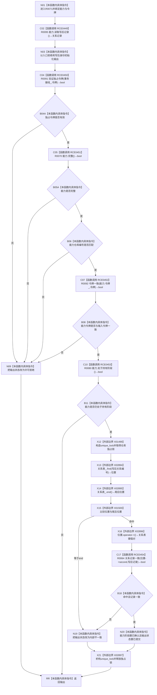

# CF-L10-0018 关系仓库结构化确认已发布关系变更现状流程图

图类型：现状流程图
代码版本：`176b674a6c1499ccdd7306f30f910fec6dc5079c`
源码事实提交：`3920a74638264f9f539d50f32f3c9fe5fb1982ab`
源码 blob：`f7a9ea9a09d3065468208c16f9ea34f806b6e183`
覆盖文件：`海中鱼巣/核心/关系仓库.cpp:1365-1392`
唯一根函数：R0071
完整签名：`海中鱼巣::结构写入结果 海中鱼巣::关系仓库::结构化确认已发布关系变更(海中鱼巣::已发布关系变更能力& 能力, const 海中鱼巣::结构事务令牌& 令牌)`
参数：能力为可写借用；令牌为 const 非拥有借用；隐式 `this` 为仓库借用
返回结果：许可或能力不合格时返回拒绝结果；锁内记录一致且能力处于持有阶段时标记能力已确认并返回已提交
已登记调用方：R0060，经 RCE0411
直接项目函数：RCE0449→R0095、RCE0450→R0091、RCE0451→R0070、RCE0452→R0092、RCE0453→R0080、RCE0454→R0064
外部边界：X01499/X01500/X02894—X02897
未解析项目调用：0
逐行映射表：`流程图/代码流程图/L10/CF-L10-0018_关系仓库结构化确认已发布关系变更_逐行代码映射表.md`
结构读取与写入：锁内只读关系表；成功时写能力阶段和局部输出，不修改关系记录
验证输出：1365—1392 行完整映射；1 条项目入边、6 条项目出边、6 个外部边界
不得作为施工许可：是

## 流程图

## 当前边界

- RCE0450、RCE0451、仓库编号比较和 RCE0452 按 `||` 顺序短路。
- X02896 和 RCE0454 仅在 X01500 判定位置不等于 end 时可达。
- X02897 覆盖独占锁构造后的成功、早退与异常展开，不把解锁解释为结构提交。
