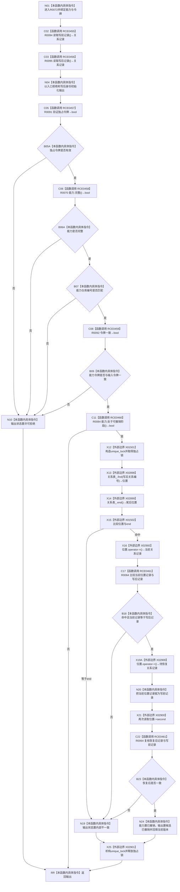

# CF-L10-0019 关系仓库结构化撤销已发布关系变更现状流程图

图类型：现状流程图
代码版本：`176b674a6c1499ccdd7306f30f910fec6dc5079c`
源码事实提交：`3920a74638264f9f539d50f32f3c9fe5fb1982ab`
源码 blob：`f7a9ea9a09d3065468208c16f9ea34f806b6e183`
覆盖文件：`海中鱼巣/核心/关系仓库.cpp:1394-1428`
唯一根函数：R0072
完整签名：`海中鱼巣::结构写入结果 海中鱼巣::关系仓库::结构化撤销已发布关系变更(海中鱼巣::已发布关系变更能力& 能力, const 海中鱼巣::结构事务令牌& 令牌)`
参数：能力为可写借用；令牌为 const 非拥有借用；隐式 `this` 为仓库借用
返回结果：许可或能力不合格时返回拒绝；锁内写后记录匹配时恢复写前记录、标记能力已撤销并返回候选已撤销
已登记调用方：R0054/R0062，经 RCE0402/RCE0413
直接项目函数：RCE0455→R0094、RCE0456→R0095、RCE0457→R0091、RCE0458→R0070、RCE0459→R0092、RCE0460→R0084、RCE0461→R0064
外部边界：X01501/X01502/X02898—X02901
未解析项目调用：0
逐行映射表：`流程图/代码流程图/L10/CF-L10-0019_关系仓库结构化撤销已发布关系变更_逐行代码映射表.md`
结构读取与写入：独占锁内把关系表当前写后记录恢复为写前记录；成功时写能力阶段和输出
验证输出：1394—1428 行完整映射；2 条项目入边、7 条项目出边、6 个外部边界
不得作为施工许可：是

## 流程图

## 当前边界

- RCE0461 聚合撤销前写后记录复核和赋值后的写前记录复核两个调用点。
- X02900 聚合三次迭代器 `operator->`：首次比较、恢复赋值和恢复后复核。
- X02901 覆盖独占锁构造后的所有退出；恢复写前记录后复核失败不会自动重做或回滚。
