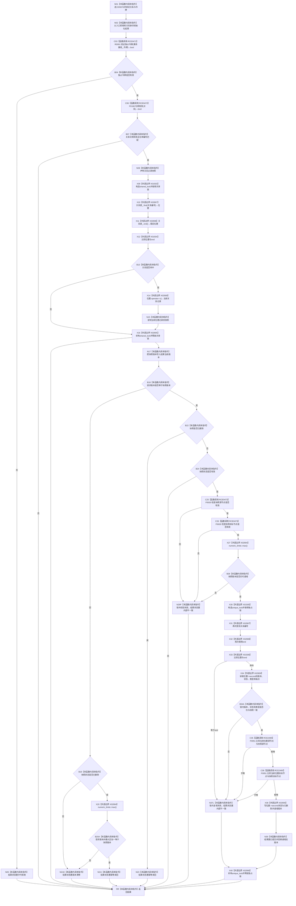

# CF-L10-0020 关系仓库严格删除关系现状流程图

图类型：现状流程图
代码版本：`176b674a6c1499ccdd7306f30f910fec6dc5079c`
源码事实提交：`3920a74638264f9f539d50f32f3c9fe5fb1982ab`
源码 blob：`f7a9ea9a09d3065468208c16f9ea34f806b6e183`
覆盖文件：`海中鱼巣/核心/关系仓库.cpp:1450-1505`
唯一根函数：R0076
完整签名：`海中鱼巣::结构写入结果 海中鱼巣::关系仓库::严格删除关系(海中鱼巣::关系句柄 关系, const 海中鱼巣::结构事务令牌& 令牌)`
参数：关系句柄按值传入；令牌为 const 非拥有借用；隐式 `this` 为仓库借用
返回结果：按许可、句柄、版本、当前状态、端点与锁内二次复核形成许可拒绝、入口拒绝、幂等读回、版本漂移、内部不一致或已提交结果
已登记调用方：R0023/R0024/R0062，经 RCE0340/RCE0344/RCE0416
直接项目函数：RCE0471→R0091、校正后 RCE0472→F0168（仅 1458）、RCE0473→F0630、RCE2495→F0051
外部边界：X01503—X01506、X02904—X02909
未解析项目调用：0
逐行映射表：`流程图/代码流程图/L10/CF-L10-0020_关系仓库严格删除关系_逐行代码映射表.md`
结构读取与写入：先在共享锁内复制快照，锁外校验，再在独占锁内二次复核并把关系状态置已删除、版本加一
验证输出：1450—1505 行完整映射；3 条项目入边、4 条项目出边、10 个外部边界
不得作为施工许可：是

## 流程图

## 当前边界

- RCE0472 仅保留 1458 行关系句柄重载；1495—1496 行是 RCE2495 节点句柄相等运算。
- X02907/X02908 聚合共享锁和独占锁两次查找；X02909 聚合 9 次迭代器 `operator->`。
- X02905 只释放共享锁，X02906 只释放独占锁；两段锁窗口之间的端点验证不是同一原子锁窗口。
- 请求版本不等于快照版本时，幂等读回要求快照已删除、请求版本非最大且请求版本加一等于快照版本。
