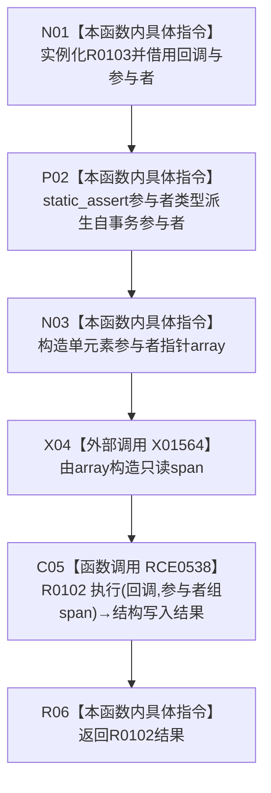

# CF-L10-0021 结构写入执行器执行单参与者模板重载现状流程图

图类型：现状流程图
代码版本：`7ad8cf5113162fe92b9f8d43f2b5b9f00d292d1a`
源码事实提交：`3920a74638264f9f539d50f32f3c9fe5fb1982ab`
源码 blob：`292e602cef1dd658ac2b507a3cc9ced7270a4a86`
覆盖文件：`海中鱼巣/核心/执行器.结构写入.ixx:185-192`
唯一根函数：R0103
完整签名：`template <typename 参与者类型> 海中鱼巣::结构写入结果 海中鱼巣::结构写入执行器::执行(const std::function<void(海中鱼巣::结构写入会话&)>& 回调, 参与者类型& 参与者) const`
参数：`回调` 为 const std::function 借用；`参与者` 为非拥有可写引用，编译期要求派生自结构写入事务参与者
返回结果：转发多参与者重载 R0102 的结构写入结果
已登记调用方：R0389，经 RCE1233
直接项目函数：RCE0538→R0102
外部边界：X01564 `std::span` 从单元素 array 构造
未解析项目调用：0
逐行映射表：`流程图/代码流程图/L10/CF-L10-0021_结构写入执行器执行单参与者模板重载_逐行代码映射表.md`
结构读取与写入：本函数仅包装参与者指针视图并转发，不直接改变结构
验证输出：185—192 行完整映射；1 条项目入边、1 条项目出边、1 个外部边界
不得作为施工许可：是

## 流程图

## 当前边界

- `static_assert` 只参与模板实例化，不形成运行期项目调用。
- X01564 只形成一元素非拥有视图；参与者生命周期仍由调用方所有。
- RCB0019 的回调注册经本模板转入 R0102，但实际调度点属于 R0102，不在本图重复登记项目回调边。
